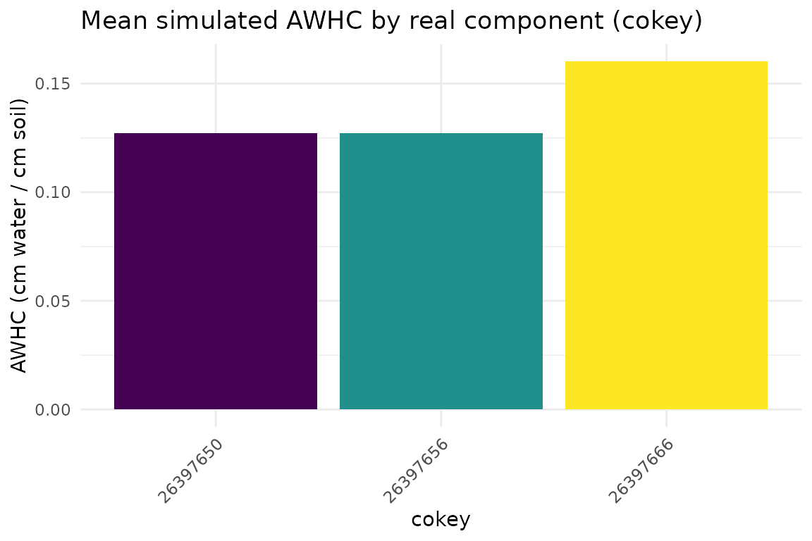
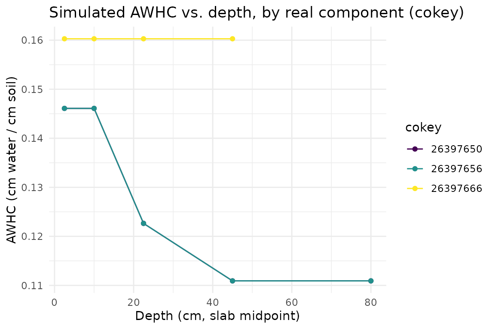
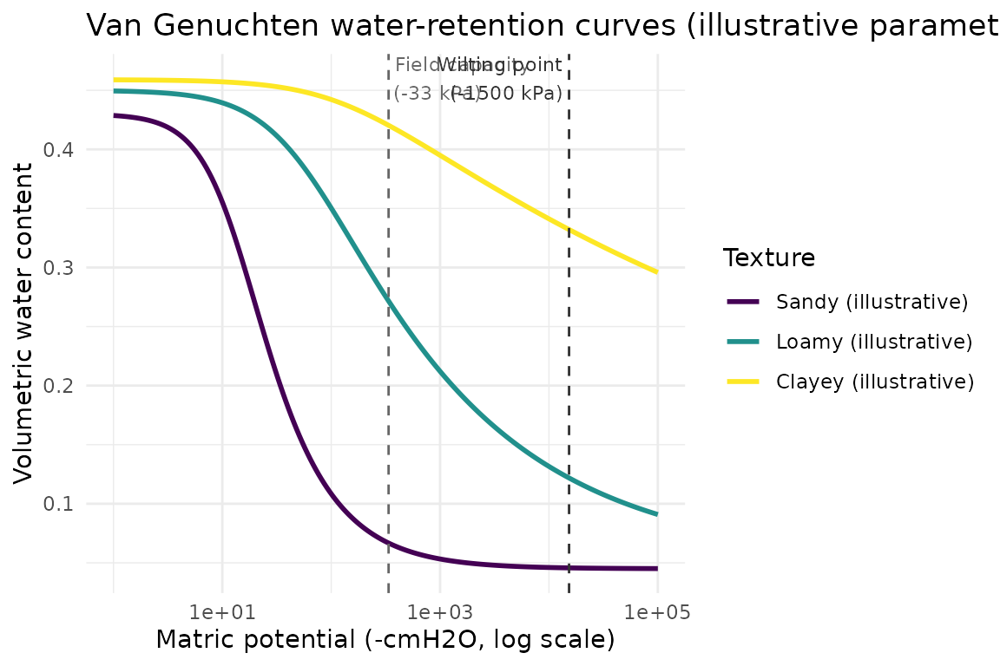

# Available Water Storage via Van Genuchten / ROSETTA

## Overview

Available water storage (AWS) - how much plant-available water a soil
can hold - is derived from the van Genuchten (1980) water-retention
curve, whose shape parameters soilSIM estimates via
[`soilDB::ROSETTA()`](http://ncss-tech.github.io/soilDB/reference/ROSETTA.md),
a live pedotransfer-function API. This vignette derives real AWS
estimates for real soil components from the same Amador-area AOI used in
the “Getting Started” vignette. See
`soilSIM/docs/07_aws_van_genuchten_modeling.md` for the full
function-level reference, including two intentional, ported-as-is quirks
in
[`simulate_vg_aws()`](https://jjmaynard.github.io/soilSIM/reference/simulate_vg_aws.md)
this vignette doesn’t need to touch.

``` r

library(soilSIM)
library(ggplot2)
```

## Step 1: Real texture/bulk-density input

[`calculate_aws_df()`](https://jjmaynard.github.io/soilSIM/reference/calculate_aws_df.md)
expects ROSETTA’s own input variable names (`sand_total`, `silt_total`,
`clay_total`, `bulk_density_third_bar`, `water_retention_third_bar`,
`water_retention_15_bar`) - different from soilSIM’s usual
`sandtotal_r`/`claytotal_r` SSURGO convention, since these are ROSETTA’s
own API contract. This vignette’s cached input was built directly from
the real SSURGO download used in the “Getting Started” vignette:

``` r

aws_example <- readRDS(system.file("extdata", "aws_rosetta_example.rds", package = "soilSIM"))
rosetta_input <- aws_example$input
unique(rosetta_input$compname)
#> [1] "Chaix"    "Cohasset"
rosetta_input[1:6, c("compname", "hzdept_r", "hzdepb_r", "sand_total", "clay_total",
                      "bulk_density_third_bar")]
#>   compname hzdept_r hzdepb_r sand_total clay_total bulk_density_third_bar
#> 2    Chaix        0       20       66.3         10                   1.19
#> 3    Chaix        0       20       66.3         10                   1.19
#> 4    Chaix        0       20       66.3         10                   1.19
#> 5    Chaix       20       86       66.3         10                   1.50
#> 6    Chaix       20       86       66.3         10                   1.50
#> 7    Chaix       20       86       66.3         10                   1.50
```

These are 15 real horizons across 2 real components from the Amador-area
AOI, each with complete real texture, bulk density, and water-retention
data
([`calculate_aws_df()`](https://jjmaynard.github.io/soilSIM/reference/calculate_aws_df.md)
requires all six ROSETTA input variables present).

## Step 2: Run ROSETTA and simulate available water storage

[`calculate_aws_df()`](https://jjmaynard.github.io/soilSIM/reference/calculate_aws_df.md)
(1) calls
[`soilDB::ROSETTA()`](http://ncss-tech.github.io/soilDB/reference/ROSETTA.md) -
a live POST to `handbook60.org` - to derive van Genuchten shape
parameters from the texture/bulk-density inputs, (2) Monte
Carlo-simulates field capacity and permanent wilting point water content
via
[`simulate_vg_aws()`](https://jjmaynard.github.io/soilSIM/reference/simulate_vg_aws.md),
and (3) depth-slices the result to standard intervals via
[`aqp::slab()`](https://ncss-tech.github.io/aqp/reference/slab.html):

``` r

# The real call this vignette's cached data came from (requires live network access):
aws_result <- calculate_aws_df(rosetta_input)
```

``` r

aws_result <- aws_example$result
aws_result
#> # A tibble: 15 × 4
#>    cokey      top bottom   AWHC
#>    <chr>    <int>  <int>  <dbl>
#>  1 26397650     0      5  0.146
#>  2 26397650     5     15  0.146
#>  3 26397650    15     30  0.123
#>  4 26397650    30     60  0.111
#>  5 26397650    60    100  0.111
#>  6 26397656     0      5  0.146
#>  7 26397656     5     15  0.146
#>  8 26397656    15     30  0.123
#>  9 26397656    30     60  0.111
#> 10 26397656    60    100  0.111
#> 11 26397666     0      5  0.160
#> 12 26397666     5     15  0.160
#> 13 26397666    15     30  0.160
#> 14 26397666    30     60  0.160
#> 15 26397666    60    100 NA
```

This is available water holding capacity (AWHC, cm water per cm soil)
for each real component, at each of the standard 0-5, 5-15, 15-30,
30-60, and 60-100 cm depth slabs actually spanned by that component’s
horizons (a slab beyond a component’s real horizon depths comes back
`NA`, as for the last row above).

``` r

plot_data <- aws_result[!is.na(aws_result$AWHC), ]
agg <- aggregate(AWHC ~ cokey, data = plot_data, FUN = mean)
agg$cokey <- factor(agg$cokey)

ggplot(agg, aes(x = cokey, y = AWHC, fill = cokey)) +
  geom_col() +
  scale_fill_viridis_d() +
  guides(fill = "none") +
  theme_minimal() +
  labs(title = "Mean simulated AWHC by real component (cokey)",
       x = "cokey", y = "AWHC (cm water / cm soil)") +
  theme(axis.text.x = element_text(angle = 45, hjust = 1))
```



Averaging across depth slabs like this, though, throws away real
structure in the data: each component’s AWHC actually varies slab to
slab. Plotting AWHC against depth for each real component shows that
depth-resolved pattern instead of flattening it away:

``` r

plot_data$mid_depth <- (plot_data$top + plot_data$bottom) / 2
plot_data$cokey <- factor(plot_data$cokey)

ggplot(plot_data, aes(x = mid_depth, y = AWHC, color = cokey)) +
  geom_line() +
  geom_point() +
  scale_color_viridis_d(name = "cokey") +
  theme_minimal() +
  labs(title = "Simulated AWHC vs. depth, by real component (cokey)",
       x = "Depth (cm, slab midpoint)", y = "AWHC (cm water / cm soil)")
```



## Step 3: The underlying water-retention curve

[`van_genuchten()`](https://jjmaynard.github.io/soilSIM/reference/van_genuchten.md)
is the closed-form curve
[`calculate_aws_df()`](https://jjmaynard.github.io/soilSIM/reference/calculate_aws_df.md)
evaluates internally at field capacity (-33 kPa) and permanent wilting
point (-1500 kPa) matric potentials. The three curves below use
illustrative shape parameters only - representative of the ranges
ROSETTA typically returns for a sandy, loamy, and clayey texture
respectively - not values derived from this vignette’s real data:

``` r

h <- -10^seq(0, 5, length.out = 200)  # matric potential, cmH2O (log-spaced)
vg_params <- data.frame(
  texture = c("Sandy (illustrative)", "Loamy (illustrative)", "Clayey (illustrative)"),
  alpha   = c(0.075, 0.02, 0.008),
  n       = c(1.89, 1.3, 1.09),
  theta_r = c(0.045, 0.05, 0.098),
  theta_s = c(0.43, 0.45, 0.459)
)

vg_curves <- do.call(rbind, lapply(seq_len(nrow(vg_params)), function(i) {
  p <- vg_params[i, ]
  data.frame(
    texture = p$texture,
    h = h,
    theta = van_genuchten(h, alpha = p$alpha, n = p$n, theta_r = p$theta_r, theta_s = p$theta_s)
  )
}))
vg_curves$texture <- factor(vg_curves$texture, levels = vg_params$texture)

fc_x <- 33 * 10.19716    # field capacity, -33 kPa in cmH2O
wp_x <- 1500 * 10.19716  # wilting point, -1500 kPa in cmH2O

ggplot(vg_curves, aes(x = -h, y = theta, color = texture)) +
  geom_line(linewidth = 1) +
  scale_x_log10() +
  scale_color_viridis_d(name = "Texture") +
  geom_vline(xintercept = fc_x, linetype = "dashed", color = "grey40") +
  geom_vline(xintercept = wp_x, linetype = "dashed", color = "grey20") +
  annotate("text", x = fc_x, y = 0.46, label = "Field capacity\n(-33 kPa)",
           hjust = -0.05, size = 3, color = "grey40") +
  annotate("text", x = wp_x, y = 0.46, label = "Wilting point\n(-1500 kPa)",
           hjust = 1.05, size = 3, color = "grey20") +
  theme_minimal() +
  labs(title = "Van Genuchten water-retention curves (illustrative parameter sets)",
       x = "Matric potential (-cmH2O, log scale)",
       y = "Volumetric water content")
```



## Where this data came from

The cached data this vignette loads
(`inst/extdata/aws_rosetta_example.rds`) was produced once by
`data-raw/build_vignette_data.R`, which builds the ROSETTA input from
the same real Amador-area SSURGO download as the “Getting Started”
vignette, then calls
[`calculate_aws_df()`](https://jjmaynard.github.io/soilSIM/reference/calculate_aws_df.md)
live (requiring network access to `handbook60.org`). Re-run that script
to refresh it.
