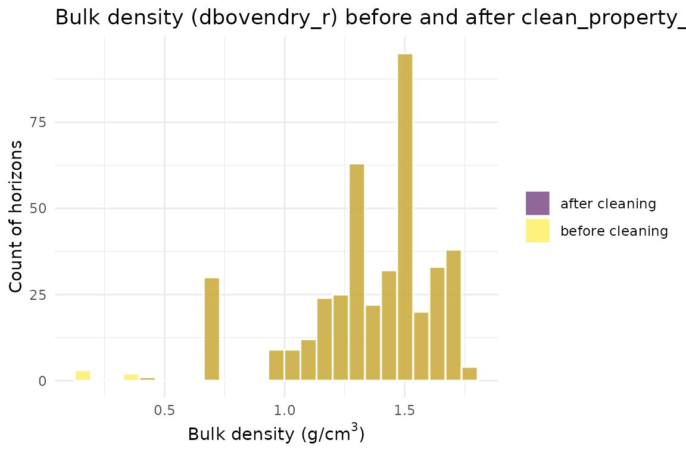
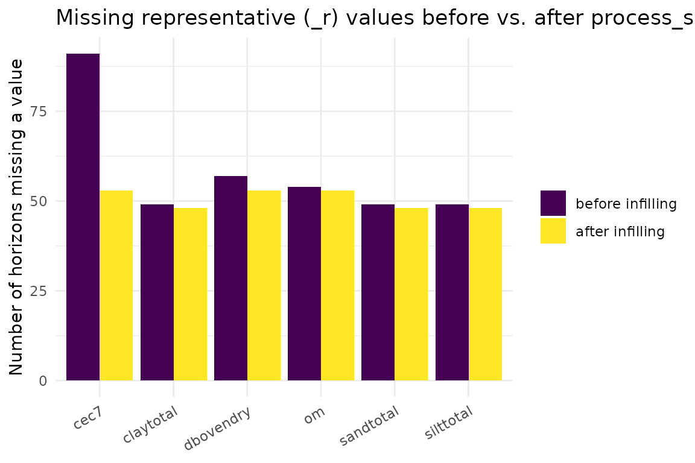

# Data Acquisition, Cleaning & Infilling: A Function-by-Function Walkthrough

## Overview

`getting-started-monte-carlo.Rmd` shows soilSIM’s tabular pipeline end
to end, but it collapses “download, clean, and infill SSURGO data” into
two or three function calls. This vignette slows that part of the
pipeline down and walks through the *individual* functions underneath,
using the same real Amador County, CA SSURGO data, so you can see what
each function actually does to the data and why each parameter exists:

1.  Acquisition:
    [`download_ssurgo_tabular()`](https://jjmaynard.github.io/soilSIM/reference/download_ssurgo_tabular.md)
    vs. the
    [`download_and_prepare_ssurgo()`](https://jjmaynard.github.io/soilSIM/reference/download_and_prepare_ssurgo.md)
    convenience wrapper built on top of it
2.  Processing:
    [`process_ssurgo_data()`](https://jjmaynard.github.io/soilSIM/reference/process_ssurgo_data.md)’s
    two sub-pipelines,
    [`process_horizon_data_working_compatible()`](https://jjmaynard.github.io/soilSIM/reference/process_horizon_data_working_compatible.md)
    and
    [`process_component_data_working_compatible()`](https://jjmaynard.github.io/soilSIM/reference/process_component_data_working_compatible.md)
3.  Per-property cleaning:
    [`clean_property_data_ssurgo_compatible()`](https://jjmaynard.github.io/soilSIM/reference/clean_property_data_ssurgo_compatible.md)
    (used during processing) vs.
    [`clean_property_data()`](https://jjmaynard.github.io/soilSIM/reference/clean_property_data.md)
    (used during infilling) and their outlier-detection strategies
4.  The infilling family:
    [`infill_soil_property()`](https://jjmaynard.github.io/soilSIM/reference/infill_soil_property.md)’s
    six-strategy recovery hierarchy, the individual strategy functions
    ([`horizon_name_property_infill()`](https://jjmaynard.github.io/soilSIM/reference/horizon_name_property_infill.md),
    [`infill_missing_property_data()`](https://jjmaynard.github.io/soilSIM/reference/infill_missing_property_data.md),
    group fallback), range infilling
    ([`infill_property_range_values()`](https://jjmaynard.github.io/soilSIM/reference/infill_property_range_values.md),
    [`learn_property_ranges()`](https://jjmaynard.github.io/soilSIM/reference/learn_property_ranges.md),
    [`get_property_contextual_ranges()`](https://jjmaynard.github.io/soilSIM/reference/get_property_contextual_ranges.md)),
    the Saxton-Rawls water-retention pedotransfer function
    ([`infill_water_retention_saxton_rawls_integrated()`](https://jjmaynard.github.io/soilSIM/reference/infill_water_retention_saxton_rawls_integrated.md)),
    and RFV-specific imputation
    ([`impute_rfv_values()`](https://jjmaynard.github.io/soilSIM/reference/impute_rfv_values.md))
5.  The pluggable validation-rule config builders:
    [`create_validation_config()`](https://jjmaynard.github.io/soilSIM/reference/create_validation_config.md),
    [`add_range_rule()`](https://jjmaynard.github.io/soilSIM/reference/add_range_rule.md),
    [`add_relationship_rule()`](https://jjmaynard.github.io/soilSIM/reference/add_relationship_rule.md),
    [`apply_validation_rules()`](https://jjmaynard.github.io/soilSIM/reference/apply_validation_rules.md),
    and
    [`summarize_unsuitable_horizons()`](https://jjmaynard.github.io/soilSIM/reference/summarize_unsuitable_horizons.md)

See `soilSIM/docs/01_data_acquisition_processing.md` for the full
function-level reference this vignette is drawn from.

``` r

library(soilSIM)
library(ggplot2)
```

## Step 1: Acquisition - `download_ssurgo_tabular()` vs. `download_and_prepare_ssurgo()`

[`download_ssurgo_tabular()`](https://jjmaynard.github.io/soilSIM/reference/download_ssurgo_tabular.md)
is the master download function. Its parameters control every stage of
the acquisition:

- `aoi_wkt` - the area of interest as a WKT polygon (`EPSG:4326`)
- `properties` - which SSURGO base properties to request (default: the 9
  core physical/chemical properties); include `"rfv"` to also request
  and aggregate rock-fragment volume
- `include_restrictions` - whether to join restriction/texture-class
  tables and run
  [`add_restriction_indicators_working()`](https://jjmaynard.github.io/soilSIM/reference/add_restriction_indicators_working.md),
  which is what produces the `unsuitable_horizon` flag used everywhere
  downstream
- `cache_dir` / `force_download` - optional on-disk caching of the raw
  SDA query result, keyed by a hash of the AOI + properties +
  restriction flag
- `validate_data` - whether to run
  [`validate_data_quality()`](https://jjmaynard.github.io/soilSIM/reference/validate_data_quality.md)
  on the result before returning it
- `verbose` - progress logging

``` r

# The real call this vignette's cached data came from:
dl <- download_ssurgo_tabular(
  aoi_wkt = "POLYGON((-120.5 38.5, -120.4 38.5, -120.4 38.6, -120.5 38.6, -120.5 38.5))",
  properties = c("sandtotal", "claytotal", "silttotal", "dbovendry", "ph1to1h2o",
                 "cec7", "om", "wthirdbar", "wfifteenbar"),
  include_restrictions = TRUE,
  cache_dir = "cache/ssurgo",
  verbose = TRUE
)
names(dl)
```

[`download_and_prepare_ssurgo()`](https://jjmaynard.github.io/soilSIM/reference/download_and_prepare_ssurgo.md)
is a thin convenience wrapper around
[`download_ssurgo_tabular()`](https://jjmaynard.github.io/soilSIM/reference/download_ssurgo_tabular.md).
It does not add new acquisition logic - it just fixes two arguments and
adds one post-processing step: it always calls with
`include_restrictions = TRUE` and `validate_data = TRUE` (no way to turn
either off), then depth-filters `ssurgo_data` to `hzdepb_r <= max_depth`
and attaches a `preparation_metadata` element (`max_depth_applied`,
`ready_for_simulation = TRUE`,
`compatible_with_infill_functions = TRUE`) so a caller can tell at a
glance that the result is ready for
[`process_ssurgo_data()`](https://jjmaynard.github.io/soilSIM/reference/process_ssurgo_data.md):

``` r

ssurgo_amador <- download_and_prepare_ssurgo(
  aoi_wkt = "POLYGON((-120.5 38.5, -120.4 38.5, -120.4 38.6, -120.5 38.6, -120.5 38.5))",
  properties = c("sandtotal", "claytotal", "silttotal", "dbovendry", "ph1to1h2o",
                 "cec7", "om", "wthirdbar", "wfifteenbar"),
  max_depth = 150
)
ssurgo_amador$preparation_metadata
```

This vignette loads the cached real output of that call, so it builds
without a live network dependency:

``` r

ssurgo_amador <- readRDS(system.file("extdata", "ssurgo_amador.rds", package = "soilSIM"))
raw_data <- ssurgo_amador$ssurgo_data
dim(raw_data)
#> [1] 474  65
length(unique(raw_data$cokey))
#> [1] 78
```

`raw_data` already has the restriction-indicator columns
[`add_restriction_indicators_working()`](https://jjmaynard.github.io/soilSIM/reference/add_restriction_indicators_working.md)
adds (`is_cemented`, `organic_horizon`, `is_potentially_restrictive`,
`unsuitable_horizon`, …) - these exist because
[`download_and_prepare_ssurgo()`](https://jjmaynard.github.io/soilSIM/reference/download_and_prepare_ssurgo.md)
always requests restrictions:

``` r

grep("restrict|unsuitable|cemented|organic_horizon", names(raw_data), value = TRUE)
#> [1] "restriction_top"              "hz_below_restriction"        
#> [3] "has_reskind_restriction"      "is_cemented"                 
#> [5] "horizon_suggests_restriction" "organic_horizon"             
#> [7] "texture_suggests_restriction" "is_potentially_restrictive"  
#> [9] "unsuitable_horizon"
sum(raw_data$unsuitable_horizon)
#> [1] 53
```

## Step 2: Processing - `process_ssurgo_data()`’s two sub-pipelines

[`process_ssurgo_data()`](https://jjmaynard.github.io/soilSIM/reference/process_ssurgo_data.md)
is the main processing entry point. Its `processing_options` list
controls seven independently-togglable steps (`detect_unsuitable`,
`advanced_cleaning`, `standardize_names`, `remove_invalid`,
`calculate_derived`, `validate_logic`, `preserve_compatibility`), all
`TRUE` by default. Internally it runs three sub-pipelines and stitches
their outputs together:
[`process_horizon_data_working_compatible()`](https://jjmaynard.github.io/soilSIM/reference/process_horizon_data_working_compatible.md),
[`process_component_data_working_compatible()`](https://jjmaynard.github.io/soilSIM/reference/process_component_data_working_compatible.md),
and
[`create_infill_compatible_dataset()`](https://jjmaynard.github.io/soilSIM/reference/create_infill_compatible_dataset.md)
(which rebuilds the combined dataset from `raw_data` directly, rather
than reusing the other two outputs, which exist mainly for their
statistics).

``` r

processed <- process_ssurgo_data(raw_data, max_depth = 150, verbose = FALSE)
names(processed)
#> [1] "processed_data"      "horizon_data"        "component_data"     
#> [4] "processing_metadata" "validation_results"  "quality_report"
dim(processed$processed_data)
#> [1] 474  65
```

### `process_horizon_data_working_compatible()` on its own

Calling the horizon sub-pipeline directly shows what each of its steps
contributes. With `advanced_cleaning = TRUE` (the default), every
identified soil-property column is run through
[`clean_property_data_ssurgo_compatible()`](https://jjmaynard.github.io/soilSIM/reference/clean_property_data_ssurgo_compatible.md),
which can turn additional cells to `NA` (outliers, out-of-range
values) - so cleaning alone can *increase* apparent missingness even
before any infilling happens:

``` r

horizon_cleaned <- process_horizon_data_working_compatible(
  raw_data, advanced_cleaning = TRUE, max_depth = 150, verbose = FALSE
)
horizon_uncleaned <- process_horizon_data_working_compatible(
  raw_data, advanced_cleaning = FALSE, max_depth = 150, verbose = FALSE
)

na_counts <- data.frame(
  property = c("sandtotal_r", "claytotal_r", "dbovendry_r"),
  advanced_cleaning_on = sapply(c("sandtotal_r", "claytotal_r", "dbovendry_r"),
                                 function(col) sum(is.na(horizon_cleaned$processed_data[[col]]))),
  advanced_cleaning_off = sapply(c("sandtotal_r", "claytotal_r", "dbovendry_r"),
                                  function(col) sum(is.na(horizon_uncleaned$processed_data[[col]])))
)
na_counts
#>                property advanced_cleaning_on advanced_cleaning_off
#> sandtotal_r sandtotal_r                   49                    49
#> claytotal_r claytotal_r                   49                    49
#> dbovendry_r dbovendry_r                   57                    52
```

`processing_stats$property_completeness` (from
[`calculate_property_completeness_working()`](https://jjmaynard.github.io/soilSIM/reference/calculate_property_completeness_working.md))
gives the fraction of non-missing `_r` values per property after
processing:

``` r

unlist(horizon_cleaned$processing_stats$property_completeness)
#>   sandtotal   claytotal   silttotal   dbovendry   ph1to1h2o        cec7 
#>   0.8966245   0.8966245   0.8966245   0.8797468   0.8902954   0.8080169 
#>          om   wthirdbar wfifteenbar         awc 
#>   0.8860759   0.8860759   0.8902954   0.8860759
```

### `process_component_data_working_compatible()` on its own

This is a separate, much smaller sub-pipeline: it selects the distinct
component-level (one row per `cokey`) columns out of `raw_data`, drops
invalid rows
([`remove_invalid_components_working()`](https://jjmaynard.github.io/soilSIM/reference/remove_invalid_components_working.md)),
and adds a couple of derived flags
([`calculate_component_stats_working()`](https://jjmaynard.github.io/soilSIM/reference/calculate_component_stats_working.md)):

``` r

component_result <- process_component_data_working_compatible(raw_data, verbose = FALSE)
dim(component_result$processed_data)
#> [1] 78  5
names(component_result$processed_data)
#> [1] "cokey"              "compname"           "comppct_r"         
#> [4] "mukey"              "is_major_component"
table(component_result$processed_data$is_major_component)
#> 
#> TRUE 
#>   78
```

`is_major_component` (`comppct_r >= 15`) is a convenience flag, not a
filter - both major and minor components stay in the output.

### Where `unsuitable_horizon` comes from, and why it matters everywhere downstream

[`process_ssurgo_data()`](https://jjmaynard.github.io/soilSIM/reference/process_ssurgo_data.md)’s
combined output flags each horizon as suitable or not, via
[`is_unsuitable()`](https://jjmaynard.github.io/soilSIM/reference/is_unsuitable.md).
This flag is the single gate that every cleaning and infilling function
in this vignette respects: unsuitable horizons (bedrock, cemented pans,
organic layers) are never targets *or* sources for infilling.

``` r

horizon_data <- processed$processed_data
sum(horizon_data$unsuitable_horizon)
#> [1] 53
table(horizon_data$hzname[horizon_data$unsuitable_horizon])
#> 
#> Cr H1 H2 H3 H4 Oi 
#>  2  2  3 30 11  5
```

[`summarize_unsuitable_horizons()`](https://jjmaynard.github.io/soilSIM/reference/summarize_unsuitable_horizons.md)
(covered again in Step 5) is the reporting companion to this flag:

``` r

summarize_unsuitable_horizons(horizon_data)
#> $n_unsuitable
#> [1] 53
#> 
#> $horizon_types
#> [1] "H1" "H3" "H4" "H2" "Oi" "Cr"
```

## Step 3: Per-property cleaning

Two nearly-parallel cleaning functions exist because they serve two
different callers.
[`clean_property_data_ssurgo_compatible()`](https://jjmaynard.github.io/soilSIM/reference/clean_property_data_ssurgo_compatible.md)
is what
[`process_ssurgo_data()`](https://jjmaynard.github.io/soilSIM/reference/process_ssurgo_data.md)
uses;
[`clean_property_data()`](https://jjmaynard.github.io/soilSIM/reference/clean_property_data.md)
is what
[`infill_soil_property()`](https://jjmaynard.github.io/soilSIM/reference/infill_soil_property.md)
uses. Both parse strings, convert types, and null out non-finite values,
but they differ in *how* they detect statistical outliers on the `_r`
column:

- [`clean_property_data_ssurgo_compatible()`](https://jjmaynard.github.io/soilSIM/reference/clean_property_data_ssurgo_compatible.md)
  uses `detect_outliers(method = "iqr", threshold = 3.0)`
  - a single generic IQR rule applied to every property alike.
- [`clean_property_data()`](https://jjmaynard.github.io/soilSIM/reference/clean_property_data.md)
  uses
  [`detect_statistical_outliers_soil_aware()`](https://jjmaynard.github.io/soilSIM/reference/detect_statistical_outliers_soil_aware.md) -
  property-type-specific rules (e.g. for pH and texture percentages,
  only physically-impossible values are flagged; other properties fall
  back to a *very* conservative IQR factor of 5.0).

Both finish with
[`apply_basic_range_limits()`](https://jjmaynard.github.io/soilSIM/reference/apply_basic_range_limits.md),
which enforces hardcoded SSURGO plausibility bounds (e.g. bulk density
`[0.3, 3.0]` g/cm^3, pH `[2.5, 11.0]`) regardless of the outlier method
used.

``` r

clean_result <- clean_property_data_ssurgo_compatible(
  raw_data, "dbovendry", generate_report = TRUE, verbose = FALSE
)
clean_result$report$outliers_detected$dbovendry_r$n_outliers
#> [1] 5
clean_result$report$type_conversions$dbovendry_r$success_rate
#> [1] 0.8902954
```

Before/after distribution of bulk density (`dbovendry_r`) - cleaning
removes physically implausible values without touching the bulk of the
distribution:

``` r

before_after <- rbind(
  data.frame(value = raw_data$dbovendry_r, stage = "before cleaning"),
  data.frame(value = clean_result$data$dbovendry_r, stage = "after cleaning")
)
before_after <- before_after[!is.na(before_after$value), ]

ggplot(before_after, aes(x = value, fill = stage)) +
  geom_histogram(bins = 25, position = "identity", alpha = 0.6, color = "white") +
  scale_fill_viridis_d() +
  theme_minimal() +
  labs(
    title = "Bulk density (dbovendry_r) before and after clean_property_data_ssurgo_compatible()",
    x = expression(paste("Bulk density (g/cm"^3, ")")),
    y = "Count of horizons",
    fill = NULL
  )
```



The infilling-side cleaner,
[`clean_property_data()`](https://jjmaynard.github.io/soilSIM/reference/clean_property_data.md),
is more conservative for texture/pH-type properties precisely because it
runs *before* the multi-strategy infilling hierarchy - it would rather
leave a borderline value in place than remove a data point the recovery
strategies could otherwise have used as a source:

``` r

clean_result_infill_side <- clean_property_data(
  raw_data, "claytotal", generate_report = TRUE, verbose = FALSE
)
# texture properties use the "texture_conservative" rule: only impossible (<0 or >100) values flagged
clean_result_infill_side$report$outliers_detected
#> list()
```

## Step 4: The infilling family

### The six-strategy recovery hierarchy

[`infill_soil_property()`](https://jjmaynard.github.io/soilSIM/reference/infill_soil_property.md)
fills missing `_r` (representative) values for a single property using
six strategies, tried in order, only ever using *suitable* horizons as
sources:

1.  **Horizon-name matching**
    ([`horizon_name_property_infill()`](https://jjmaynard.github.io/soilSIM/reference/horizon_name_property_infill.md)) -
    within the same group (component), average the property from
    horizons whose standardized name is similar (similarity \> 0.5) to
    the target horizon’s name.
2.  **Depth-weighted averaging**
    ([`depth_weighted_property_infill()`](https://jjmaynard.github.io/soilSIM/reference/depth_weighted_property_infill.md)) -
    within the same group, an inverse-distance-weighted mean of horizons
    within 20 cm depth.
3.  **Within-component interpolation**
    ([`within_component_property_interpolation()`](https://jjmaynard.github.io/soilSIM/reference/within_component_property_interpolation.md)) -
    linear ([`approx()`](https://rdrr.io/r/stats/approxfun.html)-based)
    interpolation along depth within the same component.
4.  **Cross-component interpolation**
    ([`cross_component_property_interpolation()`](https://jjmaynard.github.io/soilSIM/reference/cross_component_property_interpolation.md)) -
    whole-dataset: borrows from *other* components’ suitable horizons
    within 15 cm depth tolerance.
5.  **Related-property estimation**
    ([`related_property_estimation()`](https://jjmaynard.github.io/soilSIM/reference/related_property_estimation.md)) -
    whole-dataset: pedological relationships (e.g. texture sums to 100,
    clay/OM-based CEC).
6.  **Group-mean fallback**
    ([`apply_group_fallback_mean()`](https://jjmaynard.github.io/soilSIM/reference/apply_group_fallback_mean.md)) -
    last resort: the group’s own depth-weighted (or plain) mean of
    suitable horizons.

Each strategy only runs on cells the prior strategy left unfilled, and
every filled cell is tagged in the `infill_method` audit column with
which strategy filled it and what it used.

[`infill_soil_property()`](https://jjmaynard.github.io/soilSIM/reference/infill_soil_property.md)’s
key parameters:

- `df` - input data frame (must already have `unsuitable_horizon`
  computable / present)
- `property_name` - a single property base name (`"rfv"` is
  special-cased to
  [`infill_rfv_property_integrated()`](https://jjmaynard.github.io/soilSIM/reference/infill_rfv_property_integrated.md)
  instead of this hierarchy)
- `property_config` - optional config from
  [`get_default_property_config()`](https://jjmaynard.github.io/soilSIM/reference/get_default_property_config.md);
  auto-looked-up if `NULL`
- `max_depth` - horizons below this depth are excluded from being
  infilled (but can still act as interpolation/averaging sources for
  shallower horizons in the same profile)
- `verbose` - progress logging

### Strategy 1 and the group hierarchy, up close

[`infill_soil_property()`](https://jjmaynard.github.io/soilSIM/reference/infill_soil_property.md)
calls
[`process_property_group()`](https://jjmaynard.github.io/soilSIM/reference/process_property_group.md)
per `cokey`, which delegates to
[`infill_missing_property_data()`](https://jjmaynard.github.io/soilSIM/reference/infill_missing_property_data.md)
for Strategies 1-3. We can call these directly on one component’s
horizons to see what each strategy actually changes. First, find a
component with more than one horizon and at least one missing
`claytotal_r` value among its suitable horizons:

Clay happens to have very little missingness left at this point in the
pipeline, so we use CEC (`cec7`) instead - it has enough gaps in
multi-horizon components to show the hierarchy working:

``` r

cleaned_for_infill <- clean_property_data(horizon_data, "cec7", verbose = FALSE)$data
cleaned_for_infill$unsuitable_horizon <- is_unsuitable(cleaned_for_infill, hzname_col = "hzname")

candidate_cokeys <- cleaned_for_infill |>
  dplyr::filter(!unsuitable_horizon) |>
  dplyr::group_by(cokey) |>
  dplyr::filter(dplyr::n() > 1, any(is.na(cec7_r))) |>
  dplyr::pull(cokey) |>
  unique()
length(candidate_cokeys)
#> [1] 11

example_cokey <- candidate_cokeys[1]
example_group <- cleaned_for_infill[cleaned_for_infill$cokey == example_cokey, ]
example_group[, c("hzname", "hzdept_r", "hzdepb_r", "cec7_r", "unsuitable_horizon")]
#>    hzname hzdept_r hzdepb_r cec7_r unsuitable_horizon
#> 80     H1        0       36     20              FALSE
#> 81     H1        0       36     20              FALSE
#> 82     H2       36       84     NA              FALSE
#> 83     H2       36       84     NA              FALSE
#> 84     H3       84      127     NA              FALSE
#> 85     H3       84      127     NA              FALSE
#> 86     H3       84      127     NA              FALSE
#> 87     H4      127      137     NA               TRUE
```

``` r

problematic_mask <- is.na(example_group$cec7_r) & !example_group$unsuitable_horizon
infilled_group <- infill_missing_property_data(
  example_group, "cec7", problematic_mask,
  property_config = get_default_property_config("cec7")
)
infilled_group[, c("hzname", "hzdept_r", "hzdepb_r", "cec7_r", "infill_method")]
#>    hzname hzdept_r hzdepb_r cec7_r          infill_method
#> 80     H1        0       36     20                       
#> 81     H1        0       36     20                       
#> 82     H2       36       84     20 cec7_r:hzname(H,n=2); 
#> 83     H2       36       84     20 cec7_r:hzname(H,n=2); 
#> 84     H3       84      127     20 cec7_r:hzname(H,n=2); 
#> 85     H3       84      127     20 cec7_r:hzname(H,n=2); 
#> 86     H3       84      127     20 cec7_r:hzname(H,n=2); 
#> 87     H4      127      137     NA
```

The `infill_method` column shows exactly which strategy filled each
cell - e.g. `"hzname(...)"` for Strategy 1 matches, or blank if none of
the three within-group strategies could resolve it (in which case
Strategies 4-6, which need the whole dataset, would be needed - see
below).

### The full multi-property workflow: `process_soil_properties_comprehensive()`

[`process_soil_properties_comprehensive()`](https://jjmaynard.github.io/soilSIM/reference/process_soil_properties_comprehensive.md)
orchestrates
[`infill_soil_property()`](https://jjmaynard.github.io/soilSIM/reference/infill_soil_property.md)
(and RFV’s special path) across a whole property set in three phases:
foundation properties (texture, bulk density, RFV), then water retention
via Saxton-Rawls (only if texture + bulk density are complete), then
remaining chemical properties. Comparing missingness before and after
shows the combined effect of all six strategies:

``` r

properties <- c("sandtotal", "claytotal", "silttotal", "dbovendry", "cec7", "om")

missing_before <- sapply(properties, function(p) sum(is.na(horizon_data[[paste0(p, "_r")]])))

infilled <- process_soil_properties_comprehensive(
  horizon_data, properties = properties, max_depth = 150, verbose = FALSE
)
#> Warning in regularize.values(x, y, ties, missing(ties), na.rm = na.rm):
#> collapsing to unique 'x' values
#> Warning in value[[3L]](cond): Interpolation failed for cec7_r : need at least
#> two non-NA values to interpolate

missing_after <- sapply(properties, function(p) sum(is.na(infilled[[paste0(p, "_r")]])))

missingness_df <- data.frame(
  property = rep(properties, 2),
  n_missing = c(missing_before, missing_after),
  stage = rep(c("before infilling", "after infilling"), each = length(properties))
)
missingness_df$stage <- factor(missingness_df$stage, levels = c("before infilling", "after infilling"))

ggplot(missingness_df, aes(x = property, y = n_missing, fill = stage)) +
  geom_col(position = "dodge") +
  scale_fill_viridis_d() +
  theme_minimal() +
  labs(
    title = "Missing representative (_r) values before vs. after process_soil_properties_comprehensive()",
    x = NULL, y = "Number of horizons missing a value", fill = NULL
  ) +
  theme(axis.text.x = element_text(angle = 30, hjust = 1))
```



Any bars remaining after infilling are horizons where even the
group-mean fallback (Strategy 6) had no suitable source data anywhere in
that group - typically components made up of a single unsuitable
horizon, or components with no other members reporting that property at
all.

### Range infilling: `infill_property_range_values()`, `learn_property_ranges()`, `get_property_contextual_ranges()`

Filling `_r` is only half the job -
[`infill_property_range_values()`](https://jjmaynard.github.io/soilSIM/reference/infill_property_range_values.md)
fills `_l`/`_h` (low/high) around each `_r` value and enforces
`_l <= _r <= _h`. It combines two sources of spread, tried in priority
order (horizon-learned -\> depth-learned -\> overall-learned -\>
contextual -\> fallback):

- [`learn_property_ranges()`](https://jjmaynard.github.io/soilSIM/reference/learn_property_ranges.md) -
  learns the *median* `_r - _l` / `_h - _r` spread from this dataset’s
  own complete, suitable-horizon rows, broken out by horizon name and by
  depth zone (surface/subsurface/deep).
- [`get_property_contextual_ranges()`](https://jjmaynard.github.io/soilSIM/reference/get_property_contextual_ranges.md) -
  hardcoded pedological-knowledge spread tables used when there isn’t
  enough data to learn from (e.g. fewer than 3 rows for a given horizon
  name or zone).

``` r

clay_config <- get_default_property_config("claytotal")
learned <- learn_property_ranges(horizon_data, "claytotal", clay_config)
learned$overall
#> $lower_spread_median
#> [1] 5
#> 
#> $upper_spread_median
#> [1] 5
#> 
#> $sample_size
#> [1] 420
```

``` r

context_ranges <- get_property_contextual_ranges(horizon_data, "claytotal", clay_config)
context_ranges
#> $claytotal
#> $claytotal$typical_spread
#> [1] 8
#> 
#> $claytotal$min_spread
#> [1] 3
#> 
#> $claytotal$max_spread
#> [1] 20
```

With only 420 complete suitable-horizon rows to learn from, notice how
close the learned overall spread is to the hardcoded contextual
`typical_spread` above - in a small AOI like this one, the two sources
of information reinforce rather than override each other.

### Saxton-Rawls water retention: `infill_water_retention_saxton_rawls_integrated()`

Field capacity (`wthirdbar`) and wilting point (`wfifteenbar`) are
estimated from texture, bulk density, rock fragments, and organic matter
via the Saxton-Rawls pedotransfer function
([`calculate_saxton_rawls_single()`](https://jjmaynard.github.io/soilSIM/reference/calculate_saxton_rawls_single.md)),
rather than any of the six general strategies above - texture alone is a
strong physical predictor of water retention, so this is a dedicated
pedotransfer function instead. Its own parameters:

- `add_ranges` - also populate `_l`/`_h` (±15%) alongside the estimated
  `_r`
- `overwrite` - if `TRUE`, re-estimate even where `_r` already has a
  real SSURGO value (default `FALSE`: only fill gaps)

``` r

# texture + bulk density must already be infilled for Saxton-Rawls to have inputs to work with
wr_input <- process_soil_properties_comprehensive(
  horizon_data, properties = c("sandtotal", "claytotal", "silttotal", "dbovendry"),
  max_depth = 150, verbose = FALSE
)

before_wr <- sum(is.na(wr_input$wthirdbar_r))
wr_result <- infill_water_retention_saxton_rawls_integrated(
  wr_input, max_depth = 150, add_ranges = TRUE, overwrite = FALSE, verbose = FALSE
)
after_wr <- sum(is.na(wr_result$wthirdbar_r))
c(before = before_wr, after = after_wr)
#> before  after 
#>     54     50
```

`overwrite = FALSE` (the default) means SSURGO’s own reported values
always win where present; `overwrite = TRUE` would let the pedotransfer
estimate replace them, which is useful mainly for sensitivity checks
against the pedotransfer function rather than routine infilling:

``` r

wr_overwrite <- infill_water_retention_saxton_rawls_integrated(
  wr_input, max_depth = 150, overwrite = TRUE, verbose = FALSE
)
# every suitable, in-depth, texture-and-bulk-density-complete row now gets a Saxton-Rawls estimate,
# not just the previously-missing ones
sum(!is.na(wr_overwrite$wthirdbar_r)) - sum(!is.na(wr_result$wthirdbar_r))
#> [1] 0
```

### Rock fragment volume: `impute_rfv_values()`

RFV is handled specially throughout the infilling system because it
behaves differently from other properties: zero is a meaningful, common
value (not a gap), so a plain missing-value hierarchy would tend to
over-estimate it.
[`impute_rfv_values()`](https://jjmaynard.github.io/soilSIM/reference/impute_rfv_values.md)
is the row-level logic
[`infill_rfv_property_integrated()`](https://jjmaynard.github.io/soilSIM/reference/infill_rfv_property_integrated.md)
applies to each suitable, in-depth row: if RFV is missing and texture
sums to ~100%, it defaults to a low 0.5% (with a tight `[0.1, 1.0]`
range); otherwise a generic 2% default; existing near-zero values are
floored to 0.1% rather than left at an implausible zero; valid values
get a ±30% `_l`/`_h` spread clamped to `[0.05, 85]`.

``` r

example_row <- as.list(horizon_data[!horizon_data$unsuitable_horizon, ][1, ])
example_row$rfv_r <- NA_real_  # simulate a missing RFV value for this suitable horizon
impute_rfv_values(example_row)[c("rfv_l", "rfv_r", "rfv_h")]
#>   rfv_l rfv_r rfv_h
#> 1   0.1   0.5     1
```

## Step 5: Pluggable validation-rule config builders

Alongside the fixed hardcoded plausibility bounds in
[`apply_basic_range_limits()`](https://jjmaynard.github.io/soilSIM/reference/apply_basic_range_limits.md),
soilSIM offers a small pluggable rule system for callers who want
additional, custom checks.
[`create_validation_config()`](https://jjmaynard.github.io/soilSIM/reference/create_validation_config.md)
returns an empty config;
[`add_range_rule()`](https://jjmaynard.github.io/soilSIM/reference/add_range_rule.md)
and
[`add_relationship_rule()`](https://jjmaynard.github.io/soilSIM/reference/add_relationship_rule.md)
add rules to it;
[`apply_validation_rules()`](https://jjmaynard.github.io/soilSIM/reference/apply_validation_rules.md)
evaluates range rules against a vector of values.

``` r

config <- create_validation_config()
config <- add_range_rule(config, property = "claytotal", min_val = 0, max_val = 60,
                          severity = "warning")
config <- add_relationship_rule(config, properties = c("sandtotal", "silttotal", "claytotal"),
                                 relationship_type = "sum", expected_sum = 100, tolerance = 5)
str(config, max.level = 2)
#> List of 4
#>  $ range_rules       :List of 1
#>   ..$ :List of 4
#>  $ relationship_rules:List of 1
#>   ..$ :List of 4
#>  $ conditional_rules : list()
#>  $ custom_rules      : list()
```

Applying the range rule to real clay values shows it catching a handful
of unusually clay-rich horizons that the generic `[0, 100]`
[`apply_basic_range_limits()`](https://jjmaynard.github.io/soilSIM/reference/apply_basic_range_limits.md)
bound alone would let through:

``` r

clay_values <- infilled$claytotal_r
result <- apply_validation_rules(clay_values, "claytotal", config)
sum(result$violations, na.rm = TRUE)
#> [1] 0
clay_values[result$violations]
#> numeric(0)
```

Relationship rules like the sum-to-100 texture rule added above are
recorded on the config but are *not* currently enforced by
[`apply_validation_rules()`](https://jjmaynard.github.io/soilSIM/reference/apply_validation_rules.md)
(it only evaluates `range_rules`) - this matches the legacy reference
implementation’s behavior rather than being an oversight introduced
here, but it means a relationship rule alone won’t flag anything until a
caller writes their own enforcement against `config$relationship_rules`.

Finally,
[`summarize_unsuitable_horizons()`](https://jjmaynard.github.io/soilSIM/reference/summarize_unsuitable_horizons.md)
(introduced in Step 2) is worth revisiting here as the reporting
counterpart to this validation layer - it tells you what was *excluded*
from all of the above rather than what was flagged within what remained:

``` r

summarize_unsuitable_horizons(infilled)
#> $n_unsuitable
#> [1] 53
#> 
#> $horizon_types
#> [1] "H1" "H3" "H4" "H2" "Oi" "Cr"
```

## Where this leaves you

After acquisition, processing, cleaning, and infilling, `infilled` has
complete `_l`/`_r`/`_h` triplets (to the extent recoverable) for every
requested property, an `unsuitable_horizon` flag, and a per-row
`infill_method` audit trail:

``` r

infilled[1, c("hzname", "claytotal_l", "claytotal_r", "claytotal_h", "infill_method")]
#> # A tibble: 1 × 5
#>   hzname claytotal_l claytotal_r claytotal_h infill_method
#>   <chr>        <dbl>       <dbl>       <dbl> <chr>        
#> 1 H1              NA          NA          NA ""
```

This is exactly the shape `getting-started-monte-carlo.Rmd` starts Step
3 from - percentile-triplet distribution fitting and the correlated
Monte Carlo simulation core both consume these `_l/_r/_h` columns
directly. See `soilSIM/docs/01_data_acquisition_processing.md` for the
full function-level reference, and `getting-started-monte-carlo.Rmd` for
how this output feeds into simulation.
