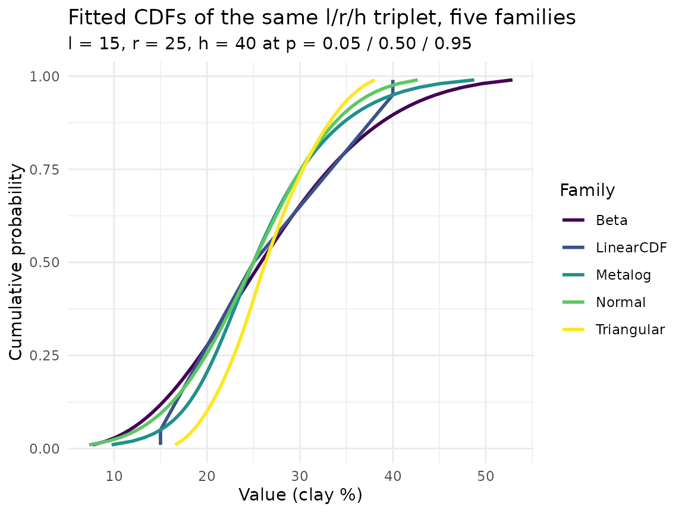
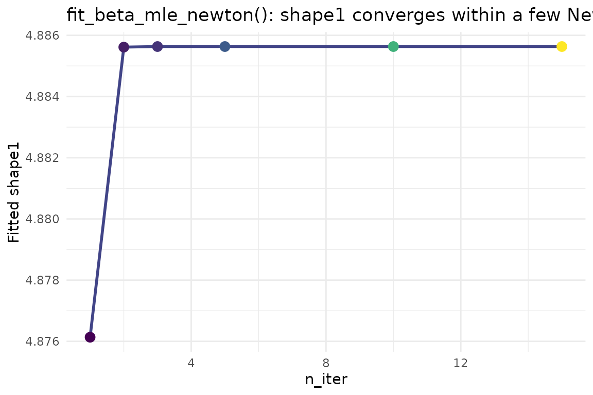
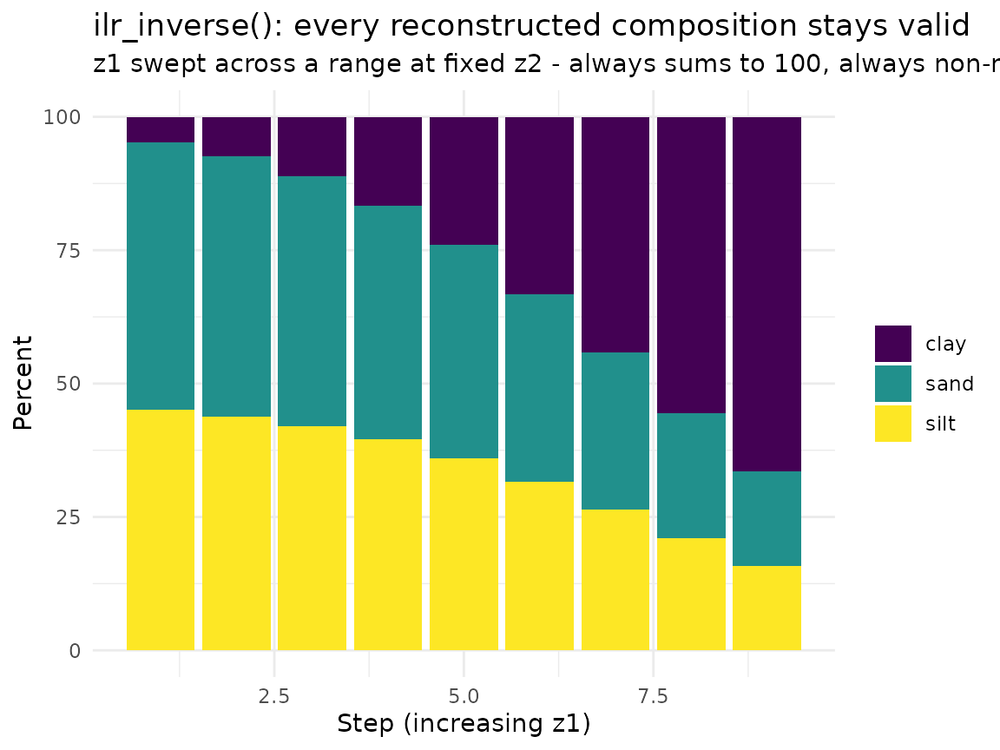
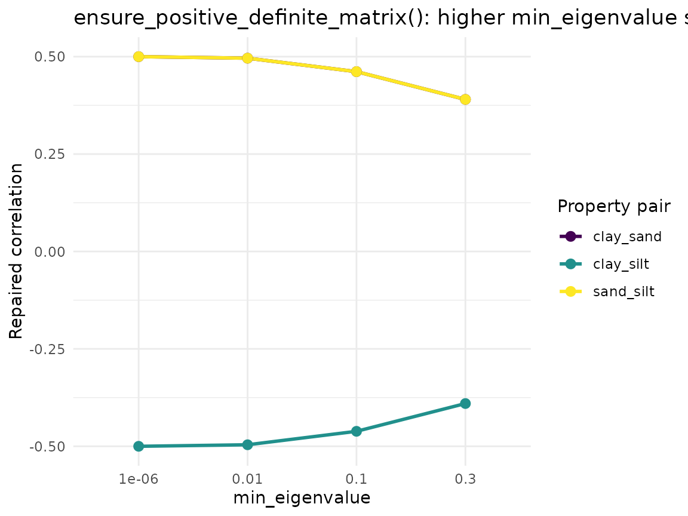

# Distribution Fitting & Correlations: A Function-by-Function Tour

## Overview

soilSIM’s other vignettes (e.g. “Getting Started: Tabular Monte Carlo
Simulation from SSURGO”) walk through top-level orchestrator functions
end to end on real data. This vignette instead zooms in on one thematic
group of *individual* functions - soilSIM’s generic,
data-source-agnostic statistical core - and shows what each one does and
how its parameters change its behavior. Nothing here knows or cares
whether a percentile triplet came from SSURGO, SOLUS, or a KSSL lab
table; these functions take plain numeric percentiles and physical
bounds and hand back fitted-distribution objects, quantile functions,
ILR-transformed compositional coordinates, and repaired
positive-definite correlation matrices. See
`soilSIM/docs/03_distribution_fitting_correlations.md` for the full
function-level reference.

All data in this vignette is small and synthetic - hand-constructed
numbers, not a real download - so that each parameter’s effect is easy
to isolate and see.

1.  Fit the same percentile triplet with five different distribution
    families and compare their shapes directly
    ([`fit_normal_triplet()`](https://jjmaynard.github.io/soilSIM/reference/fit_normal_triplet.md),
    Beta fitting,
    [`quantile_linear_cdf()`](https://jjmaynard.github.io/soilSIM/reference/quantile_linear_cdf.md),
    [`quantile_triangular()`](https://jjmaynard.github.io/soilSIM/reference/quantile_triangular.md),
    metalog fitting)
2.  [`resolve_property_family()`](https://jjmaynard.github.io/soilSIM/reference/resolve_property_family.md)’s
    automatic family selection from skew, and how `skew_threshold`
    changes the decision
3.  [`fit_percentile_triplet()`](https://jjmaynard.github.io/soilSIM/reference/fit_percentile_triplet.md)
    as the single master dispatcher tying the families together
4.  [`fit_beta_mle_newton()`](https://jjmaynard.github.io/soilSIM/reference/fit_beta_mle_newton.md)’s
    `n_iter` parameter - watching the Newton-Raphson fit actually
    converge
5.  ILR (isometric log-ratio) compositional transforms:
    [`ilr_forward()`](https://jjmaynard.github.io/soilSIM/reference/ilr_forward.md)
    /
    [`ilr_inverse()`](https://jjmaynard.github.io/soilSIM/reference/ilr_inverse.md)
6.  Correlation-matrix repair:
    [`ensure_positive_definite_matrix()`](https://jjmaynard.github.io/soilSIM/reference/ensure_positive_definite_matrix.md)
    and
    [`validate_correlation_matrix()`](https://jjmaynard.github.io/soilSIM/reference/validate_correlation_matrix.md)

``` r

library(soilSIM)
library(ggplot2)
```

## Step 1: Fitting the same triplet with five different families

A single low/representative/high (l/r/h) percentile triplet, at
probabilities 0.05/0.5/0.95, stands in for a clay-content-like property
throughout this section:

``` r

l <- 15; r <- 25; h <- 40   # clay%, at p = 0.05 / 0.50 / 0.95
bounds <- c(0, 100)          # physical bounds for the bounded families
```

Note this triplet is right-skewed (the high-side spread, `(h - r)` = 15,
is wider than the low-side spread, `(r - l)` = 10) - that skew is what
later drives
[`resolve_property_family()`](https://jjmaynard.github.io/soilSIM/reference/resolve_property_family.md)’s
automatic “lognormal” choice in Step 2.

### Normal: `fit_normal_triplet()` / `quantile_normal()`

`fit_normal_triplet(p_lo_val, p50_val, p_hi_val, p_lo, p_hi)` is an
exact closed-form fit - no iteration. `mean` is just the median value
(`p50_val`); `sd` is solved directly from the two-point spread
`(p_hi_val - p_lo_val) / (qnorm(p_hi) - qnorm(p_lo))`, an algebraic
consequence of the Normal’s linear quantile function.
`quantile_normal(fit, q)` then evaluates `mean + sd * qnorm(q)` at any
vector of probabilities `q`.

``` r

normal_fit <- fit_normal_triplet(p_lo_val = l, p50_val = r, p_hi_val = h, p_lo = 0.05, p_hi = 0.95)
normal_fit
#> $mean
#> [1] 25
#> 
#> $sd
#> [1] 7.59946
quantile_normal(normal_fit, q = c(0.05, 0.5, 0.95))  # round-trips back to l, r, h
#> [1] 12.5 25.0 37.5
```

### Beta: `fit_beta_mle_newton()` / `quantile_beta()`

Beta fitting rescales the triplet onto `[0,1]` using `bounds`, then fits
`shape1`/`shape2` by Newton-Raphson maximum likelihood (seeded from the
closed-form method-of-moments fit,
[`fit_beta_mom()`](https://jjmaynard.github.io/soilSIM/reference/fit_beta_mom.md)).
`quantile_beta(fit, q)` evaluates
[`qbeta()`](https://rdrr.io/r/stats/Beta.html) on `[0,1]`; rescaling
back to raw units
([`fit_percentile_triplet()`](https://jjmaynard.github.io/soilSIM/reference/fit_percentile_triplet.md)/[`quantile_from_fit()`](https://jjmaynard.github.io/soilSIM/reference/quantile_from_fit.md)
handle that step, shown in Step 3 below) is not part of
[`quantile_beta()`](https://jjmaynard.github.io/soilSIM/reference/quantile_beta.md)
itself.

``` r

beta_fit <- fit_beta_mle_newton(values = c(l, r, h), bounds = bounds)
beta_fit
#> $shape1
#> [1] 4.885634
#> 
#> $shape2
#> [1] 13.43313
# quantile_beta() operates on [0,1]; rescale manually here for a direct comparison
bounds[1] + quantile_beta(beta_fit, q = c(0.05, 0.5, 0.95)) * diff(bounds)
#> [1] 11.67637 25.80662 44.62860
```

### Piecewise-linear: `quantile_linear_cdf()`

`quantile_linear_cdf(probs, values, q)` builds a piecewise-linear
inverse-CDF through the supplied knots via
`approxfun(method = "linear", rule = 2)` - exact at the knots, with
`rule = 2` clamping (not extrapolating) beyond the outermost knot.

``` r

quantile_linear_cdf(probs = c(0.05, 0.5, 0.95), values = c(l, r, h), q = c(0.05, 0.5, 0.95))
#> [1] 15 25 40
quantile_linear_cdf(probs = c(0.05, 0.5, 0.95), values = c(l, r, h), q = c(0, 1))  # clamped, not extrapolated
#> [1] 15 40
```

### Triangular: `quantile_triangular()`

`quantile_triangular(fit, q)` takes `fit = list(min=, mode=, max=)` and
evaluates the standard closed-form triangular inverse-CDF, split at the
mode fraction `fc = (mode - min) / (max - min)`. Here the l/r/h triplet
plays min/mode/max directly:

``` r

triangular_fit <- list(min = l, mode = r, max = h)
quantile_triangular(triangular_fit, q = c(0.05, 0.5, 0.95))
#> [1] 18.53553 26.30694 35.66987
```

### Metalog: `fit_metalog_linear()` / `quantile_metalog_linear()`

With exactly 3 interior percentiles and 3 metalog terms,
[`fit_metalog_linear()`](https://jjmaynard.github.io/soilSIM/reference/fit_metalog_linear.md)
solves an exactly-determined linear system for the metalog coefficients
(`solve(Y, z)`) rather than optimizing. `boundedness = "u"` (unbounded)
is used here since no physical `bounds` are supplied.

``` r

metalog_fit <- fit_metalog_linear(interior_values = c(l, r, h), interior_probs = c(0.05, 0.5, 0.95),
                                   boundedness = "u")
quantile_metalog_linear(metalog_fit, q = c(0.05, 0.5, 0.95))  # exact at the knots, like the others
#> [1] 15 25 40
```

### Comparing all five fitted PDFs on the same plot

Every family above reproduces `l`/`r`/`h` exactly at `q = 0.05/0.5/0.95`
(that’s what “fitting to the triplet” means for each of them) - what
differs is the *shape* connecting those three points. Evaluating each
quantile function on a fine probability grid and differentiating
numerically approximates each family’s density:

``` r

q_grid <- seq(0.01, 0.99, by = 0.01)

families <- list(
  Normal     = quantile_normal(normal_fit, q_grid),
  Beta       = bounds[1] + quantile_beta(beta_fit, q_grid) * diff(bounds),
  LinearCDF  = quantile_linear_cdf(c(0.05, 0.5, 0.95), c(l, r, h), q_grid),
  Triangular = quantile_triangular(triangular_fit, q_grid),
  Metalog    = quantile_metalog_linear(metalog_fit, q_grid)
)

cdf_df <- do.call(rbind, lapply(names(families), function(fam) {
  data.frame(family = fam, q = q_grid, value = families[[fam]])
}))

ggplot(cdf_df, aes(x = value, y = q, color = family)) +
  geom_line(linewidth = 1) +
  scale_color_viridis_d(name = "Family") +
  theme_minimal() +
  labs(
    title = "Fitted CDFs of the same l/r/h triplet, five families",
    subtitle = "l = 15, r = 25, h = 40 at p = 0.05 / 0.50 / 0.95",
    x = "Value (clay %)", y = "Cumulative probability"
  )
```



The families agree exactly at the three fitted knots (0.05/0.5/0.95) but
diverge everywhere else - Triangular is angular by construction,
Normal/Beta/Metalog are smooth but differently shaped in the tails, and
LinearCDF is piecewise-straight between knots with hard clamping beyond
them (visible as the flat segments at the very top/bottom of its curve).

## Step 2: Automatic family selection - `resolve_property_family()`

`resolve_property_family(l, r, h, bounds = NULL, skew_threshold = 0.15)`
picks a family from a skew proxy `((h - r) - (r - l)) / (h - l)` - how
lopsided the high-side spread is relative to the low-side spread around
the representative value. If `bounds` is supplied it always resolves to
`"beta"`; otherwise `"normal"` if the skew proxy is within
`skew_threshold` of zero, else `"lognormal"`. It deliberately never
resolves to `"metalog"` - that stays an explicit, opted-in choice.

``` r

symmetric  <- list(l = 15, r = 25, h = 35)   # (35-25) - (25-15) = 0            -> skew_proxy 0
mild_skew  <- list(l = 15, r = 25, h = 40)   # (40-25) - (25-15) = 5            -> skew_proxy 0.25
strong_skew <- list(l = 20, r = 24, h = 60)  # (60-24) - (24-20) = 32           -> skew_proxy 0.9

triplets <- list(Symmetric = symmetric, `Mild skew` = mild_skew, `Strong skew` = strong_skew)

resolution_df <- do.call(rbind, lapply(names(triplets), function(nm) {
  t <- triplets[[nm]]
  res <- resolve_property_family(t$l, t$r, t$h)
  data.frame(triplet = nm, l = t$l, r = t$r, h = t$h,
             skew_proxy = round(res$skew_proxy, 3), family = res$family)
}))
resolution_df
#>       triplet  l  r  h skew_proxy    family
#> 1   Symmetric 15 25 35        0.0    normal
#> 2   Mild skew 15 25 40        0.2 lognormal
#> 3 Strong skew 20 24 60        0.8 lognormal
```

The symmetric triplet resolves to `"normal"` (skew proxy exactly 0, well
inside the default 0.15 threshold); both skewed triplets resolve to
`"lognormal"`. Sliding `skew_threshold` up past a triplet’s own skew
proxy flips the decision from `"lognormal"` back to `"normal"`:

``` r

thresholds <- c(0.05, 0.15, 0.30, 0.50)
threshold_df <- do.call(rbind, lapply(thresholds, function(th) {
  res <- resolve_property_family(mild_skew$l, mild_skew$r, mild_skew$h, skew_threshold = th)
  data.frame(skew_threshold = th, skew_proxy = round(res$skew_proxy, 3), family = res$family)
}))
threshold_df
#>   skew_threshold skew_proxy    family
#> 1           0.05        0.2 lognormal
#> 2           0.15        0.2 lognormal
#> 3           0.30        0.2    normal
#> 4           0.50        0.2    normal
```

The mild-skew triplet’s skew proxy is 0.25; once `skew_threshold` rises
above that (0.30, 0.50), the same triplet resolves to `"normal"` instead
of `"lognormal"` - the same input data, a different family, purely from
where the threshold is drawn. Supplying `bounds` overrides all of this
and always resolves to `"beta"`:

``` r

resolve_property_family(mild_skew$l, mild_skew$r, mild_skew$h, bounds = c(0, 100))$family
#> [1] "beta"
```

## Step 3: `fit_percentile_triplet()` - the master dispatcher

`fit_percentile_triplet(l, r, h, family, lh_probs = c(0.05, 0.95), bounds = NULL, boundedness = ...)`
is the single entry point the rest of soilSIM calls - it wraps every
fitter shown in Step 1 behind one `family` argument (`"triangular"`,
`"uniform"`, `"normal"`, `"lognormal"`, `"beta"`, `"metalog"`,
`"linear_cdf"`, or `"auto"`), plus two degenerate-input guards:
non-finite `l`/`r`/`h` returns `valid = FALSE`, and a zero-width
interval (`h == l`) always collapses to a triangular fit
`min = mode = max = r` regardless of the requested family, since every
parametric family divides by zero on a zero-width interval.

``` r

for (fam in c("normal", "beta", "lognormal", "triangular", "metalog", "auto")) {
  result <- fit_percentile_triplet(l, r, h, family = fam, bounds = if (fam == "beta") bounds else NULL)
  cat(sprintf("%-10s -> resolved family = %-10s valid = %s\n", fam, result$family, result$valid))
}
#> normal     -> resolved family = normal     valid = TRUE
#> beta       -> resolved family = beta       valid = TRUE
#> lognormal  -> resolved family = lognormal  valid = TRUE
#> triangular -> resolved family = triangular valid = TRUE
#> metalog    -> resolved family = metalog    valid = TRUE
#> auto       -> resolved family = lognormal  valid = TRUE
```

`family = "auto"` with no `bounds` resolves through
[`resolve_property_family()`](https://jjmaynard.github.io/soilSIM/reference/resolve_property_family.md)
exactly as in Step 2 (this triplet’s skew proxy of 0.25 exceeds the
default 0.15 threshold, so it resolves to `"lognormal"`). Once fitted,
`quantile_from_fit(u, family, fit)` is the matching master *quantile*
dispatcher - the same round-trip Step 1 built by hand for each family
individually:

``` r

auto_fit <- fit_percentile_triplet(l, r, h, family = "auto")
quantile_from_fit(u = c(0.05, 0.5, 0.95), family = auto_fit$family, fit = auto_fit$fit)
#> [1] 15.30931 25.00000 40.82483
```

The zero-width-interval guard, demonstrated directly:

``` r

fit_percentile_triplet(l = 25, r = 25, h = 25, family = "beta", bounds = bounds)
#> $family
#> [1] "triangular"
#> 
#> $fit
#> $fit$min
#> [1] 25
#> 
#> $fit$mode
#> [1] 25
#> 
#> $fit$max
#> [1] 25
#> 
#> 
#> $valid
#> [1] TRUE
```

## Step 4: `fit_beta_mle_newton()`’s `n_iter` parameter - watching convergence

`fit_beta_mle_newton(values, bounds, n_iter = 15, eps = 1e-6)` runs a
*fixed* number of Newton-Raphson steps - there is no internal
convergence check, so `n_iter` directly controls how close the fit gets
to the true MLE. Refitting the same values at increasing `n_iter` shows
the shape parameters (and the resulting quantiles) settle down after
only a few steps:

``` r

n_iters <- c(1, 2, 3, 5, 10, 15)
convergence_df <- do.call(rbind, lapply(n_iters, function(ni) {
  fit_i <- fit_beta_mle_newton(values = c(l, r, h), bounds = bounds, n_iter = ni)
  q_i <- bounds[1] + quantile_beta(fit_i, q = c(0.05, 0.5, 0.95)) * diff(bounds)
  data.frame(n_iter = ni, shape1 = fit_i$shape1, shape2 = fit_i$shape2,
             q05 = q_i[1], q50 = q_i[2], q95 = q_i[3])
}))
convergence_df
#>   n_iter   shape1   shape2      q05      q50      q95
#> 1      1 4.876135 13.40713 11.66420 25.80474 44.64633
#> 2      2 4.885615 13.43308 11.67634 25.80661 44.62864
#> 3      3 4.885634 13.43313 11.67637 25.80662 44.62860
#> 4      5 4.885634 13.43313 11.67637 25.80662 44.62860
#> 5     10 4.885634 13.43313 11.67637 25.80662 44.62860
#> 6     15 4.885634 13.43313 11.67637 25.80662 44.62860
```

``` r

ggplot(convergence_df, aes(x = n_iter, y = shape1)) +
  geom_line(color = viridisLite::viridis(1, begin = 0.2), linewidth = 1) +
  geom_point(aes(color = n_iter), size = 3) +
  scale_color_viridis_c(guide = "none") +
  theme_minimal() +
  labs(
    title = "fit_beta_mle_newton(): shape1 converges within a few Newton-Raphson steps",
    x = "n_iter", y = "Fitted shape1"
  )
```



`shape1` (and `shape2`, not plotted) moves the most between `n_iter = 1`
and `n_iter = 3`, then barely changes from `n_iter = 5` onward -
`n_iter = 15` (soilSIM’s default everywhere else) is well past the point
of diminishing returns for this triplet, which is exactly why a fixed
iteration count without a convergence check is a safe design choice
here.

## Step 5: ILR compositional transforms

Soil texture (clay/sand/silt) is a 3-part composition that must sum to a
fixed total (e.g. 100%) and stay non-negative - ordinary independent
simulation of each fraction can’t guarantee that.
[`ilr_forward()`](https://jjmaynard.github.io/soilSIM/reference/ilr_forward.md)/[`ilr_inverse()`](https://jjmaynard.github.io/soilSIM/reference/ilr_inverse.md)
are soilSIM’s isometric log-ratio transform: they move a composition
to/from a 2-dimensional unconstrained coordinate system where ordinary
Normal-distribution machinery applies safely, with the constraint
automatically satisfied on the way back.

``` r

# A synthetic clay/sand/silt composition
example_composition <- c(clay = 24, sand = 40, silt = 36)
sum(example_composition)
#> [1] 100

z <- ilr_forward(clay = example_composition["clay"], sand = example_composition["sand"],
                  silt = example_composition["silt"])
z  # 2 unconstrained coordinates, z1/z2
#>              z1         z2
#> clay -0.3740741 0.07450114
```

``` r

back <- ilr_inverse(z1 = z[, "z1"], z2 = z[, "z2"], total = 100)
back  # round-trips back to the original composition
#>      clay sand silt
#> [1,]   24   40   36
sum(back)
#> [1] 100
```

Perturbing the ILR coordinates and inverting always yields a valid
composition - non-negative and summing exactly to `total` - which is the
point of doing simulation in ILR space rather than directly on
clay/sand/silt:

``` r

set.seed(42)
z1_perturbed <- z[, "z1"] + seq(-1.5, 1.5, length.out = 9)
z2_perturbed <- rep(z[, "z2"], 9)
perturbed_compositions <- as.data.frame(ilr_inverse(z1_perturbed, z2_perturbed, total = 100))
perturbed_compositions$step <- seq_len(9)

stack_df <- do.call(rbind, lapply(c("clay", "sand", "silt"), function(part) {
  data.frame(step = perturbed_compositions$step, fraction = part,
             pct = perturbed_compositions[[part]])
}))

ggplot(stack_df, aes(x = step, y = pct, fill = fraction)) +
  geom_col() +
  scale_fill_viridis_d(name = NULL) +
  theme_minimal() +
  labs(
    title = "ilr_inverse(): every reconstructed composition stays valid",
    subtitle = "z1 swept across a range at fixed z2 - always sums to 100, always non-negative",
    x = "Step (increasing z1)", y = "Percent"
  )
```



Every bar in the stack sums to exactly 100 -
[`ilr_inverse()`](https://jjmaynard.github.io/soilSIM/reference/ilr_inverse.md)’s
softmax-like normalization guarantees this by construction, for any
finite `z1`/`z2`.

## Step 6: Correlation-matrix repair

Multi-property Monte Carlo simulation needs a positive-definite (PD)
correlation matrix for its Cholesky-copula step. Empirically estimated
or hand-assembled correlation matrices are not always PD -
[`ensure_positive_definite_matrix()`](https://jjmaynard.github.io/soilSIM/reference/ensure_positive_definite_matrix.md)
repairs one via eigenvalue flooring, and
[`validate_correlation_matrix()`](https://jjmaynard.github.io/soilSIM/reference/validate_correlation_matrix.md)
checks whether a candidate matrix is already usable.

A deliberately broken, non-positive-definite 3x3 correlation matrix
(valid-looking diagonal and range, but internally inconsistent pairwise
correlations):

``` r

broken_matrix <- matrix(
  c( 1.0,  0.9, -0.9,
     0.9,  1.0,  0.9,
    -0.9,  0.9,  1.0),
  nrow = 3, dimnames = list(c("clay", "sand", "silt"), c("clay", "sand", "silt"))
)
broken_matrix
#>      clay sand silt
#> clay  1.0  0.9 -0.9
#> sand  0.9  1.0  0.9
#> silt -0.9  0.9  1.0
eigen(broken_matrix, only.values = TRUE)$values  # a negative eigenvalue confirms it's not PD
#> [1]  1.9  1.9 -0.8
```

``` r

validate_correlation_matrix(broken_matrix, properties = c("clay", "sand", "silt"))
#> $valid
#> [1] FALSE
#> 
#> $message
#> [1] "Matrix is not positive definite"
```

`ensure_positive_definite_matrix(matrix, min_eigenvalue = 1e-6)`
eigendecomposes the matrix, floors any eigenvalue below
`min_eigenvalue`, reconstructs, and rescales back to a unit-diagonal
correlation matrix (also restoring the original dimnames, which
`eigen()$vectors` does not carry):

``` r

repaired_matrix <- ensure_positive_definite_matrix(broken_matrix)
repaired_matrix
#>            clay      sand       silt
#> clay  1.0000000 0.4999996 -0.4999996
#> sand  0.4999996 1.0000000  0.4999996
#> silt -0.4999996 0.4999996  1.0000000
eigen(repaired_matrix, only.values = TRUE)$values  # all positive now
#> [1] 1.500000e+00 1.500000e+00 7.894735e-07
validate_correlation_matrix(repaired_matrix, properties = c("clay", "sand", "silt"))
#> $valid
#> [1] TRUE
#> 
#> $message
#> [1] ""
```

Raising `min_eigenvalue` pushes the repaired matrix further from the
(broken) original toward a better-conditioned but less “confident”
correlation structure - visible as the off-diagonal correlations
shrinking toward zero as the floor rises:

``` r

floors <- c(1e-6, 0.01, 0.1, 0.3)
floor_df <- do.call(rbind, lapply(floors, function(mv) {
  r <- ensure_positive_definite_matrix(broken_matrix, min_eigenvalue = mv)
  data.frame(min_eigenvalue = mv, clay_sand = r["clay", "sand"], clay_silt = r["clay", "silt"],
             sand_silt = r["sand", "silt"])
}))
floor_df_long <- do.call(rbind, lapply(c("clay_sand", "clay_silt", "sand_silt"), function(pair) {
  data.frame(min_eigenvalue = floor_df$min_eigenvalue, pair = pair, correlation = floor_df[[pair]])
}))

ggplot(floor_df_long, aes(x = factor(min_eigenvalue), y = correlation, color = pair, group = pair)) +
  geom_line(linewidth = 1) +
  geom_point(size = 2.5) +
  scale_color_viridis_d(name = "Property pair") +
  theme_minimal() +
  labs(
    title = "ensure_positive_definite_matrix(): higher min_eigenvalue shrinks correlations",
    x = "min_eigenvalue", y = "Repaired correlation"
  )
```



`validate_correlation_matrix(corr_matrix, properties)` is the cheaper,
non-repairing counterpart - it only checks shape (square, matching
`length(properties)`), unit diagonal, and positive definiteness,
returning the first failing check’s message rather than fixing anything.
Together these two functions are the shared final guard both
[`estimate_correlation_matrix_robust()`](https://jjmaynard.github.io/soilSIM/reference/estimate_correlation_matrix_robust.md)
and
[`build_kssl_fallback_matrix()`](https://jjmaynard.github.io/soilSIM/reference/build_kssl_fallback_matrix.md)
route their correlation matrices through before the Cholesky-copula
simulation step consumes them.
