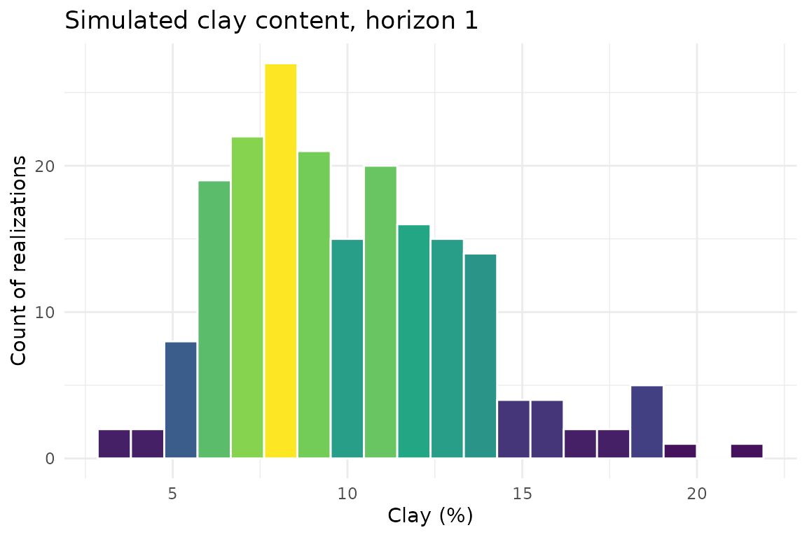
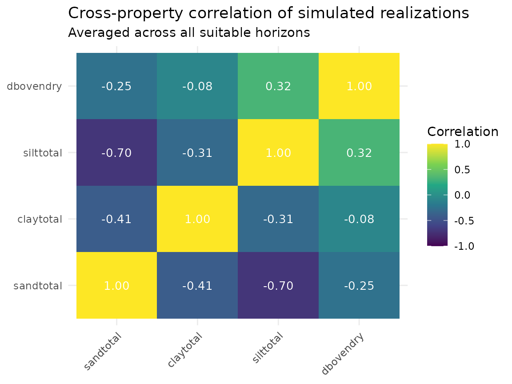
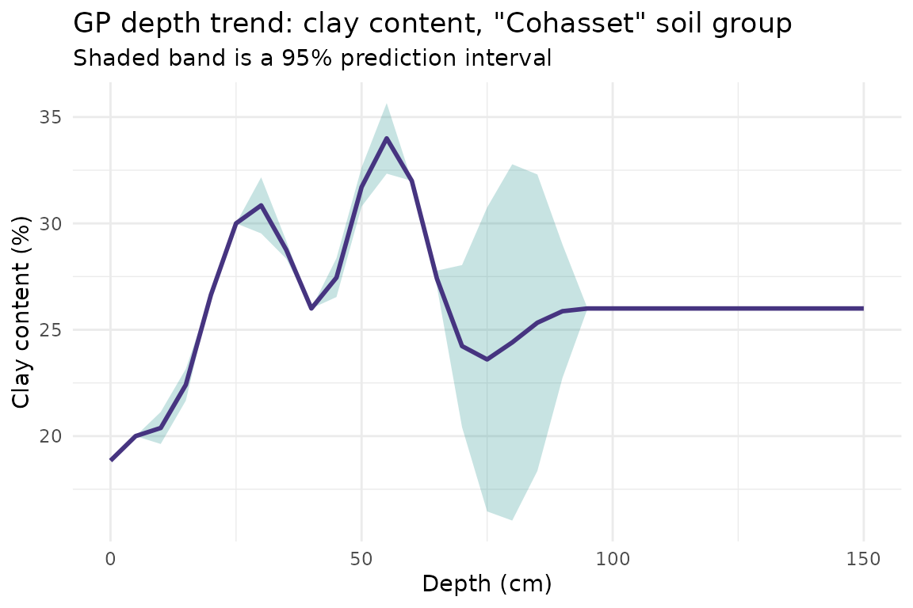

# Getting Started: Tabular Monte Carlo Simulation from SSURGO

## Overview

This vignette walks through soilSIM’s core tabular pipeline end to end,
using real SSURGO data for a small area of interest (AOI) in the Sierra
Nevada foothills of Amador County, California:

1.  Download and clean real SSURGO tabular data for the AOI
2.  Fill in missing property values
3.  Fit percentile-triplet distributions and run a correlated Monte
    Carlo simulation
4.  Characterize the simulated output statistically
5.  Fit Gaussian-process depth-trend models as a next step toward
    depth-aware simulation

Every number in this vignette originated from a real download against
NRCS Soil Data Access - see the “Where this data came from” note below.
See `soilSIM/docs/01_data_acquisition_processing.md`,
`03_distribution_fitting_correlations.md`,
`04_monte_carlo_simulation.md`, and
`05_gp_modeling_multivariate_adjustment.md` for the full function-level
reference behind each step.

``` r

library(soilSIM)
library(ggplot2)
```

## Step 1: Acquire and process real SSURGO data

The AOI is a small polygon (about 1 km x 1 km) near Amador County, CA:

``` r

amador_wkt <- "POLYGON((-120.5 38.5, -120.4 38.5, -120.4 38.6, -120.5 38.6, -120.5 38.5))"
```

[`download_and_prepare_ssurgo()`](https://jjmaynard.github.io/soilSIM/reference/download_and_prepare_ssurgo.md)
queries NRCS Soil Data Access live for this AOI, then filters to a
maximum depth. That call is shown here for reference, but this vignette
loads a cached copy of its real output so the vignette builds without a
live network dependency:

``` r

# The real call this vignette's cached data came from:
ssurgo_amador <- download_and_prepare_ssurgo(
  aoi_wkt = amador_wkt,
  properties = c("sandtotal", "claytotal", "silttotal", "dbovendry", "ph1to1h2o",
                 "cec7", "om", "wthirdbar", "wfifteenbar"),
  max_depth = 150
)
```

``` r

ssurgo_amador <- readRDS(system.file("extdata", "ssurgo_amador.rds", package = "soilSIM"))
raw_data <- ssurgo_amador$ssurgo_data
dim(raw_data)
#> [1] 575  67
length(unique(raw_data$cokey))
#> [1] 116
length(unique(raw_data$mukey))
#> [1] 66
```

This AOI resolves to 66 real map units and 116 soil components.
[`process_ssurgo_data()`](https://jjmaynard.github.io/soilSIM/reference/process_ssurgo_data.md)
cleans and standardizes the raw download - flagging unsuitable horizons
(bedrock, cemented pans, organic layers) that shouldn’t feed property
simulation:

``` r

processed <- process_ssurgo_data(raw_data, max_depth = 150, verbose = FALSE)
horizon_data <- processed$processed_data
sum(horizon_data$unsuitable_horizon)
#> [1] 84
```

## Step 2: Fill in missing property values

Real SSURGO data has gaps -
[`process_soil_properties_comprehensive()`](https://jjmaynard.github.io/soilSIM/reference/process_soil_properties_comprehensive.md)
fills them in using pedologically informed recovery strategies
(horizon-name matching, depth-weighted averaging, related-property
estimation) rather than a blind mean-impute:

``` r

properties <- c("sandtotal", "claytotal", "silttotal", "dbovendry")
infilled <- process_soil_properties_comprehensive(horizon_data, properties = properties, verbose = FALSE)
mean(infilled$property_data_complete, na.rm = TRUE)
#> [1] 1
```

## Step 3: Fit distributions and run the Monte Carlo simulation

soilSIM’s percentile-triplet fitter
([`fit_percentile_triplet()`](https://jjmaynard.github.io/soilSIM/reference/fit_percentile_triplet.md))
turns each property’s SSURGO low/representative/high values into a
fitted distribution. For clay content in the first suitable horizon:

``` r

first_row <- infilled[!infilled$unsuitable_horizon, ][1, ]
clay_fit <- fit_percentile_triplet(
  l = first_row$claytotal_l, r = first_row$claytotal_r, h = first_row$claytotal_h,
  family = "normal"
)
quantile_from_fit(u = c(0.05, 0.5, 0.95), family = clay_fit$family, fit = clay_fit$fit)
#> [1]  5 10 15
```

[`generate_monte_carlo_realizations()`](https://jjmaynard.github.io/soilSIM/reference/generate_monte_carlo_realizations.md)
is the master pipeline: it does this fitting for every property/horizon,
estimates (or falls back to a KSSL reference) correlation structure
across properties, and draws correlated realizations:

``` r

mc_result <- generate_monte_carlo_realizations(
  soil_data = infilled,
  properties = properties,
  n_realizations = 200,
  simulation_config = list(
    max_depth = 150,
    auto_correlation = TRUE,
    correlation_fallback = "kssl_global"
  ),
  parallel = FALSE,
  seed = 123
)

dim(mc_result$simulation_data)  # [horizon, property, realization]
#> [1] 491   4 200
mc_result$metadata$success_rate
#> [1] 1
mc_result$quality_assessment$overall_quality_score
#> [1] 1
```

491 suitable horizons x 4 properties x 200 realizations, at a 100%
success rate. Distribution of simulated clay content across all
realizations, for the first horizon:

``` r

clay_col <- match("claytotal", properties)
clay_realizations <- data.frame(clay = mc_result$simulation_data[1, clay_col, ])

ggplot(clay_realizations, aes(x = clay, fill = after_stat(count))) +
  geom_histogram(bins = 20, color = "white") +
  scale_fill_viridis_c() +
  theme_minimal() +
  labs(
    title = "Simulated clay content, horizon 1",
    x = "Clay (%)",
    y = "Count of realizations"
  ) +
  theme(legend.position = "none")
```



The Monte Carlo engine’s whole point is preserving cross-property
correlation structure, not just marginal distributions - it’s worth
checking that this actually happened. `mc_result$simulation_data` is a
`[horizon, property, realization]` array; the correlation matrix below
is computed across realizations for each horizon, then averaged over all
suitable horizons:

``` r

prop_names <- dimnames(mc_result$simulation_data)[[2]]
n_horizons <- dim(mc_result$simulation_data)[1]
n_props <- length(prop_names)

cor_by_horizon <- array(NA_real_, dim = c(n_props, n_props, n_horizons))
for (h in seq_len(n_horizons)) {
  realizations_by_property <- t(mc_result$simulation_data[h, , ])
  cor_by_horizon[, , h] <- cor(realizations_by_property, use = "pairwise.complete.obs")
}
mean_cor <- apply(cor_by_horizon, c(1, 2), mean, na.rm = TRUE)
dimnames(mean_cor) <- list(prop_names, prop_names)

cor_df <- as.data.frame(as.table(mean_cor))
names(cor_df) <- c("property_1", "property_2", "correlation")

ggplot(cor_df, aes(x = property_1, y = property_2, fill = correlation)) +
  geom_tile() +
  geom_text(aes(label = sprintf("%.2f", correlation)), color = "white", size = 3.5) +
  scale_fill_viridis_c(limits = c(-1, 1), name = "Correlation") +
  theme_minimal() +
  labs(
    title = "Cross-property correlation of simulated realizations",
    subtitle = "Averaged across all suitable horizons",
    x = NULL, y = NULL
  ) +
  theme(axis.text.x = element_text(angle = 45, hjust = 1))
```



## Step 4: Characterize the simulated data statistically

[`analyze_soil_statistics()`](https://jjmaynard.github.io/soilSIM/reference/analyze_soil_statistics.md)
runs correlation analysis, distribution fitting, and outlier detection
on the processed data (the same real Amador dataset from Step 1):

``` r

stats_result <- analyze_soil_statistics(horizon_data, verbose = FALSE)
stats_result$analysis_metadata$properties_analyzed
#> [1] 16
```

## Step 5: Toward depth-aware simulation - Gaussian process depth trends

The Monte Carlo simulation above treats every suitable horizon
independently. soilSIM’s GP modeling group
([`build_stratified_gp_models()`](https://jjmaynard.github.io/soilSIM/reference/build_stratified_gp_models.md))
fits depth-trend models per soil group, so simulated properties can
follow a realistic depth trend rather than horizon-by-horizon
independence.
[`prepare_nrcs_training_data()`](https://jjmaynard.github.io/soilSIM/reference/prepare_nrcs_training_data.md)
automatically selects a grouping strategy - for this AOI, it selects
grouping by soil series:

``` r

gp_train <- prepare_nrcs_training_data(horizon_data, max_depth = 150)
table(gp_train$soil_group)
#> 
#>     Chaix  Cohasset   Holland Josephine  Mariposa  McCarthy     Sites 
#>        24       118        21        81        50        60        31
```

``` r

gp_models <- build_stratified_gp_models(
  gp_train,
  properties = c("clay_pct", "sand_pct", "pH", "organic_matter"),
  min_profiles_per_group = 3,
  min_observations_per_group = 15,
  optimize_hyperparameters = FALSE
)
gp_models$model_summary$total_models
#> [1] 26
```

26 GP models were fit across 7 real soil-series groups from this AOI.
Each fitted model predicts a property’s mean depth trend (with
uncertainty) for its soil-series group via
[`predict_gp_depth_trends()`](https://jjmaynard.github.io/soilSIM/reference/predict_gp_depth_trends.md).
For clay content in the first group:

``` r

clay_groups <- names(gp_models$clay_pct$models)
first_group <- clay_groups[1]
clay_gp_model <- gp_models$clay_pct$models[[first_group]]

depth_seq <- seq(0, 150, by = 5)
gp_mean <- predict_gp_depth_trends(clay_gp_model, depth_seq)

# predict_gp_depth_trends() returns the fitted mean only; pull the prediction
# variance directly from GPfit to draw an uncertainty band around it
scaling <- clay_gp_model$depth_scaling
scaled_depths <- pmax(0, pmin(1, (depth_seq - scaling$min) / scaling$range))
gp_pred <- GPfit::predict.GP(clay_gp_model$gp_model, xnew = as.matrix(scaled_depths))
gp_se <- sqrt(pmax(gp_pred$MSE, 0))

gp_depth_trend <- data.frame(
  depth = depth_seq,
  mean = gp_mean,
  lower = gp_mean - 1.96 * gp_se,
  upper = gp_mean + 1.96 * gp_se
)

ggplot(gp_depth_trend, aes(x = depth, y = mean)) +
  geom_ribbon(aes(ymin = lower, ymax = upper), fill = viridisLite::viridis(1, begin = 0.5), alpha = 0.25) +
  geom_line(color = viridisLite::viridis(1, begin = 0.15), linewidth = 1) +
  theme_minimal() +
  labs(
    title = paste0("GP depth trend: clay content, \"", first_group, "\" soil group"),
    subtitle = "Shaded band is a 95% prediction interval",
    x = "Depth (cm)",
    y = "Clay content (%)"
  )
```



From here,
[`integrate_monte_carlo_with_gp()`](https://jjmaynard.github.io/soilSIM/reference/integrate_monte_carlo_with_gp.md)
(see `soilSIM/docs/05_gp_modeling_multivariate_adjustment.md`) combines
these depth-trend models with a Monte Carlo simulation like `mc_result`
above, nudging each realization toward its group’s fitted depth trend
while preserving the cross-property correlation structure - the natural
next step beyond this vignette’s scope.

## Where this data came from

The cached data this vignette loads (`inst/extdata/ssurgo_amador.rds`)
was produced once by `data-raw/build_vignette_data.R`, which calls
[`download_and_prepare_ssurgo()`](https://jjmaynard.github.io/soilSIM/reference/download_and_prepare_ssurgo.md)
live against NRCS Soil Data Access for the AOI above. Re-run that script
to refresh it.
