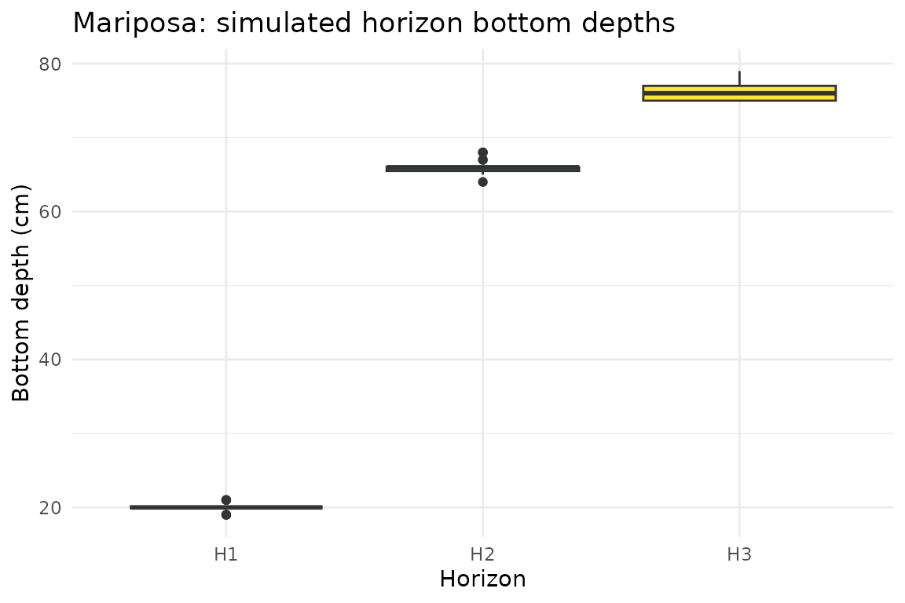
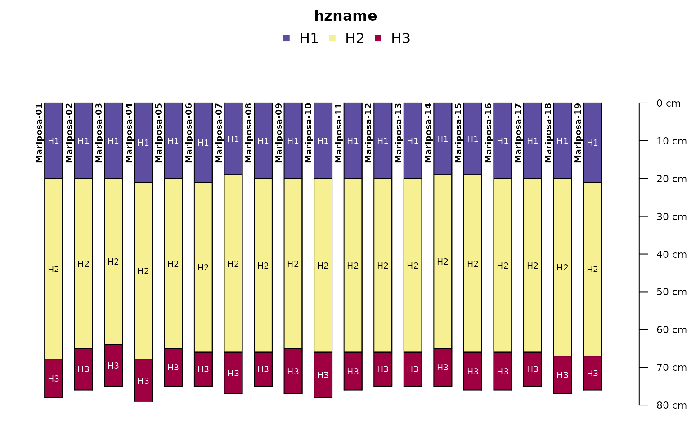
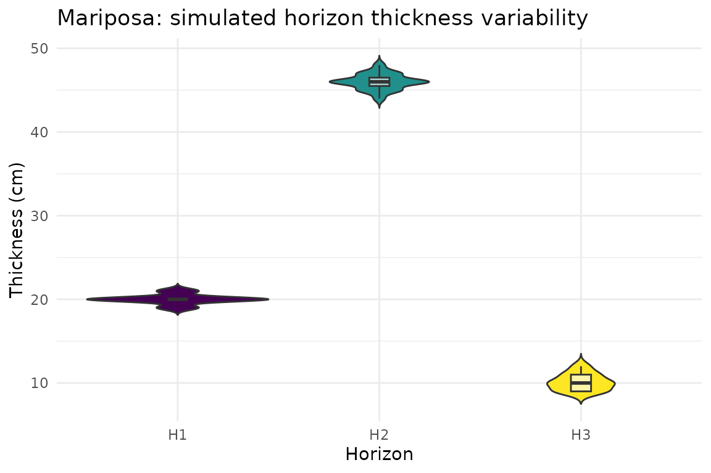

# Profile, Component & Depth Simulation with a Real Soil Component

## Overview

soilSIM can simulate two related kinds of variability for a real SSURGO
map unit: how much of a map unit a component actually occupies
(component composition), and how variable a component’s horizon depths
and thicknesses are in the field (depth/thickness variability, informed
by Official Series Description boundary-distinctness data). This
vignette demonstrates both, using a real map unit from the same
Amador-area AOI as the “Getting Started” vignette. See
`soilSIM/docs/06_profile_component_depth_simulation.md` for the full
function-level reference.

``` r

library(soilSIM)
library(ggplot2)
```

## The real component

[`get_aws_data_by_mukey()`](https://jjmaynard.github.io/soilSIM/reference/get_aws_data_by_mukey.md)
queries NRCS Soil Data Access live for a given map unit key. This
vignette’s cached data was produced by that real call (see “Where this
data came from” below) for map unit **462255** within the Amador-area
AOI, which resolves to a single real component:

``` r

depth_sim_mukey <- readRDS(system.file("extdata", "depth_sim_mukey_data.rds", package = "soilSIM"))
mu_data <- depth_sim_mukey$data
mu_data[, c("cokey", "compname", "comppct_l", "comppct_r", "comppct_h",
            "hzname", "hzdept_r", "hzdepb_r", "sandtotal_r", "claytotal_r")]
#>      cokey compname comppct_l comppct_r comppct_h hzname hzdept_r hzdepb_r
#> 1 26397825 Mariposa        NA        75        NA     H1        0       20
#> 2 26397825 Mariposa        NA        75        NA     H2       20       66
#> 3 26397825 Mariposa        NA        75        NA     H3       66       76
#>   sandtotal_r claytotal_r
#> 1        30.1        15.0
#> 2        22.6        27.5
#> 3          NA          NA
```

This is a real component named **“Mariposa”** (`cokey` 26397825), with 3
horizons and a representative component percentage of 75% (ranging
NA-NA%).

## Step 1: Simulate component composition

[`sim_component_comp()`](https://jjmaynard.github.io/soilSIM/reference/sim_component_comp.md)
draws `n_simulations` triangular samples from each component’s
low/representative/high percentage and derives a single `sim_comppct`
value - the number of Monte Carlo profile realizations to simulate for
that component:

``` r

component_sim <- sim_component_comp(mu_data, n_simulations = 25)
component_sim
#>    mukey    cokey compname comppct_l comppct_r comppct_h sim_comppct
#> 1 462255 26397825 Mariposa        73        75        77          19
```

With this component’s real NA/75/NA percentage triplet, 25 triangular
draws collapse to `sim_comppct` = 19 - the number of profile replicates
simulated in the next step.

## Step 2: Simulate horizon depth and thickness variability

[`simulate_profile_depths_by_mukey()`](https://jjmaynard.github.io/soilSIM/reference/simulate_profile_depths_by_mukey.md)
orchestrates the full depth-simulation pipeline for a real mukey: it
queries SSURGO, derives `sim_comppct` via
[`sim_component_comp()`](https://jjmaynard.github.io/soilSIM/reference/sim_component_comp.md)
and joins it onto every horizon (internally - no manual join needed by
the caller), fetches real Official Series Description
boundary-distinctness data for the component name, and perturbs horizon
thickness and boundary depths accordingly:

``` r

# The real call this vignette's cached data came from:
simulated_profiles <- simulate_profile_depths_by_mukey("462255", n_simulations = 25, seed = 123)
```

``` r

simulated_profiles <- readRDS(system.file("extdata", "depth_sim_profiles_amador.rds", package = "soilSIM"))
simulated_profiles
#> Loading required namespace: aqp
#> SoilProfileCollection with 19 profiles and 57 horizons
#> profile ID: id  |  horizon ID: hzID 
#> Depth range: 75 - 79 cm
#> 
#> ----- Horizons (6 / 57 rows  |  10 / 13 columns) -----
#>           id hzID hzdept_r hzdepb_r hzname  mukey    cokey compname sim_comppct
#>  Mariposa-01    1        0       20     H1 462255 26397825 Mariposa          19
#>  Mariposa-01    2       20       68     H2 462255 26397825 Mariposa          19
#>  Mariposa-01    3       68       78     H3 462255 26397825 Mariposa          19
#>  Mariposa-02    4        0       20     H1 462255 26397825 Mariposa          19
#>  Mariposa-02    5       20       65     H2 462255 26397825 Mariposa          19
#>  Mariposa-02    6       65       76     H3 462255 26397825 Mariposa          19
#>  thickness_sd
#>          0.85
#>          1.08
#>          1.05
#>          0.85
#>          1.08
#>          1.05
#> [... more horizons ...]
#> 
#> ----- Sites (6 / 19 rows  |  2 / 2 columns) -----
#>           id      .oldID
#>  Mariposa-01 Mariposa-01
#>  Mariposa-02 Mariposa-02
#>  Mariposa-03 Mariposa-03
#>  Mariposa-04 Mariposa-04
#>  Mariposa-05 Mariposa-05
#>  Mariposa-06 Mariposa-06
#> [... more sites ...]
#> 
#> Spatial Data:
#> [EMPTY]
```

19 simulated profile realizations were produced - matching the
`sim_comppct` value derived in Step 1. Each realization independently
perturbs the three horizons’ boundary depths:

``` r

horizons_df <- aqp::horizons(simulated_profiles)
horizons_df[horizons_df$hzname == "H2", c("id", "hzname", "hzdept_r", "hzdepb_r", "thickness_sd")]
#>             id hzname hzdept_r hzdepb_r thickness_sd
#> 2  Mariposa-01     H2       20       68         1.08
#> 5  Mariposa-02     H2       20       65         1.08
#> 8  Mariposa-03     H2       20       64         1.08
#> 11 Mariposa-04     H2       21       68         1.08
#> 14 Mariposa-05     H2       20       65         1.08
#> 17 Mariposa-06     H2       21       66         1.08
#> 20 Mariposa-07     H2       19       66         1.08
#> 23 Mariposa-08     H2       20       66         1.08
#> 26 Mariposa-09     H2       20       65         1.08
#> 29 Mariposa-10     H2       20       66         1.08
#> 32 Mariposa-11     H2       20       66         1.08
#> 35 Mariposa-12     H2       20       66         1.08
#> 38 Mariposa-13     H2       20       66         1.08
#> 41 Mariposa-14     H2       19       65         1.08
#> 44 Mariposa-15     H2       19       66         1.08
#> 47 Mariposa-16     H2       20       66         1.08
#> 50 Mariposa-17     H2       20       66         1.08
#> 53 Mariposa-18     H2       20       67         1.08
#> 56 Mariposa-19     H2       21       67         1.08
```

The second horizon’s simulated bottom depth varies across realizations
(thickness standard deviation 1.08 cm) - real, component-specific
variability rather than a fixed SSURGO representative value. Plotting
the simulated bottom-depth spread per horizon:

``` r

ggplot(horizons_df, aes(x = hzname, y = hzdepb_r, fill = hzname)) +
  geom_boxplot() +
  scale_fill_viridis_d(guide = "none") +
  labs(title = paste0(unique(mu_data$compname), ": simulated horizon bottom depths"),
       x = "Horizon", y = "Bottom depth (cm)") +
  theme_minimal()
```



## Visualizing the simulated profiles directly

Boxplots summarize the spread of bottom depths per horizon, but they
don’t show what any single simulated profile actually looks like, or how
boundary perturbations compound down a profile.
[`aqp::plotSPC()`](https://ncss-tech.github.io/aqp/reference/SoilProfileCollection-plotting-methods.html)
is the standard way to visualize a `SoilProfileCollection`: horizontal
soil-profile “sketches,” stacked side by side, one per realization,
color-coded by horizon designation. Here all 19 simulated realizations
are shown together, making the real perturbed depth boundaries - and how
they vary realization to realization - visible at a glance:

``` r

par(mar = c(1, 1, 3, 1))
aqp::plotSPC(simulated_profiles, color = "hzname", width = 0.3,
             name.style = "center-center", cex.names = 0.6, cex.id = 0.6,
             main = paste0(unique(mu_data$compname), ": simulated profile realizations"))
```



Beyond bottom-depth position, the actual simulated *thickness* of each
horizon (`hzdepb_r - hzdept_r` within each realization) is another
useful view of the same variability, directly comparable to the
`thickness_sd` values driving the simulation:

``` r

horizons_df$thickness <- horizons_df$hzdepb_r - horizons_df$hzdept_r

ggplot(horizons_df, aes(x = hzname, y = thickness, fill = hzname)) +
  geom_violin(trim = FALSE) +
  geom_boxplot(width = 0.1, fill = "white", alpha = 0.6, outlier.shape = NA) +
  scale_fill_viridis_d(guide = "none") +
  labs(title = paste0(unique(mu_data$compname), ": simulated horizon thickness variability"),
       x = "Horizon", y = "Thickness (cm)") +
  theme_minimal()
```



## Known limitation this vignette’s data illustrates

The third horizon (H3) in this real component is missing its
`sandtotal_h`/`claytotal_h` (upper bound) values - a genuine SSURGO data
gap, not a simulation artifact. soilSIM’s
[`evaluate_simulated_depths()`](https://jjmaynard.github.io/soilSIM/reference/evaluate_simulated_depths.md)
QC function (see
`soilSIM/docs/06_profile_component_depth_simulation.md`) flags exactly
this kind of gap: it can only assess whether a simulated depth falls
outside a horizon’s original low/high bounds when those bounds are
actually present in the source data.

## Where this data came from

The cached data this vignette loads
(`inst/extdata/depth_sim_mukey_data.rds`,
`inst/extdata/depth_sim_profiles_amador.rds`) was produced once by
`data-raw/build_vignette_data.R`, which calls
[`process_aoi_and_get_mukeys_working()`](https://jjmaynard.github.io/soilSIM/reference/process_aoi_and_get_mukeys_working.md),
[`get_aws_data_by_mukey()`](https://jjmaynard.github.io/soilSIM/reference/get_aws_data_by_mukey.md),
and
[`simulate_profile_depths_by_mukey()`](https://jjmaynard.github.io/soilSIM/reference/simulate_profile_depths_by_mukey.md)
live against NRCS Soil Data Access and the Official Series Description
database. Re-run that script to refresh it (the real mukey it resolves
to may change if SSURGO data for this AOI is updated).
