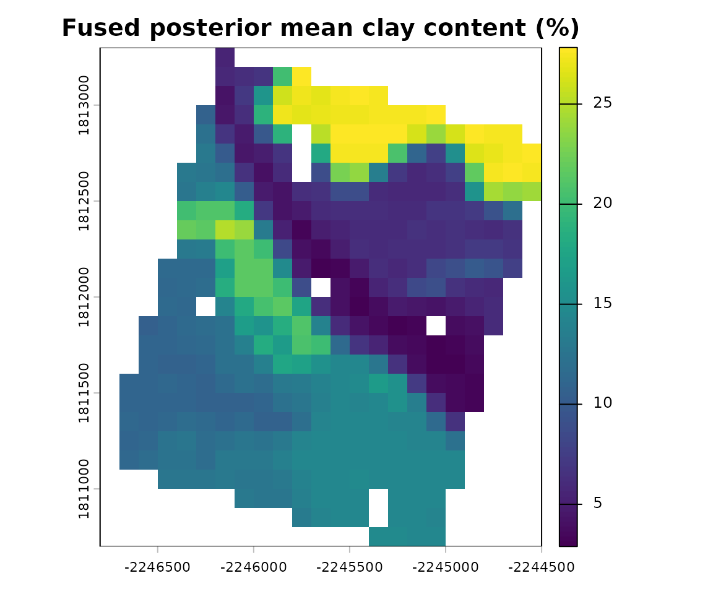
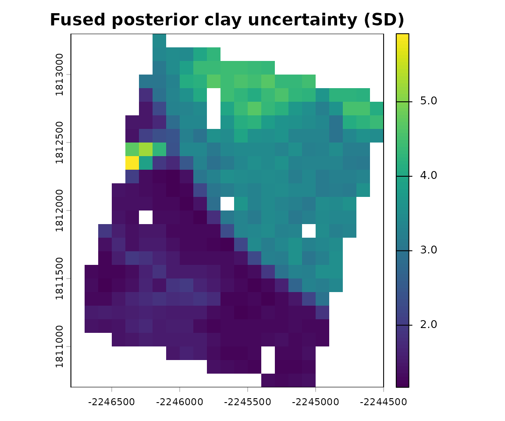
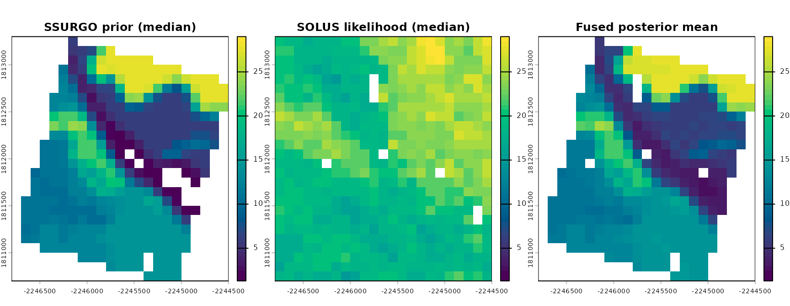
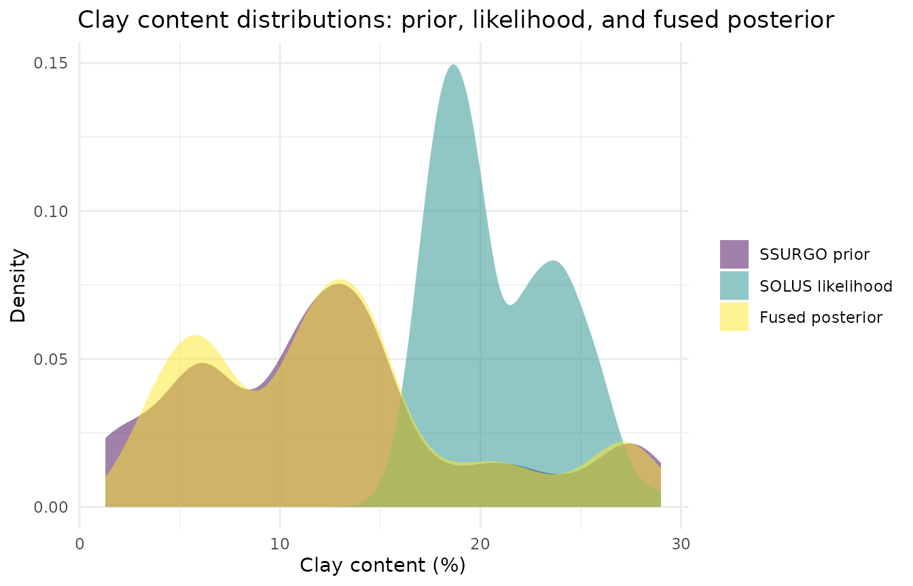
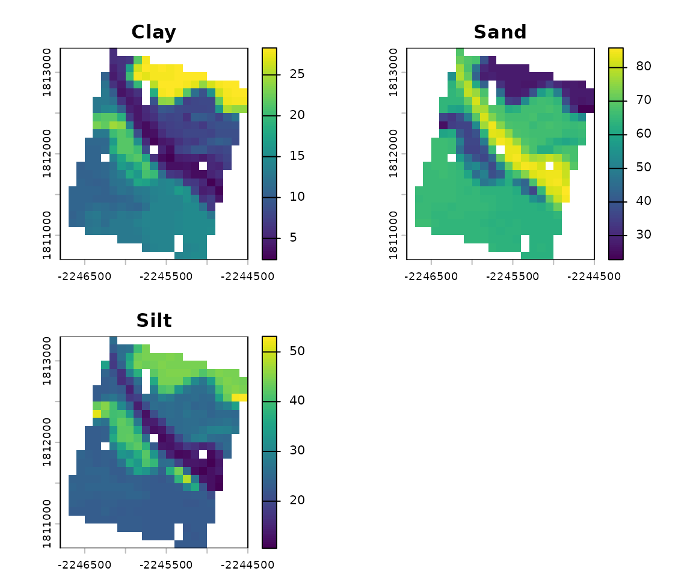

# Multi-Source Raster Fusion: SSURGO x SOLUS100

## Overview

This vignette is the clearest example of soilSIM’s core architecture: a
generic, data-source-agnostic raster fusion **core**
([`fuse_property_adaptive()`](https://jjmaynard.github.io/soilSIM/reference/fuse_property_adaptive.md),
built on the same Bayesian-updating primitives as the scalar
`bayesian-updating.R` toolkit) combined with two concrete data-source
**adapters** - SSURGO (supplying the prior) and SOLUS100 (supplying the
likelihood) - over a shared, real area of interest (AOI). The
architecture is designed so future data sources (e.g. HWSD, SoilGrids)
could plug in as new adapters supplying either side, without changing
the fusion core. See
`soilSIM/docs/09_multi_source_raster_fusion_pipeline.md` for the full
function-level reference.

``` r

library(soilSIM)
library(ggplot2) # only for the non-spatial prior/likelihood/posterior comparison chart below
```

## The real AOI

A ~2 km x 2 km area of interest in the Salinas Valley, California -
chosen because it has confirmed real SOLUS100 coverage:

``` r

salinas_wkt <- "POLYGON((-121.66 36.60, -121.64 36.60, -121.64 36.62, -121.66 36.62, -121.66 36.60))"
aoi <- terra::vect(salinas_wkt, crs = "epsg:4326")
aoi <- terra::project(aoi, "epsg:5070")
```

## Step 1: Fuse a single property (clay content)

[`run_stage1_fusion()`](https://jjmaynard.github.io/soilSIM/reference/run_stage1_fusion.md)
is the top-level orchestrator: it fetches (and disk-caches) SSURGO
percentile rasters as the prior, SOLUS100 percentile rasters as the
likelihood, resamples the SSURGO prior onto SOLUS100’s coarser grid, and
fuses them via
[`fuse_property_adaptive()`](https://jjmaynard.github.io/soilSIM/reference/fuse_property_adaptive.md),
which adaptively routes to a closed-form or general grid-KDE fusion
depending on the property’s distributional shape:

``` r

# The real call this vignette's cached data came from:
property_config <- list(id = "clay", solus_variable = "claytotal", dist = "normal")
fusion_clay <- run_stage1_fusion(aoi, property_config, top_depth = 0, bottom_depth = 5)
```

``` r

fusion_clay <- unwrap_nested_rasters(
  readRDS(system.file("extdata", "fusion_clay_salinas.rds", package = "soilSIM"))
)
fusion_clay$dist
#> [1] "normal"
fusion_clay$route
#> [1] "bayesian_update_general"
names(fusion_clay$posterior)
#> [1] "mu"    "sigma"
```

The fused posterior for a `dist = "normal"` property routed through
bayesian_update_general is a pair of rasters - `mu` (posterior mean) and
`sigma` (posterior standard deviation) - one value per grid cell, at
SOLUS100’s native 100 m resolution:

``` r

fusion_clay$posterior$mu
#> class       : SpatRaster
#> size        : 26, 23, 1  (nrow, ncol, nlyr)
#> resolution  : 100, 100  (x, y)
#> extent      : -2246800, -2244500, 1810700, 1813300  (xmin, xmax, ymin, ymax)
#> coord. ref. : NAD83 / Conus Albers (EPSG:5070)
#> source(s)   : memory
#> name        :     lyr.1
#> min value   :  2.893044
#> max value   : 27.828436
terra::plot(fusion_clay$posterior$mu, main = "Fused posterior mean clay content (%)")
```



``` r

terra::plot(fusion_clay$posterior$sigma, main = "Fused posterior clay uncertainty (SD)")
```



### Comparing the prior, likelihood, and fused posterior

The plots above show only the fusion *output*. To see what fusion
actually did, we need to look at its two *inputs* side by side with the
result. `fusion_clay$prior$values` and `fusion_clay$likelihood$values`
are each a list of percentile rasters (SSURGO’s and SOLUS100’s,
respectively) rather than a single raster - we use each source’s median
(`P50`) as its representative value:

``` r

names(fusion_clay$prior$values)      # SSURGO percentiles
#> [1] "P05" "P25" "P50" "P75" "P95"
names(fusion_clay$likelihood$values) # SOLUS100 percentiles
#> [1] "P025" "P50"  "P975"

prior_r <- fusion_clay$prior$values[["P50"]]
likelihood_r <- fusion_clay$likelihood$values[["P50"]]
posterior_r <- fusion_clay$posterior$mu
```

[`run_stage1_fusion()`](https://jjmaynard.github.io/soilSIM/reference/run_stage1_fusion.md)
already resampled the SSURGO prior onto SOLUS100’s grid before fusing,
so all three rasters share the same extent/resolution and combine
directly with [`c()`](https://rdrr.io/r/base/c.html) - no separate
`par(mfrow = ...)` panels needed. We use one shared color scale
(`range`) across all three panels so that color differences reflect real
differences in clay content, not each panel’s own auto-rescaling:

``` r

shared_range <- range(
  terra::minmax(prior_r), terra::minmax(likelihood_r), terra::minmax(posterior_r)
)

compare_stack <- c(prior_r, likelihood_r, posterior_r)
names(compare_stack) <- c("SSURGO prior", "SOLUS likelihood", "Fused posterior")
terra::plot(
  compare_stack,
  main = c("SSURGO prior (median)", "SOLUS likelihood (median)", "Fused posterior mean"),
  col = grDevices::hcl.colors(50, "viridis"),
  range = shared_range,
  nc = 3
)
```



The SSURGO prior is sparse and blocky (map-unit polygons rasterized onto
the grid, with `NA` where no delineation lines up with a cell) while the
SOLUS100 likelihood is a smooth, fully-populated 100 m grid - the fused
posterior inherits the prior’s spatial support (cells stay `NA` unless
both inputs contribute) but its clay values are pulled toward the
SOLUS100 pattern.

The same three rasters, viewed as distributions rather than maps, show
what the Bayesian update did numerically:

``` r

prior_vals <- terra::values(prior_r, na.rm = TRUE)
likelihood_vals <- terra::values(likelihood_r, na.rm = TRUE)
posterior_vals <- terra::values(posterior_r, na.rm = TRUE)

clay_dist_df <- data.frame(
  value = c(prior_vals, likelihood_vals, posterior_vals),
  source = factor(
    c(rep("SSURGO prior", length(prior_vals)),
      rep("SOLUS likelihood", length(likelihood_vals)),
      rep("Fused posterior", length(posterior_vals))),
    levels = c("SSURGO prior", "SOLUS likelihood", "Fused posterior")
  )
)

ggplot(clay_dist_df, aes(x = value, fill = source)) +
  geom_density(alpha = 0.5, color = NA) +
  scale_fill_viridis_d(name = NULL) +
  labs(
    title = "Clay content distributions: prior, likelihood, and fused posterior",
    x = "Clay content (%)",
    y = "Density"
  ) +
  theme_minimal()
```



In this AOI, the SSURGO prior’s mass sits mostly at low clay values with
a long thin tail, while the SOLUS100 likelihood is centered much higher
(~15-25%). The fused posterior is a sharp, narrow peak near the prior’s
low end - the closed-form normal-normal update (bayesian_update_general)
combines both sources weighted by their relative (un)certainty, and here
it lands close to the prior rather than the likelihood, illustrating
that “fusion” is a precision-weighted compromise, not a simple average
of the two inputs.

## Step 2: Fuse a compositional group (clay, sand, silt jointly)

Fusing clay/sand/silt independently can break the sum-to-100 constraint
texture fractions must satisfy.
[`run_stage1_fusion_group()`](https://jjmaynard.github.io/soilSIM/reference/run_stage1_fusion_group.md)
fuses a whole compositional group jointly, in isometric log-ratio (ILR)
space, guaranteeing every cell’s fused clay + sand + silt sums to 100:

``` r

# The real call this vignette's cached data came from:
composition_groups <- list(texture = list(members = c("clay", "sand", "silt")))
property_configs <- list(
  clay = list(id = "clay", solus_variable = "claytotal", composition_group = "texture"),
  sand = list(id = "sand", solus_variable = "sandtotal", composition_group = "texture"),
  silt = list(id = "silt", solus_variable = "silttotal", composition_group = "texture")
)
fusion_texture <- run_stage1_fusion_group(
  aoi, "texture", composition_groups, property_configs, top_depth = 0, bottom_depth = 5
)
```

``` r

fusion_texture <- unwrap_nested_rasters(
  readRDS(system.file("extdata", "fusion_texture_salinas.rds", package = "soilSIM"))
)
names(fusion_texture)
#> [1] "clay" "sand" "silt"
fusion_texture$clay$dist   # "texture_ilr" for every member - not the per-property normal/beta/gamma dist
#> [1] "texture_ilr"
```

``` r

means <- sapply(fusion_texture, function(m) terra::global(m$posterior$value, "mean", na.rm = TRUE)[1, 1])
means
#>     clay     sand     silt 
#> 12.96215 59.93548 27.10238
sum(means)
#> [1] 100
```

Mean fused clay/sand/silt percentages sum to 100 across the AOI - the
joint ILR fusion’s guarantee, verified here on real fused output rather
than just asserted.

``` r

terra::plot(c(fusion_texture$clay$posterior$value,
              fusion_texture$sand$posterior$value,
              fusion_texture$silt$posterior$value),
            main = c("Clay", "Sand", "Silt"))
```



## Under the hood: scalar Bayesian updating

Both fusion routes above ultimately reduce to elementwise arithmetic on
`bayesian-updating.R`’s scalar fusion functions
([`bayes_update_normal_normal()`](https://jjmaynard.github.io/soilSIM/reference/bayes_update_normal_normal.md),
[`fuse_beta()`](https://jjmaynard.github.io/soilSIM/reference/fuse_beta.md)/[`fuse_gamma()`](https://jjmaynard.github.io/soilSIM/reference/fuse_gamma.md),
[`bayesian_update()`](https://jjmaynard.github.io/soilSIM/reference/bayesian_update.md)’s
general grid-KDE fusion) - they already work unchanged on `SpatRaster`
inputs via `terra`’s operator overloading, so the raster-native code in
`raster-fusion.R` reuses them directly rather than reimplementing the
same math per-cell. See `soilSIM/docs/08_bayesian_updating.md` for these
building blocks used directly on scalar prior/likelihood pairs,
independent of any raster or AOI.

## Where this data came from

The cached data this vignette loads
(`inst/extdata/fusion_clay_salinas.rds`,
`inst/extdata/fusion_texture_salinas.rds`) was produced once by
`data-raw/build_vignette_data.R`, which calls
[`run_stage1_fusion()`](https://jjmaynard.github.io/soilSIM/reference/run_stage1_fusion.md)/[`run_stage1_fusion_group()`](https://jjmaynard.github.io/soilSIM/reference/run_stage1_fusion_group.md)
live against NRCS Soil Data Access (SSURGO) and
[`soilDB::fetchSOLUS()`](http://ncss-tech.github.io/soilDB/reference/fetchSOLUS.md)
(SOLUS100) for the AOI above. Re-run that script to refresh it.
Producing this vignette’s data surfaced and fixed a real caching bug in
[`run_stage1_fusion_group()`](https://jjmaynard.github.io/soilSIM/reference/run_stage1_fusion_group.md)
(it wasn’t wrapping/unwrapping `SpatRaster`s around its disk cache,
silently corrupting the cached texture-group result on a second read) -
fixed in `R/raster-fusion.R`.
