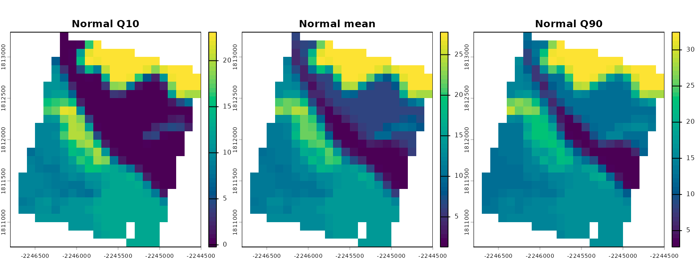
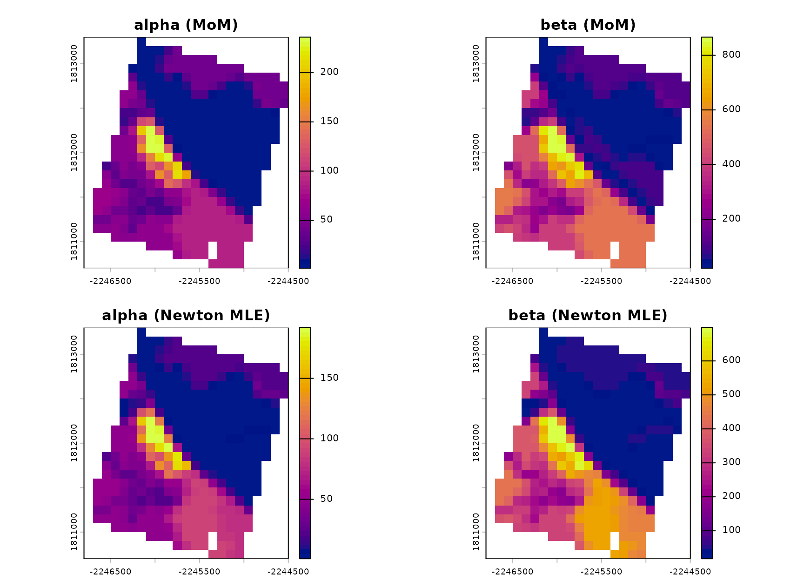
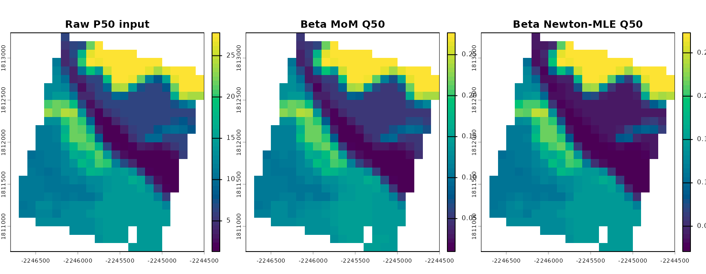
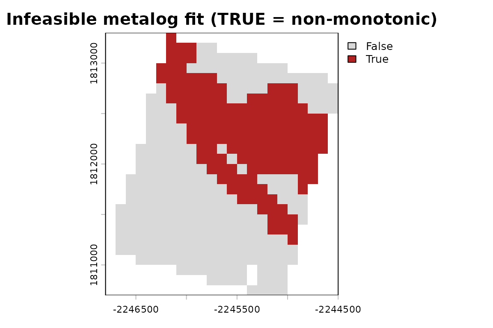
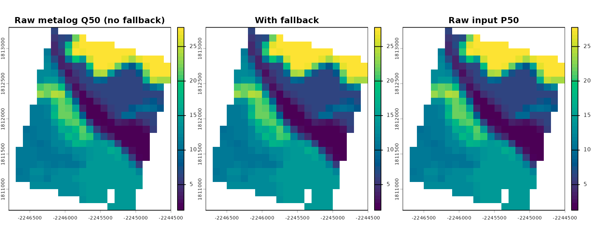
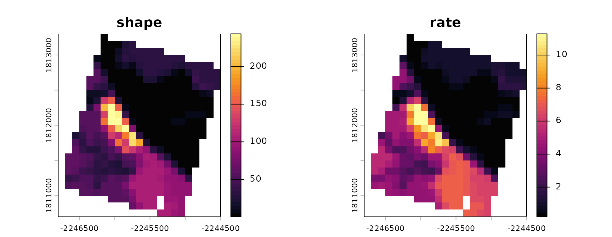
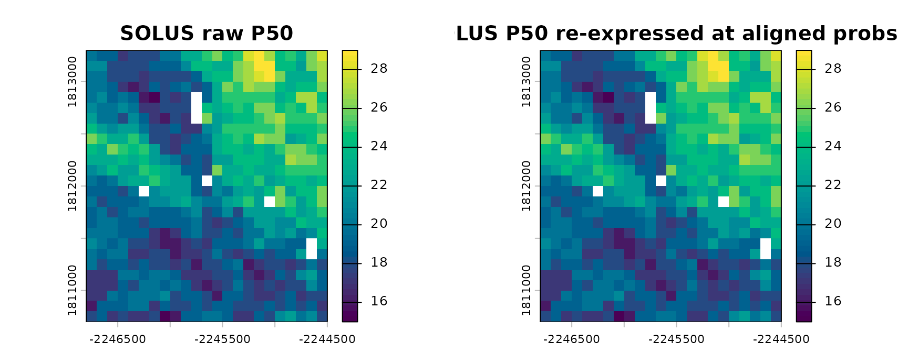
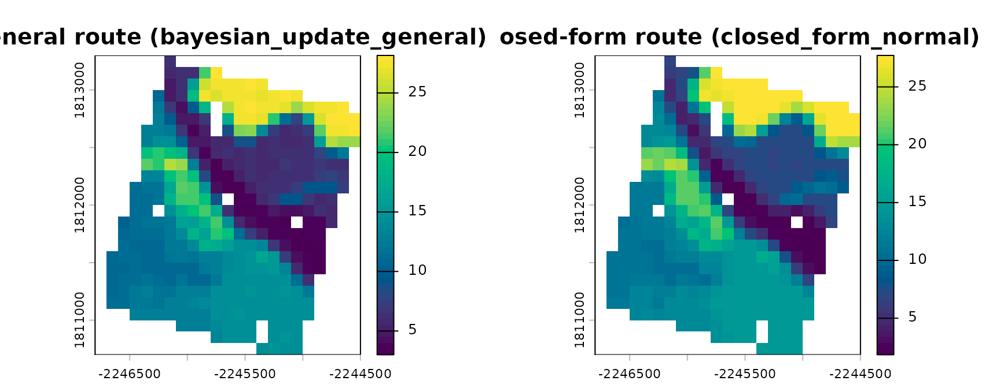
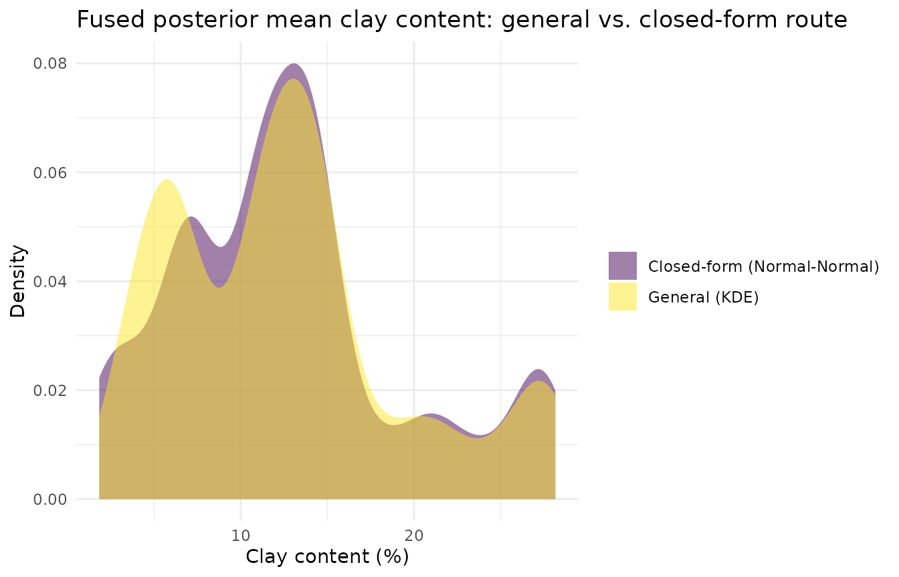

# Raster-Native Fitting & Fusion Internals

## Overview

`raster-fusion-ssurgo-solus.Rmd` shows the *pipeline* view of soilSIM’s
multi-source raster fusion: call
[`run_stage1_fusion()`](https://jjmaynard.github.io/soilSIM/reference/run_stage1_fusion.md)/[`run_stage1_fusion_group()`](https://jjmaynard.github.io/soilSIM/reference/run_stage1_fusion_group.md)
and get back a fused posterior. This vignette opens the hood.
[`run_stage1_fusion()`](https://jjmaynard.github.io/soilSIM/reference/run_stage1_fusion.md)
is a thin fetch-and-cache wrapper around a handful of small, composable,
raster-native building blocks - distribution fitting functions
(`R/distribution-fitting-raster.R`), a fusion core
(`R/raster-fusion.R`), and a disk cache (`R/raster-cache.R`) - each of
which does exactly one thing to a
[`terra::SpatRaster`](https://rspatial.github.io/terra/reference/SpatRaster-class.html)
(or list of them) and can be called directly. Understanding these
individually is what makes the pipeline’s behavior (which route it took,
why a family was resolved a certain way, why two sources’ percentiles
had to be realigned before fusing) legible rather than a black box. See
`soilSIM/docs/09_multi_source_raster_fusion_pipeline.md` for the full
function-level reference this vignette is built from.

``` r

library(soilSIM)
library(terra)
#> terra 1.9.34
library(ggplot2)
```

## Reusing real data instead of fetching

Fetching SSURGO/SOLUS100 live requires network access and takes minutes;
this vignette reuses the same cached Salinas Valley clay-content fusion
result `raster-fusion-ssurgo-solus.Rmd` uses, so every function below
runs on real percentile rasters rather than synthetic ones. The real
(network) calls that originally produced this cached object are shown
for reference only and not evaluated here:

``` r

# Reference only - not run in this vignette.
salinas_wkt <- "POLYGON((-121.66 36.60, -121.64 36.60, -121.64 36.62, -121.66 36.62, -121.66 36.60))"
aoi <- terra::project(terra::vect(salinas_wkt, crs = "epsg:4326"), "epsg:5070")
property_config <- list(id = "clay", solus_variable = "claytotal", dist = "normal")
fusion_clay <- run_stage1_fusion(aoi, property_config, top_depth = 0, bottom_depth = 5)
```

``` r

fusion_clay <- unwrap_nested_rasters(
  readRDS(system.file("extdata", "fusion_clay_salinas.rds", package = "soilSIM"))
)

# The two inputs every function below operates on: named lists of percentile-value
# SpatRasters, one list per source, plus the probabilities each percentile represents.
prior_values <- fusion_clay$prior$values        # SSURGO, already resampled onto the SOLUS grid
prior_probs <- fusion_clay$prior$probs
lik_values <- fusion_clay$likelihood$values     # SOLUS100
lik_probs <- fusion_clay$likelihood$probs

names(prior_values); prior_probs
#> [1] "P05" "P25" "P50" "P75" "P95"
#> [1] 0.05 0.25 0.50 0.75 0.95
names(lik_values); lik_probs
#> [1] "P025" "P50"  "P975"
#> [1] 0.025 0.500 0.975
bounds <- c(0, 100)  # clay content is a percentage
```

This is the “common currency” every function in this vignette speaks: a
**named list of single-layer percentile-value rasters** (e.g. `P05`,
`P25`, `P50`, …) plus a **numeric vector of the probabilities they
represent**, all sharing one grid. Everything downstream - fitting,
quantile evaluation, fusion, caching - operates on this shape (or a pair
of them, prior and likelihood).

## 1. Fitting a Normal distribution

[`fit_normal_raster()`](https://jjmaynard.github.io/soilSIM/reference/fit_normal_raster.md)
is the simplest fit in the file: closed-form, exact, and just three
raster arithmetic operations. It takes a low/median/high
percentile-value raster triplet and the probabilities the low/high
rasters represent, and returns `mu` (the median raster, used directly as
the mean) and `sigma` (back-solved from the tail spacing):

``` r

fit_n <- fit_normal_raster(
  p_lo_r = prior_values$P25, p50_r = prior_values$P50, p_hi_r = prior_values$P75,
  p_lo = 0.25, p_hi = 0.75
)
fit_n$mu
#> class       : SpatRaster
#> size        : 26, 23, 1  (nrow, ncol, nlyr)
#> resolution  : 100, 100  (x, y)
#> extent      : -2246800, -2244500, 1810700, 1813300  (xmin, xmax, ymin, ymax)
#> coord. ref. : NAD83 / Conus Albers (EPSG:5070)
#> source(s)   : memory
#> varname     : claytotal_0_cm_l
#> name        :       P50
#> min value   :  1.291976
#> max value   : 27.771105
```

`sigma` is `(p_hi_r - p_lo_r) / (qnorm(p_hi) - qnorm(p_lo))` - the raw
value spread between the two tail percentiles, divided by how many
standard-normal units apart those two probabilities are. This is a
single elementwise expression, so its cost doesn’t depend on how many
cells the raster has.
[`quantile_normal_raster()`](https://jjmaynard.github.io/soilSIM/reference/fit_normal_raster.md)
then evaluates the fitted distribution at any target probability `q` via
`mu + sigma * qnorm(q)`:

``` r

q10 <- quantile_normal_raster(fit_n, 0.1)
q90 <- quantile_normal_raster(fit_n, 0.9)

normal_stack <- c(q10, fit_n$mu, q90)
names(normal_stack) <- c("Q10", "mu (=P50)", "Q90")
terra::plot(normal_stack, main = c("Normal Q10", "Normal mean", "Normal Q90"),
            col = grDevices::hcl.colors(50, "viridis"), nc = 3)
```



## 2. Fitting a Beta distribution: method-of-moments vs. Newton-Raphson MLE

Clay content is bounded on `[0, 100]`, which the Normal fit above
ignores (its Q10/Q90 rasters can dip below 0 in low-clay cells). A Beta
fit respects those bounds. soilSIM ships two Beta fitters:

- `fit_beta_mom_raster(mean_r, var_r)` - closed-form method-of-moments,
  APPROXIMATE, and used only to seed the Newton-Raphson solver below
  (not intended as a standalone fit). It takes a **rescaled-to-`[0,1]`**
  mean/variance pair directly, not raw percentile rasters.
- `fit_beta_mle_newton_raster(value_rasters, bounds, n_iter = 15, eps = 1e-6)` -
  a vectorized Newton-Raphson MLE solver that exploits the Beta
  log-likelihood’s closed-form score/Hessian (in
  [`digamma()`](https://rdrr.io/r/base/Special.html)/[`trigamma()`](https://rdrr.io/r/base/Special.html),
  both vectorized base-R functions) to update every cell’s
  `(alpha, beta)` simultaneously per iteration, `n_iter` times. It takes
  the raw percentile-value rasters and the physical `bounds` directly,
  and internally seeds itself from
  [`fit_beta_mom_raster()`](https://jjmaynard.github.io/soilSIM/reference/fit_beta_mom_raster.md).

``` r

# Method-of-moments needs mean/var already rescaled to [0,1]; reuse the Normal fit above as a
# cheap mean/variance proxy, rescaled by `bounds`.
mean_r <- fit_n$mu / bounds[2]
var_r <- (fit_n$sigma / bounds[2])^2
fit_beta_mom <- fit_beta_mom_raster(mean_r, var_r)

# The Newton-Raphson MLE fit takes the raw percentile rasters and bounds directly - it does its
# own internal method-of-moments seeding.
fit_beta_mle <- fit_beta_mle_newton_raster(prior_values, bounds)
```

``` r

beta_params <- c(fit_beta_mom$alpha, fit_beta_mom$beta, fit_beta_mle$alpha, fit_beta_mle$beta)
names(beta_params) <- c("alpha (MoM)", "beta (MoM)", "alpha (Newton MLE)", "beta (Newton MLE)")
terra::plot(beta_params, col = grDevices::hcl.colors(50, "plasma"), nc = 2)
```



The two fits’ shape-parameter rasters differ cell-by-cell (MoM only
matches the first two moments; Newton MLE fits all of the percentiles
supplied to it), but both feed the same quantile function shape -
`quantile_beta_mom_raster(fit, q)` /
`quantile_beta_mle_newton_raster(fit, q)`, each implemented via
[`terra::lapp()`](https://rspatial.github.io/terra/reference/lapp.html)
calling [`stats::qbeta()`](https://rdrr.io/r/stats/Beta.html) per cell,
since [`qbeta()`](https://rdrr.io/r/stats/Beta.html) has no
raster-native vectorized form of its own:

``` r

q_mom <- quantile_beta_mom_raster(fit_beta_mom, 0.5)
q_mle <- quantile_beta_mle_newton_raster(fit_beta_mle, 0.5)

median_compare <- c(prior_values$P50, q_mom, q_mle)
names(median_compare) <- c("Raw P50 input", "Beta MoM Q50", "Beta Newton-MLE Q50")
terra::plot(median_compare, col = grDevices::hcl.colors(50, "viridis"), nc = 3)
```



The Newton-MLE fit’s own Q50 tracks the raw input P50 raster much more
closely than the MoM fit’s does, since MLE was fit against all five of
`prior_values`’ percentiles rather than just a mean/variance proxy
derived from two of them.

## 3. Fitting a metalog distribution, and its feasibility fallback

The metalog family can match an arbitrary number of percentiles exactly
via a linear solve rather than an optimization -
`fit_metalog_linear_raster(value_rasters, probs, bounds, boundedness)`
requires the number of *interior* percentiles (excluding
`p = 0`/`p = 1`, where the metalog’s logit transform is undefined) to
equal the number of metalog terms, making the fit exactly determined.

Symmetric percentile sets are a real, sharp edge here: fitting all five
of `prior_values`’s percentiles (`0.05/0.25/0.5/0.75/0.95` - symmetric
about the median) makes the underlying basis matrix numerically
singular, since two of its basis columns become linearly dependent for a
symmetric probability grid. An asymmetric 4-term subset avoids it:

``` r

ml_probs <- c(0.05, 0.25, 0.5, 0.75)
ml_values <- prior_values[c("P05", "P25", "P50", "P75")]
fit_ml <- fit_metalog_linear_raster(ml_values, ml_probs, bounds, boundedness = "b")
length(fit_ml$a)   # one coefficient raster per term
#> [1] 4
fit_ml$term
#> [1] 4
```

Not every fitted metalog is a *valid* one - a metalog quantile function
must be monotonically increasing (equivalent to non-negative density
everywhere), and the exact linear solve above gives no such guarantee.
[`check_metalog_feasibility_raster()`](https://jjmaynard.github.io/soilSIM/reference/check_metalog_feasibility_raster.md)
probes the fit at a grid of probabilities and flags cells where
consecutive probes decrease:

``` r

infeasible <- check_metalog_feasibility_raster(fit_ml, bounds, boundedness = "b")
n_infeasible <- sum(terra::values(infeasible), na.rm = TRUE)
n_total <- terra::ncell(infeasible)
cat(sprintf("%d / %d cells (%.0f%%) have an infeasible metalog fit\n",
            n_infeasible, n_total, 100 * n_infeasible / n_total))
#> 150 / 598 cells (25%) have an infeasible metalog fit
terra::plot(infeasible, main = "Infeasible metalog fit (TRUE = non-monotonic)",
            col = c("grey85", "firebrick"))
```



A substantial fraction of cells are infeasible here - not a bug, just a
real consequence of fitting only 4 of the 5 available percentiles to a
family with no correction step of its own.
[`quantile_metalog_linear_with_fallback()`](https://jjmaynard.github.io/soilSIM/reference/quantile_metalog_linear_with_fallback.md)
is the function every real caller should use instead of
[`quantile_metalog_linear_raster()`](https://jjmaynard.github.io/soilSIM/reference/fit_metalog_linear_raster.md)
directly: it evaluates the raw metalog quantile function, and for
whichever cells
[`check_metalog_feasibility_raster()`](https://jjmaynard.github.io/soilSIM/reference/check_metalog_feasibility_raster.md)
flagged, blends in
[`quantile_linear_cdf_raster()`](https://jjmaynard.github.io/soilSIM/reference/quantile_linear_cdf_raster.md)’s
nonparametric interpolation (evaluated against the *full* percentile
set, not just the interior ones used to fit the metalog) instead:

``` r

fallback_result <- quantile_metalog_linear_with_fallback(
  fit_ml, infeasible, full_value_rasters = prior_values, full_probs = prior_probs,
  q = 0.5, bounds = bounds, boundedness = "b"
)

raw_metalog_q50 <- quantile_metalog_linear_raster(fit_ml, 0.5, bounds, boundedness = "b")
blend_stack <- c(raw_metalog_q50, fallback_result$value, prior_values$P50)
names(blend_stack) <- c("Raw metalog Q50 (no fallback)", "With fallback", "Raw input P50")
terra::plot(blend_stack, col = grDevices::hcl.colors(50, "viridis"), nc = 3)
```



## 4. Fitting a Gamma distribution

[`fit_gamma_mom_raster()`](https://jjmaynard.github.io/soilSIM/reference/fit_gamma_mom_raster.md)
is a thin raster wrapper: it computes mean/variance rasters across a
list of percentile-value rasters (the only genuinely raster-specific
step, via `Reduce(+, ...)`), then delegates to `R/bayesian-updating.R`’s
existing scalar
[`moments_to_gamma()`](https://jjmaynard.github.io/soilSIM/reference/moments_to_gamma.md),
which is pure elementwise arithmetic and therefore already works
unchanged on `SpatRaster` inputs:

``` r

fit_gamma <- fit_gamma_mom_raster(prior_values)
gamma_stack <- c(fit_gamma$shape, fit_gamma$rate)
names(gamma_stack) <- c("shape", "rate")
terra::plot(gamma_stack, col = grDevices::hcl.colors(50, "inferno"), nc = 2)
```



## 5. Aligning mismatched percentile grids: `align_percentile_probs()`

SSURGO’s prior percentiles (0.05, 0.25, 0.5, 0.75, 0.95) and SOLUS100’s
likelihood percentiles (0.025, 0.5, 0.975) aren’t the same
probabilities - every fusion route needs both sides to share one `probs`
vector, so passing them through mismatched would silently mis-fit
whichever side’s percentiles don’t match the assumed labels.

``` r

aligned <- align_percentile_probs(prior_values, prior_probs, lik_values, lik_probs)
aligned$probs
#> [1] 0.05 0.25 0.50 0.75 0.95
names(aligned$prior_value_rasters)   # unchanged (SSURGO's probs won - see below)
#> [1] "P05" "P25" "P50" "P75" "P95"
length(aligned$lik_value_rasters)    # SOLUS reinterpolated onto aligned$probs - unnamed list
#> [1] 5
```

[`align_percentile_probs()`](https://jjmaynard.github.io/soilSIM/reference/align_percentile_probs.md)
picks whichever side’s probabilities span the *narrower* range as the
shared target (`diff(range(prior_probs))` = 0.9 vs.
`diff(range(lik_probs))` = 0.95, so the SSURGO side’s probabilities win
here) and reinterpolates the other side onto it via
[`quantile_linear_cdf_raster()`](https://jjmaynard.github.io/soilSIM/reference/quantile_linear_cdf_raster.md) -
never the reverse, since interpolating requires the target probability
to fall within the source’s own range, and the narrower side is always
safely interpolatable from the wider one. The reinterpolated side comes
back as a plain (unnamed) list in `aligned$probs`’ order, so pick the
layer to compare by matching its position in `aligned$probs` rather than
by name:

``` r

idx50 <- which(aligned$probs == 0.5)
lik_compare <- c(lik_values$P50, aligned$lik_value_rasters[[idx50]])
names(lik_compare) <- c("SOLUS raw P50", "SOLUS P50 re-expressed at aligned probs")
terra::plot(lik_compare, col = grDevices::hcl.colors(50, "viridis"), nc = 2)
```



Here the shared target happens to already include `0.5` on both sides,
so the `P50` layer above is unchanged by realignment - it’s the tail
percentiles (`P05`/`P95` vs. `P025`/`P975`) that actually get
reinterpolated.

## 6. Family resolution: `resolve_property_dist()`

When `property_config$dist == "auto"`,
[`resolve_property_dist()`](https://jjmaynard.github.io/soilSIM/reference/resolve_property_dist.md)
picks a distribution family from the AOI’s own percentile skew rather
than a fixed per-property label - and never overrides an explicit
(non-`"auto"`) `dist`. It’s deliberately narrow: it only ever resolves
to `"beta"` (if `bounds` is configured), `"normal"`, or `"lognormal"` -
never `"metalog"` or `"gamma"`, since distinguishing those from a
3-point proxy isn’t considered reliable.

``` r

# With bounds configured, "auto" always resolves to "beta" regardless of skew.
resolve_property_dist(list(dist = "auto", bounds = c(0, 100)), prior_values, prior_probs)
#> $dist
#> [1] "beta"
#> 
#> $dist_source
#> [1] "auto"
#> 
#> $skew_proxy
#> [1] 0.1347358

# Without bounds, it falls back to a skew-proxy test: normal if |skew| is small, lognormal if not.
resolve_property_dist(list(dist = "auto"), prior_values, prior_probs)
#> $dist
#> [1] "normal"
#> 
#> $dist_source
#> [1] "auto"
#> 
#> $skew_proxy
#> [1] 0.1347358
```

The skew proxy itself is
`((high - median) - (median - low)) / (high - low)`, aggregated once
across the whole AOI (default
[`stats::median()`](https://rdrr.io/r/stats/median.html)) rather than
per cell - computing it per cell would create map discontinuities right
at the family boundary. An explicit `dist` is always honored untouched:

``` r

resolve_property_dist(list(dist = "normal"), prior_values, prior_probs)$dist_source
#> [1] "config"
```

## 7. Adaptive fusion dispatch: `fuse_adaptive()`

[`fuse_adaptive()`](https://jjmaynard.github.io/soilSIM/reference/fuse_adaptive.md)
is the size-adaptive engine
[`fuse_property_adaptive()`](https://jjmaynard.github.io/soilSIM/reference/fuse_property_adaptive.md)
(and therefore
[`run_stage1_fusion()`](https://jjmaynard.github.io/soilSIM/reference/run_stage1_fusion.md))
delegates to for `"normal"`/`"beta"`/`"gamma"` families. It picks the
fusion *route* from the AOI’s own cell count rather than requiring the
caller to choose: at or below `threshold_cells` (default 80,000), it
uses a fully general per-cell KDE route
([`bayesian_update()`](https://jjmaynard.github.io/soilSIM/reference/bayesian_update.md)
on samples drawn from each side’s percentiles); above it, a much faster
closed-form route built directly on the fitting functions from Sections
1-4 above (e.g.
[`fit_normal_raster()`](https://jjmaynard.github.io/soilSIM/reference/fit_normal_raster.md) +
[`bayes_update_normal_normal()`](https://jjmaynard.github.io/soilSIM/reference/bayes_update_normal_normal.md)
for `family = "normal"`).

This AOI is small (598 cells), so it naturally takes the general route.
Forcing `threshold_cells = 0` shows the alternate closed-form route on
the exact same inputs, with `verbose = TRUE` (the pipeline default is
quiet - this is a deliberate log demo):

``` r

fused_general <- fuse_adaptive(
  aligned$prior_value_rasters, aligned$lik_value_rasters, aligned$probs,
  family = "normal", verbose = TRUE
)
#> [fuse_adaptive] AOI: 598 cells (threshold: 80000) -> route: bayesian_update_general
fused_closed_form <- fuse_adaptive(
  aligned$prior_value_rasters, aligned$lik_value_rasters, aligned$probs,
  family = "normal", threshold_cells = 0, verbose = TRUE
)
#> [fuse_adaptive] AOI: 598 cells (threshold: 0) -> route: closed_form_normal
```

``` r

route_compare <- c(fused_general$posterior$mu, fused_closed_form$posterior$mu)
names(route_compare) <- c(paste0("General route (", fused_general$route, ")"),
                           paste0("Closed-form route (", fused_closed_form$route, ")"))
terra::plot(route_compare, col = grDevices::hcl.colors(50, "viridis"), nc = 2)
```



Both routes fuse the same prior/likelihood into a `mu`/`sigma` posterior
with the same output contract, but they reach it differently: the
general route makes no distributional assumption about the *fusion* step
itself (only about the requested output family), while the closed-form
route fits both sides Normal first (Section 1) and fuses via the
closed-form
[`bayes_update_normal_normal()`](https://jjmaynard.github.io/soilSIM/reference/bayes_update_normal_normal.md)
update - much cheaper per cell, at the cost of that Normal assumption.

``` r

route_df <- data.frame(
  value = c(terra::values(fused_general$posterior$mu, na.rm = TRUE),
            terra::values(fused_closed_form$posterior$mu, na.rm = TRUE)),
  route = rep(c("General (KDE)", "Closed-form (Normal-Normal)"),
              c(sum(!is.na(terra::values(fused_general$posterior$mu))),
                sum(!is.na(terra::values(fused_closed_form$posterior$mu)))))
)
ggplot(route_df, aes(x = value, fill = route)) +
  geom_density(alpha = 0.5, color = NA) +
  scale_fill_viridis_d(name = NULL) +
  labs(title = "Fused posterior mean clay content: general vs. closed-form route",
       x = "Clay content (%)", y = "Density") +
  theme_minimal()
```



## 8. Caching internals

[`run_stage1_fusion()`](https://jjmaynard.github.io/soilSIM/reference/run_stage1_fusion.md)/[`run_stage1_fusion_group()`](https://jjmaynard.github.io/soilSIM/reference/run_stage1_fusion_group.md)
disk-cache every fetch step under
`tools::R_user_dir("soilSIM", "cache")`, keyed by AOI + property/group
id + depth window + kind.

[`build_cache_key()`](https://jjmaynard.github.io/soilSIM/reference/build_cache_key.md)
builds a deterministic, filename-safe key from an AOI’s WKT geometry
(hashed via
[`digest::digest()`](https://eddelbuettel.github.io/digest/man/digest.html)),
a property/group id, a depth window, and a `kind` string:

``` r

salinas_wkt <- "POLYGON((-121.66 36.60, -121.64 36.60, -121.64 36.62, -121.66 36.62, -121.66 36.60))"
aoi <- terra::project(terra::vect(salinas_wkt, crs = "epsg:4326"), "epsg:5070")

key <- build_cache_key(aoi, id = "clay", top_depth = 0, bottom_depth = 5, kind = "ssurgo")
key
#> [1] "raster_3e9ea7cad8f2_clay_0_5_ssurgo"
CACHE_TTL_SECONDS / 86400  # cache max-age, in days
#> [1] 30
```

`cache_get(key, ttl_seconds)`/`cache_set(key, kind, value)` are the
generic get/set pair every fetch step above uses - a miss (absent, or
older than `ttl_seconds`) returns `NULL` rather than erroring:

``` r

cache_get(key)  # NULL: nothing has been cached under this exact key in this session
#> NULL
cache_set(key, "ssurgo", value = list(hello = "world"))
#> [1] TRUE
cache_get(key)
#> $hello
#> [1] "world"
```

### Why `SpatRaster`s need `terra::wrap()` before caching

[`cache_set()`](https://jjmaynard.github.io/soilSIM/reference/cache_set.md)’s
docs flag a real, sharp limitation: a
[`terra::SpatRaster`](https://rspatial.github.io/terra/reference/SpatRaster-class.html)
holds an **external pointer** to in-memory/on-disk GDAL state, not the
raster’s actual values. A plain
[`saveRDS()`](https://rspatial.github.io/terra/reference/serialize.html)/[`readRDS()`](https://rspatial.github.io/terra/reference/serialize.html)
round-trip serializes that pointer, which is meaningless in a new R
session - the read-back object *looks* like a `SpatRaster` but errors
the moment anything tries to touch its actual data:

``` r

r <- fusion_clay$posterior$mu
naive_file <- tempfile(fileext = ".rds")
saveRDS(r, naive_file)               # serializes the pointer, not the raster's values
r_naive <- readRDS(naive_file)
class(r_naive)                       # still LOOKS like a SpatRaster...
#> [1] "SpatRaster"
#> attr(,"package")
#> [1] "terra"
terra::values(r_naive)               # ...but touching it throws
#>            lyr.1
#>   [1,]        NA
#>   [2,]        NA
#>   [3,]        NA
#>   [4,]        NA
#>   [5,]        NA
#>   [6,]        NA
#>   [7,]  5.617684
#>   [8,]        NA
#>   [9,]        NA
#>  [10,]        NA
#>  [11,]        NA
#>  [12,]        NA
#>  [13,]        NA
#>  [14,]        NA
#>  [15,]        NA
#>  [16,]        NA
#>  [17,]        NA
#>  [18,]        NA
#>  [19,]        NA
#>  [20,]        NA
#>  [21,]        NA
#>  [22,]        NA
#>  [23,]        NA
#>  [24,]        NA
#>  [25,]        NA
#>  [26,]        NA
#>  [27,]        NA
#>  [28,]        NA
#>  [29,]        NA
#>  [30,]  5.702985
#>  [31,]  6.338704
#>  [32,]  6.716888
#>  [33,] 20.168330
#>  [34,] 27.702405
#>  [35,]        NA
#>  [36,]        NA
#>  [37,]        NA
#>  [38,]        NA
#>  [39,]        NA
#>  [40,]        NA
#>  [41,]        NA
#>  [42,]        NA
#>  [43,]        NA
#>  [44,]        NA
#>  [45,]        NA
#>  [46,]        NA
#>  [47,]        NA
#>  [48,]        NA
#>  [49,]        NA
#>  [50,]        NA
#>  [51,]        NA
#>  [52,]        NA
#>  [53,]  4.176256
#>  [54,]  7.046635
#>  [55,] 15.987307
#>  [56,] 25.949105
#>  [57,] 27.156740
#>  [58,] 26.814613
#>  [59,] 27.525625
#>  [60,] 27.621148
#>  [61,] 27.401021
#>  [62,]        NA
#>  [63,]        NA
#>  [64,]        NA
#>  [65,]        NA
#>  [66,]        NA
#>  [67,]        NA
#>  [68,]        NA
#>  [69,]        NA
#>  [70,]        NA
#>  [71,]        NA
#>  [72,]        NA
#>  [73,]        NA
#>  [74,]        NA
#>  [75,] 10.694405
#>  [76,]  4.511492
#>  [77,]  6.298189
#>  [78,] 18.944530
#>  [79,] 27.238920
#>  [80,] 26.786937
#>  [81,] 26.916070
#>  [82,] 27.174763
#>  [83,] 27.185201
#>  [84,] 27.356489
#>  [85,] 27.425391
#>  [86,] 27.500891
#>  [87,] 27.823371
#>  [88,]        NA
#>  [89,]        NA
#>  [90,]        NA
#>  [91,]        NA
#>  [92,]        NA
#>  [93,]        NA
#>  [94,]        NA
#>  [95,]        NA
#>  [96,]        NA
#>  [97,]        NA
#>  [98,] 12.133555
#>  [99,]  6.826584
#> [100,]  4.679505
#> [101,]  9.864507
#> [102,] 18.881457
#> [103,]        NA
#> [104,] 25.159190
#> [105,] 27.828436
#> [106,] 27.769639
#> [107,] 27.660459
#> [108,] 27.723049
#> [109,] 26.295819
#> [110,] 23.918799
#> [111,] 26.264536
#> [112,] 27.712778
#> [113,] 27.483733
#> [114,] 27.461973
#> [115,]        NA
#> [116,]        NA
#> [117,]        NA
#> [118,]        NA
#> [119,]        NA
#> [120,]        NA
#> [121,] 12.931697
#> [122,]  9.895927
#> [123,]  4.633854
#> [124,]  5.075940
#> [125,]  6.752006
#> [126,]        NA
#> [127,] 18.025786
#> [128,] 27.405256
#> [129,] 27.458148
#> [130,] 27.431489
#> [131,] 20.730648
#> [132,] 10.910891
#> [133,]  7.702441
#> [134,] 15.348878
#> [135,] 26.559989
#> [136,] 26.997718
#> [137,] 27.480773
#> [138,] 27.720959
#> [139,]        NA
#> [140,]        NA
#> [141,]        NA
#> [142,]        NA
#> [143,] 12.952013
#> [144,] 12.854790
#> [145,] 12.092157
#> [146,]  6.591795
#> [147,]  4.095535
#> [148,]  6.028768
#> [149,]        NA
#> [150,]  8.729769
#> [151,] 22.668705
#> [152,] 23.691406
#> [153,] 13.578688
#> [154,]  7.076538
#> [155,]  5.763104
#> [156,]  6.192164
#> [157,]  7.666363
#> [158,] 21.648069
#> [159,] 27.513079
#> [160,] 27.647589
#> [161,] 27.387311
#> [162,]        NA
#> [163,]        NA
#> [164,]        NA
#> [165,]        NA
#> [166,] 12.726173
#> [167,] 13.846402
#> [168,] 14.409468
#> [169,] 10.239828
#> [170,]  4.704287
#> [171,]  4.316316
#> [172,]  6.323697
#> [173,]  6.434593
#> [174,]  8.658343
#> [175,]  8.805277
#> [176,]  5.897694
#> [177,]  5.743684
#> [178,]  5.854044
#> [179,]  5.848724
#> [180,]  6.243088
#> [181,] 15.715158
#> [182,] 24.417458
#> [183,] 23.792208
#> [184,] 24.238709
#> [185,]        NA
#> [186,]        NA
#> [187,]        NA
#> [188,]        NA
#> [189,] 20.229208
#> [190,] 20.900485
#> [191,] 21.078078
#> [192,] 18.251905
#> [193,]  7.099557
#> [194,]  4.299301
#> [195,]  4.869237
#> [196,]  6.038959
#> [197,]  6.301134
#> [198,]  6.377844
#> [199,]  6.184424
#> [200,]  6.095194
#> [201,]  6.118544
#> [202,]  6.650154
#> [203,]  6.713374
#> [204,]  7.144828
#> [205,]  9.139453
#> [206,] 11.903225
#> [207,]        NA
#> [208,]        NA
#> [209,]        NA
#> [210,]        NA
#> [211,]        NA
#> [212,] 22.010988
#> [213,] 21.358278
#> [214,] 24.971645
#> [215,] 23.887198
#> [216,] 13.119547
#> [217,]  5.340641
#> [218,]  3.160899
#> [219,]  5.121146
#> [220,]  5.454242
#> [221,]  6.008744
#> [222,]  5.974584
#> [223,]  6.009174
#> [224,]  6.597794
#> [225,]  6.158204
#> [226,]  6.388054
#> [227,]  6.325234
#> [228,]  6.053934
#> [229,]  6.591564
#> [230,]        NA
#> [231,]        NA
#> [232,]        NA
#> [233,]        NA
#> [234,]        NA
#> [235,] 12.909365
#> [236,] 13.179286
#> [237,] 20.019355
#> [238,] 21.488223
#> [239,] 20.022960
#> [240,]  8.490597
#> [241,]  3.971563
#> [242,]  3.638997
#> [243,]  5.022210
#> [244,]  6.301289
#> [245,]  5.959104
#> [246,]  6.284724
#> [247,]  6.271624
#> [248,]  6.349554
#> [249,]  6.433059
#> [250,]  7.317796
#> [251,]  7.286896
#> [252,]  6.693646
#> [253,]        NA
#> [254,]        NA
#> [255,]        NA
#> [256,]        NA
#> [257,] 11.448872
#> [258,] 11.380142
#> [259,] 11.535049
#> [260,] 16.861378
#> [261,] 21.476056
#> [262,] 21.392043
#> [263,] 14.707120
#> [264,]  4.639382
#> [265,]  2.989449
#> [266,]  3.194979
#> [267,]  4.767386
#> [268,]  6.324323
#> [269,]  5.722054
#> [270,]  6.361562
#> [271,]  8.252430
#> [272,]  8.905715
#> [273,]  9.941006
#> [274,]  9.491506
#> [275,]  7.863938
#> [276,]        NA
#> [277,]        NA
#> [278,]        NA
#> [279,]        NA
#> [280,] 11.357762
#> [281,] 11.415883
#> [282,] 11.643706
#> [283,] 18.487289
#> [284,] 21.509336
#> [285,] 21.507523
#> [286,] 20.019083
#> [287,]  8.653790
#> [288,]        NA
#> [289,]  3.913314
#> [290,]  3.318900
#> [291,]  5.588911
#> [292,]  6.342805
#> [293,]  8.556738
#> [294,]  9.118963
#> [295,]  6.597258
#> [296,]  6.010344
#> [297,]  5.673744
#> [298,]        NA
#> [299,]        NA
#> [300,]        NA
#> [301,]        NA
#> [302,]        NA
#> [303,] 11.452175
#> [304,] 11.304660
#> [305,]        NA
#> [306,] 14.154623
#> [307,] 17.910095
#> [308,] 20.556115
#> [309,] 21.369003
#> [310,] 17.519728
#> [311,]  6.360027
#> [312,]  4.103785
#> [313,]  3.040284
#> [314,]  3.835789
#> [315,]  4.684710
#> [316,]  4.504426
#> [317,]  4.219863
#> [318,]  4.848295
#> [319,]  5.556707
#> [320,]  6.074394
#> [321,]        NA
#> [322,]        NA
#> [323,]        NA
#> [324,]        NA
#> [325,] 10.597117
#> [326,] 11.036027
#> [327,] 11.474717
#> [328,] 11.635570
#> [329,] 12.336323
#> [330,] 16.633663
#> [331,] 15.637043
#> [332,] 18.540736
#> [333,] 21.053512
#> [334,] 14.022302
#> [335,]  6.105902
#> [336,]  4.269402
#> [337,]  3.561030
#> [338,]  3.039839
#> [339,]  3.144924
#> [340,]        NA
#> [341,]  3.671052
#> [342,]  3.901577
#> [343,]  5.913622
#> [344,]        NA
#> [345,]        NA
#> [346,]        NA
#> [347,]        NA
#> [348,] 10.998285
#> [349,] 10.950407
#> [350,] 11.212268
#> [351,] 11.418008
#> [352,] 12.163398
#> [353,] 13.770360
#> [354,] 18.204260
#> [355,] 16.576592
#> [356,] 20.711823
#> [357,] 19.908498
#> [358,] 11.591488
#> [359,]  6.825564
#> [360,]  5.386630
#> [361,]  3.783755
#> [362,]  3.485764
#> [363,]  2.923684
#> [364,]  3.299894
#> [365,]  3.689571
#> [366,]        NA
#> [367,]        NA
#> [368,]        NA
#> [369,]        NA
#> [370,]        NA
#> [371,] 11.005018
#> [372,] 10.812557
#> [373,] 10.835087
#> [374,] 10.977705
#> [375,] 12.119147
#> [376,] 12.316670
#> [377,] 13.663350
#> [378,] 17.782268
#> [379,] 17.162470
#> [380,] 15.576498
#> [381,] 14.396967
#> [382,] 14.471198
#> [383,] 12.639718
#> [384,]  6.617924
#> [385,]  3.836892
#> [386,]  2.946136
#> [387,]  2.893044
#> [388,]  3.500804
#> [389,]        NA
#> [390,]        NA
#> [391,]        NA
#> [392,]        NA
#> [393,] 11.063758
#> [394,] 11.091718
#> [395,] 11.126497
#> [396,] 10.995348
#> [397,] 10.747688
#> [398,] 11.544555
#> [399,] 12.141505
#> [400,] 11.731577
#> [401,] 12.977408
#> [402,] 13.129820
#> [403,] 14.005758
#> [404,] 14.464418
#> [405,] 14.773730
#> [406,] 16.545207
#> [407,] 15.495910
#> [408,]  7.214580
#> [409,]  3.802836
#> [410,]  3.444904
#> [411,]  3.286404
#> [412,]        NA
#> [413,]        NA
#> [414,]        NA
#> [415,]        NA
#> [416,] 11.100818
#> [417,] 10.965907
#> [418,] 10.932998
#> [419,] 10.907047
#> [420,] 10.679867
#> [421,] 10.682395
#> [422,] 10.744802
#> [423,] 11.017734
#> [424,] 12.269237
#> [425,] 12.703248
#> [426,] 13.818927
#> [427,] 14.499390
#> [428,] 14.302580
#> [429,] 14.593490
#> [430,] 15.420992
#> [431,] 13.496583
#> [432,]  6.291990
#> [433,]  3.611701
#> [434,]  3.286138
#> [435,]        NA
#> [436,]        NA
#> [437,]        NA
#> [438,]        NA
#> [439,] 11.131727
#> [440,] 11.017138
#> [441,] 11.188368
#> [442,] 11.804024
#> [443,] 11.553905
#> [444,] 10.922787
#> [445,] 11.616745
#> [446,] 10.833914
#> [447,] 10.657217
#> [448,] 12.071977
#> [449,] 14.342268
#> [450,] 14.382558
#> [451,] 14.546165
#> [452,] 14.496087
#> [453,] 14.357558
#> [454,] 14.137270
#> [455,] 11.527928
#> [456,]  6.448558
#> [457,]        NA
#> [458,]        NA
#> [459,]        NA
#> [460,]        NA
#> [461,]        NA
#> [462,] 10.902055
#> [463,] 11.282760
#> [464,] 12.542547
#> [465,] 12.720685
#> [466,] 11.745327
#> [467,] 12.150287
#> [468,] 12.832627
#> [469,] 12.600565
#> [470,] 13.035498
#> [471,] 14.193585
#> [472,] 14.388327
#> [473,] 14.546348
#> [474,] 14.558520
#> [475,] 14.510922
#> [476,] 14.399485
#> [477,] 14.335807
#> [478,] 14.350758
#> [479,] 12.139128
#> [480,]        NA
#> [481,]        NA
#> [482,]        NA
#> [483,]        NA
#> [484,]        NA
#> [485,] 11.369655
#> [486,] 11.625507
#> [487,] 12.477548
#> [488,] 12.386648
#> [489,] 11.672267
#> [490,] 12.894360
#> [491,] 12.919620
#> [492,] 13.005918
#> [493,] 13.762807
#> [494,] 14.364387
#> [495,] 14.584837
#> [496,] 14.605988
#> [497,] 14.575658
#> [498,] 14.584730
#> [499,] 14.453947
#> [500,] 14.536285
#> [501,] 14.389497
#> [502,] 14.436680
#> [503,]        NA
#> [504,]        NA
#> [505,]        NA
#> [506,]        NA
#> [507,]        NA
#> [508,]        NA
#> [509,]        NA
#> [510,] 12.663847
#> [511,] 12.854205
#> [512,] 12.642188
#> [513,] 12.926218
#> [514,] 12.857848
#> [515,] 12.852172
#> [516,] 12.887548
#> [517,] 14.015755
#> [518,] 14.518835
#> [519,] 14.512737
#> [520,] 14.706808
#> [521,] 14.563848
#> [522,] 14.499688
#> [523,] 14.407165
#> [524,] 14.467907
#> [525,] 14.370917
#> [526,]        NA
#> [527,]        NA
#> [528,]        NA
#> [529,]        NA
#> [530,]        NA
#> [531,]        NA
#> [532,]        NA
#> [533,]        NA
#> [534,]        NA
#> [535,]        NA
#> [536,]        NA
#> [537,] 12.940160
#> [538,] 12.776208
#> [539,] 12.702400
#> [540,] 13.746518
#> [541,] 14.474658
#> [542,] 14.381805
#> [543,] 14.558518
#> [544,]        NA
#> [545,] 14.478268
#> [546,] 14.381277
#> [547,] 14.398467
#> [548,]        NA
#> [549,]        NA
#> [550,]        NA
#> [551,]        NA
#> [552,]        NA
#> [553,]        NA
#> [554,]        NA
#> [555,]        NA
#> [556,]        NA
#> [557,]        NA
#> [558,]        NA
#> [559,]        NA
#> [560,]        NA
#> [561,]        NA
#> [562,]        NA
#> [563,] 13.149357
#> [564,] 14.269775
#> [565,] 14.452127
#> [566,] 14.528230
#> [567,]        NA
#> [568,] 14.608018
#> [569,] 14.502137
#> [570,] 14.293218
#> [571,]        NA
#> [572,]        NA
#> [573,]        NA
#> [574,]        NA
#> [575,]        NA
#> [576,]        NA
#> [577,]        NA
#> [578,]        NA
#> [579,]        NA
#> [580,]        NA
#> [581,]        NA
#> [582,]        NA
#> [583,]        NA
#> [584,]        NA
#> [585,]        NA
#> [586,]        NA
#> [587,]        NA
#> [588,]        NA
#> [589,]        NA
#> [590,] 14.641297
#> [591,] 14.644867
#> [592,] 14.583728
#> [593,] 14.481388
#> [594,]        NA
#> [595,]        NA
#> [596,]        NA
#> [597,]        NA
#> [598,]        NA
```

[`terra::wrap()`](https://rspatial.github.io/terra/reference/wrap.html)
converts a `SpatRaster` into a `PackedSpatRaster` - a plain, fully
self-contained R object holding the actual cell values - which *does*
survive
[`saveRDS()`](https://rspatial.github.io/terra/reference/serialize.html)/[`readRDS()`](https://rspatial.github.io/terra/reference/serialize.html);
[`terra::unwrap()`](https://rspatial.github.io/terra/reference/wrap.html)
converts it back:

``` r

wrap_file <- tempfile(fileext = ".rds")
saveRDS(terra::wrap(r), wrap_file)
r_wrapped_read <- readRDS(wrap_file)
class(r_wrapped_read)                # PackedSpatRaster - plain data, not a live pointer
#> [1] "SpatRaster"
#> attr(,"package")
#> [1] "terra"

r_restored <- terra::unwrap(r_wrapped_read)
class(r_restored)                    # SpatRaster again
#> [1] "SpatRaster"
#> attr(,"package")
#> [1] "terra"
identical(terra::values(r), terra::values(r_restored))  # values round-tripped exactly
#> [1] TRUE
```

Since
[`cache_get()`](https://jjmaynard.github.io/soilSIM/reference/cache_get.md)/[`cache_set()`](https://jjmaynard.github.io/soilSIM/reference/cache_set.md)
themselves don’t wrap/unwrap automatically (not every cached value is a
raster - e.g. cached SSURGO Monte Carlo draws are a plain data frame),
every caller that caches raster values has to do this manually. Two
helpers cover the two result shapes this pipeline actually caches:

- [`wrap_percentile_list()`](https://jjmaynard.github.io/soilSIM/reference/wrap_percentile_list.md)/[`unwrap_percentile_list()`](https://jjmaynard.github.io/soilSIM/reference/wrap_percentile_list.md) -
  for the fixed `list(values = <SpatRasters>, probs = )` percentile
  shape
  [`fetch_ssurgo_percentiles()`](https://jjmaynard.github.io/soilSIM/reference/fetch_ssurgo_percentiles.md)/[`fetch_solus_percentiles()`](https://jjmaynard.github.io/soilSIM/reference/fetch_solus_percentiles.md)
  return.
- [`wrap_nested_rasters()`](https://jjmaynard.github.io/soilSIM/reference/wrap_nested_rasters.md)/[`unwrap_nested_rasters()`](https://jjmaynard.github.io/soilSIM/reference/wrap_nested_rasters.md) -
  a fully generic version for result structures whose shape isn’t that
  fixed form,
  e.g. [`run_stage1_fusion()`](https://jjmaynard.github.io/soilSIM/reference/run_stage1_fusion.md)’s
  own return value, which nests `SpatRaster`s at `prior$values`,
  `likelihood$values`, and inside `posterior` (whose shape varies by
  `dist`). It recurses into every list element, replacing each
  `SpatRaster` it finds with its wrapped/unwrapped equivalent and
  leaving everything else untouched - which is exactly how this
  vignette’s own `fusion_clay` object was loaded, back in Section
  “Reusing real data instead of fetching”:

``` r

# This is the call this whole vignette started with:
raw <- readRDS(system.file("extdata", "fusion_clay_salinas.rds", package = "soilSIM"))
class(raw$posterior$mu)                              # still PackedSpatRaster on disk
#> [1] "PackedSpatRaster"
#> attr(,"package")
#> [1] "terra"
fusion_clay_reloaded <- unwrap_nested_rasters(raw)
class(fusion_clay_reloaded$posterior$mu)              # SpatRaster after unwrap_nested_rasters()
#> [1] "SpatRaster"
#> attr(,"package")
#> [1] "terra"
```

## Where this data came from

The cached data this vignette loads
(`inst/extdata/fusion_clay_salinas.rds`) is the same object
`raster-fusion-ssurgo-solus.Rmd` loads, produced once by
`data-raw/build_vignette_data.R` against live NRCS Soil Data Access
(SSURGO) and
[`soilDB::fetchSOLUS()`](http://ncss-tech.github.io/soilDB/reference/fetchSOLUS.md)
(SOLUS100) for the Salinas Valley AOI. See that vignette for the full
fetch-through-fuse pipeline view, and
`soilSIM/docs/09_multi_source_raster_fusion_pipeline.md` for the
complete function-level reference this vignette exposed piece by piece.
