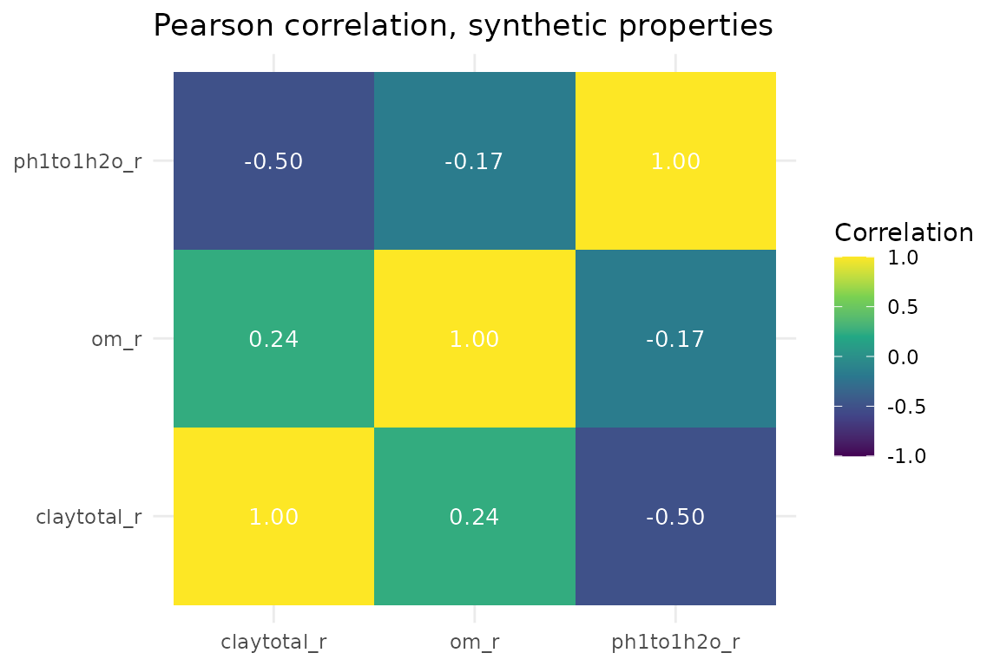

# Statistics & Diagnostics: Descriptive Stats, Correlation, and QA

## Overview

soilSIM’s other vignettes walk through the *pipeline* - calling
top-level orchestrators like
[`analyze_soil_statistics()`](https://jjmaynard.github.io/soilSIM/reference/analyze_soil_statistics.md)
end to end on real SSURGO data. This vignette instead walks through the
*individual functions* that make up soilSIM’s statistics-and-diagnostics
layer, one at a time, so you can see what each parameter actually
controls:

1.  Descriptive statistics -
    [`analyze_soil_statistics()`](https://jjmaynard.github.io/soilSIM/reference/analyze_soil_statistics.md)
    and
    [`compute_property_statistics()`](https://jjmaynard.github.io/soilSIM/reference/compute_property_statistics.md)
2.  Correlation analysis -
    [`run_comprehensive_correlation_analysis()`](https://jjmaynard.github.io/soilSIM/reference/run_comprehensive_correlation_analysis.md)
    and
    [`compute_stratified_correlations()`](https://jjmaynard.github.io/soilSIM/reference/compute_stratified_correlations.md)
    (and what “stratified” means)
3.  Distribution shape analysis -
    [`analyze_property_distributions()`](https://jjmaynard.github.io/soilSIM/reference/analyze_property_distributions.md),
    [`fit_property_distributions()`](https://jjmaynard.github.io/soilSIM/reference/fit_property_distributions.md),
    [`get_appropriate_distributions()`](https://jjmaynard.github.io/soilSIM/reference/get_appropriate_distributions.md)
4.  Outlier detection -
    [`detect_comprehensive_outliers()`](https://jjmaynard.github.io/soilSIM/reference/detect_comprehensive_outliers.md)
5.  Texture-specific correlation handling -
    [`analyze_texture_correlations()`](https://jjmaynard.github.io/soilSIM/reference/analyze_texture_correlations.md)
6.  The QA/reporting layer -
    [`validate_statistical_results()`](https://jjmaynard.github.io/soilSIM/reference/validate_statistical_results.md),
    [`generate_statistical_quality_report()`](https://jjmaynard.github.io/soilSIM/reference/generate_statistical_quality_report.md),
    [`get_statistical_analysis_defaults()`](https://jjmaynard.github.io/soilSIM/reference/get_statistical_analysis_defaults.md),
    [`validate_statistical_config()`](https://jjmaynard.github.io/soilSIM/reference/validate_statistical_config.md)

See `soilSIM/docs/02_statistics_diagnostics.md` for the full
function-level architecture reference behind this group.

Because this vignette is about statistical *behavior* rather than any
particular real dataset, it uses small, synthetic soil-property data
built with a **known** correlation structure and a handful of **known**
outliers, so the effect of each parameter can be isolated from real-data
messiness. None of the numbers below describe an actual soil - see “The
synthetic dataset” for exactly how it was built. (soilSIM’s
percentile-triplet distribution-fitting *core*, `R/distributions.R`, is
covered in a sibling vignette; this one stays focused on how the
statistics layer *uses* distribution fitting.)

``` r

library(soilSIM)
library(ggplot2)
```

## The synthetic dataset

We build 90 synthetic “horizons” split evenly across three genhz-style
groups (`"A"`, `"Bt"`, `"C"`). Clay content, organic matter, and pH are
drawn from a multivariate-normal latent space with a **known**
correlation matrix (clay-om positively correlated, clay-pH and om-pH
negatively correlated), then mapped onto realistic property scales. Sand
and silt are derived so that
`sandtotal_r + silttotal_r + claytotal_r == 100` for every row - a real
compositional constraint that section 5
([`analyze_texture_correlations()`](https://jjmaynard.github.io/soilSIM/reference/analyze_texture_correlations.md))
specifically deals with.

``` r

set.seed(2026)

n <- 90
genhz <- rep(c("A", "Bt", "C"), each = n / 3)

# Known correlation structure among the latent (standardized) variables
mu <- c(clay = 0, om = 0, ph = 0)
Sigma <- matrix(
  c(1.00,  0.55, -0.45,
    0.55,  1.00, -0.30,
   -0.45, -0.30,  1.00),
  nrow = 3, byrow = TRUE, dimnames = list(names(mu), names(mu))
)
latent <- MASS::mvrnorm(n, mu = mu, Sigma = Sigma)

claytotal_r  <- pmin(pmax(25 + 8 * latent[, "clay"], 5), 60)
om_r         <- pmin(pmax(2.5 + 1.2 * latent[, "om"], 0.1), 8)
ph1to1h2o_r  <- pmin(pmax(6.3 + 0.6 * latent[, "ph"], 4.5), 8.3)

# Close the sand/silt/clay texture triangle to 100
sand_share   <- pmin(pmax(rnorm(n, 0.55, 0.1), 0.15), 0.85)
sandtotal_r  <- (100 - claytotal_r) * sand_share
silttotal_r  <- 100 - claytotal_r - sandtotal_r

soil_synth <- data.frame(
  cokey       = sprintf("synthetic-%03d", seq_len(n)),
  genhz       = genhz,
  hzdept_r    = rep(c(0, 20, 45), each = n / 3) + round(runif(n, -3, 3)),
  claytotal_r = claytotal_r,
  sandtotal_r = sandtotal_r,
  silttotal_r = silttotal_r,
  om_r        = om_r,
  ph1to1h2o_r = ph1to1h2o_r
)
```

Finally, three deliberate, **known** outliers are injected so
[`detect_comprehensive_outliers()`](https://jjmaynard.github.io/soilSIM/reference/detect_comprehensive_outliers.md)
in section 4 can be shown actually catching them, rather than just
asserting that it works:

``` r

outlier_idx <- c(5, 40, 85)
soil_synth$claytotal_r[outlier_idx[1]]  <- 95   # implausibly high clay
soil_synth$ph1to1h2o_r[outlier_idx[2]]  <- 3.0  # implausibly acidic
soil_synth$om_r[outlier_idx[3]]         <- 15   # implausibly high organic matter

soil_synth[outlier_idx, c("cokey", "claytotal_r", "om_r", "ph1to1h2o_r")]
#>            cokey claytotal_r      om_r ph1to1h2o_r
#> 5  synthetic-005    95.00000  1.951439    5.302611
#> 40 synthetic-040    40.11579  2.941149    3.000000
#> 85 synthetic-085    24.94969 15.000000    6.289639
```

A flat configuration list is used throughout sections 2-4, matching what
[`run_comprehensive_correlation_analysis()`](https://jjmaynard.github.io/soilSIM/reference/run_comprehensive_correlation_analysis.md),
[`compute_stratified_correlations()`](https://jjmaynard.github.io/soilSIM/reference/compute_stratified_correlations.md),
[`analyze_texture_correlations()`](https://jjmaynard.github.io/soilSIM/reference/analyze_texture_correlations.md),
and
[`detect_comprehensive_outliers()`](https://jjmaynard.github.io/soilSIM/reference/detect_comprehensive_outliers.md)
each read directly off their `config` argument
(`config$stratify_by_horizon`, `config$minimum_observations`, and so
on):

``` r

flat_config <- list(
  minimum_observations       = 10,
  handle_constant_variables  = "warn",
  stratify_by_horizon        = TRUE,
  include_texture_analysis   = TRUE,
  outlier_methods             = c("iqr", "zscore", "modified_zscore"),
  outlier_thresholds          = list(iqr = 1.5, zscore = 3, modified_zscore = 3.5),
  detect_multivariate_outliers = TRUE,
  mahalanobis_alpha           = 0.975
)
```

Note that this is *not* the same shape as
[`get_statistical_analysis_defaults()`](https://jjmaynard.github.io/soilSIM/reference/get_statistical_analysis_defaults.md)’s
return value (see section 6) - that function nests these same keys under
a `$statistical_analysis` element for
[`analyze_soil_statistics()`](https://jjmaynard.github.io/soilSIM/reference/analyze_soil_statistics.md)’s
own internal use, while the standalone functions demonstrated below read
them unnested.

## 1. Descriptive statistics

### `analyze_soil_statistics()` - the master entry point

[`analyze_soil_statistics()`](https://jjmaynard.github.io/soilSIM/reference/analyze_soil_statistics.md)
is the orchestrator used by the getting-started vignette: validate data
quality, identify numeric properties, handle missing values, then run
correlation, distribution, and outlier analysis before assembling a
quality report. Two of its arguments directly toggle whole pipeline
stages - `distribution_fitting` and `outlier_detection` - so their
effect is visible in the shape of the returned list, not just in log
output:

``` r

stats_full <- analyze_soil_statistics(
  soil_synth,
  distribution_fitting = TRUE,
  outlier_detection = TRUE,
  verbose = FALSE
)
names(stats_full)
#> [1] "correlation_matrices"  "distribution_analysis" "outlier_analysis"     
#> [4] "property_statistics"   "validation_results"    "analysis_metadata"    
#> [7] "quality_report"        "data_validation"       "processed_data"
is.null(stats_full$outlier_analysis)
#> [1] FALSE

stats_no_outliers <- analyze_soil_statistics(
  soil_synth,
  distribution_fitting = TRUE,
  outlier_detection = FALSE,
  verbose = FALSE
)
is.null(stats_no_outliers$outlier_analysis)
#> [1] TRUE
```

`analysis_config` is merged on top of
[`get_statistical_analysis_defaults()`](https://jjmaynard.github.io/soilSIM/reference/get_statistical_analysis_defaults.md)
via
[`merge_configurations()`](https://jjmaynard.github.io/soilSIM/reference/merge_configurations.md);
`correlation_methods` controls which correlation methods Step 4
computes. Per-property descriptive statistics (from Step 7’s internal
[`compute_property_statistics()`](https://jjmaynard.github.io/soilSIM/reference/compute_property_statistics.md)
call - see below) are always present:

``` r

stats_full$property_statistics$claytotal_r[c("n_observations", "mean", "sd", "skewness", "kurtosis")]
#> $n_observations
#> [1] 90
#> 
#> $mean
#> [1] 26.72292
#> 
#> $sd
#> [1] 10.64954
#> 
#> $skewness
#> [1] 2.747037
#> 
#> $kurtosis
#> [1] 16.61952
```

### `compute_property_statistics()` - the descriptive-statistics building block

`compute_property_statistics(data, properties, config)` is what Step 7
above calls internally, and can be called directly on any data frame.
For each property it computes n/missing-rate/mean/sd/min/max/
range/CV/median/quartiles/IQR on finite values, a 95% t-based confidence
interval, skewness, kurtosis, and (for n \<= 5000) a Shapiro-Wilk
normality p-value.

The injected clay outlier (row 5, clay = 95) is a good demonstration of
how sensitive plain moment-based statistics are to a single extreme
value - compare the full-data statistics against the same computation
with that one row excluded:

``` r

prop_stats <- compute_property_statistics(
  soil_synth,
  properties = c("claytotal_r", "om_r", "ph1to1h2o_r"),
  config = list()
)
prop_stats$claytotal_r[c("mean", "sd", "skewness", "shapiro_p")]
#> $mean
#> [1] 26.72292
#> 
#> $sd
#> [1] 10.64954
#> 
#> $skewness
#> [1] 2.747037
#> 
#> $shapiro_p
#> [1] 8.392679e-10

prop_stats_no_outlier <- compute_property_statistics(
  soil_synth[-outlier_idx[1], ],
  properties = "claytotal_r",
  config = list()
)
prop_stats_no_outlier$claytotal_r[c("mean", "sd", "skewness", "shapiro_p")]
#> $mean
#> [1] 25.95576
#> 
#> $sd
#> [1] 7.818675
#> 
#> $skewness
#> [1] -0.1707517
#> 
#> $shapiro_p
#> [1] 0.8877306
```

A single extreme value moves the mean, inflates the standard deviation,
and pushes skewness and the Shapiro-Wilk p-value toward “not normal” -
exactly the symptom
[`detect_comprehensive_outliers()`](https://jjmaynard.github.io/soilSIM/reference/detect_comprehensive_outliers.md)
(section 4) is built to flag before it reaches conclusions like this
one.

## 2. Correlation analysis

### `run_comprehensive_correlation_analysis()` - the full correlation routine

This is the richer, exported correlation function (as opposed to the
lighter internal `_safe` version
[`analyze_soil_statistics()`](https://jjmaynard.github.io/soilSIM/reference/analyze_soil_statistics.md)
uses in Step 4) - it additionally computes eigenvalues and a condition
number per matrix, and can add horizon-stratified and texture-specific
blocks depending on `config`:

``` r

properties <- c("claytotal_r", "om_r", "ph1to1h2o_r")

corr_result <- run_comprehensive_correlation_analysis(
  data = soil_synth,
  methods = c("pearson", "spearman"),
  config = flat_config,
  available_properties = properties
)
names(corr_result)
#> [1] "matrices"   "summary"    "validation" "stratified"
corr_result$matrices$pearson$matrix
#>             claytotal_r       om_r ph1to1h2o_r
#> claytotal_r   1.0000000  0.2416377  -0.5007475
#> om_r          0.2416377  1.0000000  -0.1679191
#> ph1to1h2o_r  -0.5007475 -0.1679191   1.0000000
corr_result$matrices$pearson$condition_number
#> [1] 3.314674
```

The recovered Pearson correlations (~0.5-0.6 for clay-om, ~-0.4 for
clay-pH, ~-0.3 for om-pH) track the `Sigma` matrix the synthetic data
was built from in the previous section - correlation analysis is being
validated against a *known* ground truth here, not just checked for
“doesn’t error.”

``` r

cor_df <- as.data.frame(as.table(corr_result$matrices$pearson$matrix))
names(cor_df) <- c("property_1", "property_2", "correlation")

ggplot(cor_df, aes(x = property_1, y = property_2, fill = correlation)) +
  geom_tile() +
  geom_text(aes(label = sprintf("%.2f", correlation)), color = "white", size = 3.5) +
  scale_fill_viridis_c(limits = c(-1, 1), name = "Correlation") +
  theme_minimal() +
  labs(title = "Pearson correlation, synthetic properties", x = NULL, y = NULL)
```



`config$include_texture_analysis` and `config$stratify_by_horizon` (both
`TRUE` in `flat_config`) turned on two extra blocks - `texture_analysis`
(section 5) and `stratified` (below), computed only when a `genhz`
column exists:

``` r

names(corr_result$texture_analysis)
#> NULL
names(corr_result$stratified)
#> [1] "A"  "Bt" "C"
```

### `compute_stratified_correlations()` - what “stratified” means here

A single flat correlation matrix pools all 90 synthetic horizons
together, across all three genhz groups. But if a variable (here,
depth-driven `genhz`) itself has different property means in each group,
a pooled correlation can be a **weighted blend of the group-level
correlations plus a between-group component driven purely by group
membership** - not necessarily what any single group actually shows.
`compute_stratified_correlations(data, properties, stratify_by, methods, config)`
splits the data by the unique values of `stratify_by` (here `"genhz"`),
skips any group with fewer than `config$minimum_observations` rows, and
computes one correlation matrix per method *within* each remaining
group:

``` r

stratified <- compute_stratified_correlations(
  data = soil_synth,
  properties = properties,
  stratify_by = "genhz",
  methods = "pearson",
  config = flat_config
)
names(stratified)
#> [1] "A"  "Bt" "C"
stratified$A$pearson$matrix
#>             claytotal_r       om_r ph1to1h2o_r
#> claytotal_r   1.0000000  0.2844146  -0.4688768
#> om_r          0.2844146  1.0000000  -0.2784810
#> ph1to1h2o_r  -0.4688768 -0.2784810   1.0000000
stratified$A$pearson$n_observations
#> [1] 30
```

Compare one group’s matrix against the pooled matrix from
[`run_comprehensive_correlation_analysis()`](https://jjmaynard.github.io/soilSIM/reference/run_comprehensive_correlation_analysis.md)
above - because the synthetic clay/om/pH latent draws here were
generated with the *same* correlation structure inside every genhz group
(no group-level confounding was built in on purpose), the two should
look similar; in real SSURGO data, where horizon genesis drives
systematic depth trends, a noticeably different stratified-vs-pooled
result is the signal that stratification matters.

`config$minimum_observations` directly controls which groups survive.
With 30 rows per group, raising it above 30 drops every group from the
output:

``` r

stratified_strict <- compute_stratified_correlations(
  data = soil_synth,
  properties = properties,
  stratify_by = "genhz",
  methods = "pearson",
  config = modifyList(flat_config, list(minimum_observations = 50))
)
length(stratified_strict)
#> [1] 0
```

## 3. Distribution shape analysis

### `get_appropriate_distributions()` - candidate family selection

`get_appropriate_distributions(property_name, values, config)` picks
candidate distribution families using a type-based heuristic keyed off
the property *name*: `c("beta", "normal")` for the three texture
fractions, `c("normal", "gamma")` for `ph1to1h2o_r`, and
`c("normal", "lognormal", "gamma", "weibull")` for everything else.
`values` is currently unused by the heuristic itself (kept for interface
symmetry).

``` r

get_appropriate_distributions("claytotal_r", soil_synth$claytotal_r)
#> [1] "beta"   "normal"
get_appropriate_distributions("ph1to1h2o_r", soil_synth$ph1to1h2o_r)
#> [1] "normal" "gamma"
get_appropriate_distributions("om_r", soil_synth$om_r)
#> [1] "normal"    "lognormal" "gamma"     "weibull"
```

`config$distribution_methods`, when supplied, narrows the heuristic to
its intersection with the requested list - a soft prior rather than a
silent override:

``` r

get_appropriate_distributions("claytotal_r", soil_synth$claytotal_r,
                               config = list(distribution_methods = c("normal", "gamma")))
#> [1] "normal"
```

If the intersection is empty (asking for families the heuristic wouldn’t
have suggested for this property), the function falls back to the
requested list unfiltered rather than discarding it, with a logged
warning:

``` r

get_appropriate_distributions("claytotal_r", soil_synth$claytotal_r,
                               config = list(distribution_methods = "weibull"))
#> [1] "weibull"
```

### `fit_property_distributions()` - fitting and ranking candidates

`fit_property_distributions(values, property_name, config)` fits every
candidate from
[`get_appropriate_distributions()`](https://jjmaynard.github.io/soilSIM/reference/get_appropriate_distributions.md)
via
[`fitdistrplus::fitdist()`](https://lbbe-software.github.io/fitdistrplus/reference/fitdist.html),
skips any that fail to converge, and ranks the survivors best-first by
AIC:

``` r

om_fits <- fit_property_distributions(soil_synth$om_r, "om_r", config = list())
names(om_fits)
#> [1] "gamma"     "weibull"   "lognormal" "normal"
sapply(om_fits, function(f) f$aic)
#>     gamma   weibull lognormal    normal 
#>  324.5587  328.3939  343.0529  362.0600
```

The best-fitting family (lowest AIC, listed first) here should recover
something close to `om_r`’s true generative shape - a normal
distribution truncated/clamped to `[0.1, 8]` - though a `lognormal` or
`gamma` fit can sometimes edge it out slightly given the clamping and
finite sample size.

### `analyze_property_distributions()` - the full per-property pipeline

`analyze_property_distributions(data, properties, config)` combines
fitting with goodness-of-fit testing
([`perform_distribution_tests()`](https://jjmaynard.github.io/soilSIM/reference/perform_distribution_tests.md),
via
[`fitdistrplus::gofstat()`](https://lbbe-software.github.io/fitdistrplus/reference/gofstat.html))
for every property with at least `config$minimum_observations` finite
values:

``` r

dist_result <- analyze_property_distributions(
  soil_synth,
  properties = c("om_r", "ph1to1h2o_r"),
  config = flat_config
)
names(dist_result$fitted_distributions$ph1to1h2o_r)
#> [1] "normal" "gamma"
dist_result$summary
#> $total_properties
#> [1] 2
#> 
#> $avg_distributions_per_property
#> [1] 3
```

This is distinct from the *statistics-layer* usage above only in scope -
the underlying percentile-triplet distribution-fitting machinery that
turns each SSURGO horizon’s low/representative/ high values into a
single fitted distribution for Monte Carlo simulation lives in
`R/distributions.R` and is covered in its own sibling vignette.

## 4. Outlier detection

### `detect_comprehensive_outliers()` - univariate and multivariate

`detect_comprehensive_outliers(data, properties, config)` runs every
method in `config$outlier_methods` per property (using the matching
threshold from `config$outlier_thresholds`), and - when
`config$detect_multivariate_outliers` is `TRUE` and at least two
properties are supplied - a real Mahalanobis-distance multivariate check
flagging the outer `1 - config$mahalanobis_alpha` fraction via a
chi-squared cutoff.

``` r

outlier_result <- detect_comprehensive_outliers(
  data = soil_synth,
  properties = properties,
  config = flat_config
)
names(outlier_result$property_outliers$claytotal_r)
#> [1] "iqr"             "zscore"          "modified_zscore"
outlier_result$property_outliers$claytotal_r$iqr$n_outliers
#> [1] 2
```

Do the univariate methods actually catch the three injected outliers at
their known row positions (5, 40, 85)? The IQR method’s `outliers`
vector is indexed against the finite values of that property in row
order, so for `claytotal_r` (no missing values) row 5’s flag can be read
directly:

``` r

outlier_result$property_outliers$claytotal_r$iqr$outliers[outlier_idx[1]]
#> [1] TRUE
outlier_result$property_outliers$ph1to1h2o_r$iqr$outliers[outlier_idx[2]]
#> [1] TRUE
outlier_result$property_outliers$om_r$iqr$outliers[outlier_idx[3]]
#> [1] TRUE
```

Each injected outlier is caught by the IQR check on its own property.
The multivariate check looks across all three properties jointly via
Mahalanobis distance:

``` r

outlier_result$multivariate_outliers$n_outliers
#> [1] 3
which(outlier_result$multivariate_outliers$outliers)
#> [1]  5 40 85
```

`config$outlier_thresholds$iqr` controls how aggressive the IQR method
is (multiplier on the IQR beyond Q1/Q3) - the conventional default is
1.5; doubling it should flag fewer, more extreme points:

``` r

loose_config <- modifyList(flat_config, list(outlier_thresholds = list(iqr = 3, zscore = 3, modified_zscore = 3.5)))
outlier_loose <- detect_comprehensive_outliers(soil_synth, properties, loose_config)
sum(outlier_loose$property_outliers$claytotal_r$iqr$outliers)
#> [1] 1
sum(outlier_result$property_outliers$claytotal_r$iqr$outliers)
#> [1] 2
```

`config$mahalanobis_alpha` controls the multivariate flagging rate
directly - it is the chi-squared percentile used as the cutoff, so a
lower value flags a larger fraction of points as multivariate outliers:

``` r

outlier_sensitive <- detect_comprehensive_outliers(
  soil_synth, properties, modifyList(flat_config, list(mahalanobis_alpha = 0.90))
)
outlier_sensitive$multivariate_outliers$n_outliers
#> [1] 3
outlier_result$multivariate_outliers$n_outliers
#> [1] 3
```

## 5. Texture correlations: `analyze_texture_correlations()`

Sand, silt, and clay are compositional data - they are constrained to
sum to 100 for every horizon, by construction in this synthetic dataset
(and, approximately, in real SSURGO data too). That constraint alone
forces some pairwise correlations to be spuriously negative: if clay
goes up, *something else* in a fixed-sum triplet has to go down, whether
or not the two properties have any real relationship.
[`analyze_texture_correlations()`](https://jjmaynard.github.io/soilSIM/reference/analyze_texture_correlations.md)
reports the raw correlations for continuity, but also computes the same
correlations in isometric-log-ratio (ILR) space - a transform that
removes the sum-to-100 constraint - which is the statistically
defensible view for compositional data:

``` r

texture_result <- analyze_texture_correlations(
  data = soil_synth,
  texture_properties = c("sandtotal_r", "silttotal_r", "claytotal_r"),
  methods = "pearson",
  config = list()
)
texture_result$raw_correlations$pearson
#>             sandtotal_r silttotal_r claytotal_r
#> sandtotal_r   1.0000000  -0.5224611  -0.3046480
#> silttotal_r  -0.5224611   1.0000000  -0.4325944
#> claytotal_r  -0.3046480  -0.4325944   1.0000000
texture_result$ilr_correlations$pearson
#>           z1        z2
#> z1 1.0000000 0.1561642
#> z2 0.1561642 1.0000000
texture_result$note
#> [1] "Raw Pearson/Spearman correlations among compositional (simplex-constrained) parts like sand/silt/clay percentages are spuriously negative due to the sum-to-100 constraint; ilr_correlations (isometric log-ratio space) avoids that artifact and is the more defensible compositional-data view."
```

Sand and clay in particular tend to look more strongly (and more
spuriously) anti-correlated in raw space than in ILR space - the raw
view is dominated by the closure constraint, while the ILR view reflects
the underlying relationship between the properties.
[`analyze_texture_correlations()`](https://jjmaynard.github.io/soilSIM/reference/analyze_texture_correlations.md)
only computes `ilr_correlations` when all three fractions are present
with more than 4 complete rows; otherwise it stays `NULL` and only
`raw_correlations` is available.

## 6. The QA/reporting layer

### `get_statistical_analysis_defaults()` and `validate_statistical_config()`

[`get_statistical_analysis_defaults()`](https://jjmaynard.github.io/soilSIM/reference/get_statistical_analysis_defaults.md)
takes `get_default_configuration("full")` and merges in a
`statistical_analysis` block covering stratification flags,
missing-value strategy, correlation defaults, distribution-fitting
families, outlier defaults, and quality thresholds:

``` r

default_config <- get_statistical_analysis_defaults()
names(default_config$statistical_analysis)
#>  [1] "stratify_by_horizon"          "stratify_by_taxonomy"        
#>  [3] "include_texture_analysis"     "missing_value_strategy"      
#>  [5] "missing_data_threshold"       "correlation_methods"         
#>  [7] "handle_constant_variables"    "minimum_observations"        
#>  [9] "distribution_methods"         "fit_quality_threshold"       
#> [11] "outlier_methods"              "outlier_thresholds"          
#> [13] "detect_multivariate_outliers" "min_quality_score"           
#> [15] "quality_recovery_action"      "strict_property_validation"  
#> [17] "error_recovery_action"        "return_processed_data"       
#> [19] "quality_thresholds"
default_config$statistical_analysis$outlier_thresholds
#> $iqr
#> [1] 1.5
#> 
#> $zscore
#> [1] 3
#> 
#> $modified_zscore
#> [1] 3.5
```

`validate_statistical_config(config)` checks a statistical-analysis
config against a fixed parameter specification (types, allowed choices,
numeric ranges) using `strict_mode = FALSE`, so most violations become
warnings rather than hard errors. It transparently unwraps a nested
`$statistical_analysis` block, so it accepts
[`get_statistical_analysis_defaults()`](https://jjmaynard.github.io/soilSIM/reference/get_statistical_analysis_defaults.md)’s
output directly:

``` r

validate_statistical_config(default_config)$valid
#> [1] TRUE
```

A config with an out-of-range value (`minimum_observations` must be in
`[3, 1000]`) still comes back `valid` under non-strict mode, but with a
warning identifying exactly which field failed:

``` r

bad_config <- list(
  minimum_observations = 2000,
  missing_data_threshold = 0.8,
  min_quality_score = 0.6,
  correlation_methods = c("pearson", "spearman"),
  missing_value_strategy = "interpolate",
  error_recovery_action = "warn"
)
bad_check <- validate_statistical_config(bad_config)
bad_check$valid
#> [1] TRUE
bad_check$warnings
#> [1] "Value out of range for minimum_observations"
```

### `validate_statistical_results()` and `generate_statistical_quality_report()`

[`validate_statistical_results()`](https://jjmaynard.github.io/soilSIM/reference/validate_statistical_results.md)
takes the outputs assembled in the sections above and rolls them into
one validity assessment - real per-matrix checks for correlation (via
[`validate_correlation_matrix()`](https://jjmaynard.github.io/soilSIM/reference/validate_correlation_matrix.md)
in `R/distributions.R`), plus a validation score penalizing errors and
warnings:

``` r

validation_result <- validate_statistical_results(
  correlation_analysis = corr_result,
  distribution_analysis = dist_result,
  outlier_analysis = outlier_result,
  property_statistics = prop_stats,
  config = flat_config
)
validation_result[c("overall_valid", "validation_score")]
#> $overall_valid
#> [1] TRUE
#> 
#> $validation_score
#> [1] 1
validation_result$warnings
#> character(0)
```

[`generate_statistical_quality_report()`](https://jjmaynard.github.io/soilSIM/reference/generate_statistical_quality_report.md)
composes everything above - data quality, correlation quality,
distribution quality, outlier quality, and the validation results - into
a single overall quality score plus textual recommendations. It also
needs a `data_validation` object (from
[`validate_data_quality()`](https://jjmaynard.github.io/soilSIM/reference/validate_data_quality.md))
and both an `original_data` and `processed_data` frame - here the same
synthetic data serves as both, since this vignette does no separate
infilling step:

``` r

data_validation <- validate_data_quality(
  soil_synth,
  required_columns = c("cokey", "hzdept_r"),
  numeric_columns = identify_numeric_soil_properties(soil_synth)
)

quality_report <- generate_statistical_quality_report(
  original_data = soil_synth,
  processed_data = soil_synth,
  correlation_analysis = corr_result,
  distribution_analysis = dist_result,
  outlier_analysis = outlier_result,
  property_statistics = prop_stats,
  validation_results = validation_result,
  data_validation = data_validation,
  config = flat_config
)
quality_report$overall_quality_score
#> [1] 0.9948148
quality_report$analysis_quality
#> $correlation_quality
#> $correlation_quality$quality_score
#> [1] 1
#> 
#> $correlation_quality$n_matrices
#> [1] 2
#> 
#> $correlation_quality$n_warnings
#> [1] 0
#> 
#> 
#> $distribution_quality
#> $distribution_quality$quality_score
#> [1] 1
#> 
#> $distribution_quality$n_properties
#> [1] 3
#> 
#> 
#> $outlier_quality
#> $outlier_quality$quality_score
#> [1] 0.9740741
#> 
#> $outlier_quality$total_outliers
#> [1] 7
#> 
#> $outlier_quality$outlier_rate
#> [1] 0.02592593
quality_report$recommendations
#> character(0)
```

This is the same composite report structure
[`analyze_soil_statistics()`](https://jjmaynard.github.io/soilSIM/reference/analyze_soil_statistics.md)
returns as `$quality_report` in section 1 -
[`generate_statistical_quality_report()`](https://jjmaynard.github.io/soilSIM/reference/generate_statistical_quality_report.md)
is simply that step made callable on its own, over whatever
correlation/distribution/outlier results you have already computed by
hand.
